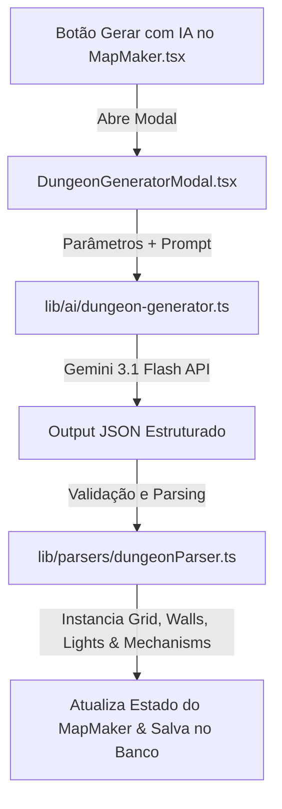

# Plano de Arquitetura: AI Dungeon Generator (Gerador de Masmorras por IA)

> **Objetivo:** Permitir que o Mestre crie masmorras completas por Inteligência Artificial a partir do `MapMaker.tsx` (ao lado do botão Importar UVTT). Ao clicar em "Gerar Masmorra com IA", um modal rico é exibido permitindo definir tamanho customizado do grid, nível da masmorra, tema, inclusão de puzzles com alavancas/grades, quantidade de andares e prompt descritivo livre.

---

## 🎨 1. Design da Interface (`components/map/DungeonGeneratorModal.tsx`)

O modal será integrado ao `MapMaker.tsx` com um design sofisticado (dark mode, glassmorphism e acentos dourados/âmbar), contendo as seguintes seções:

### A. Parâmetros de Configuração
1. **Prompt Livre (Descrição da Masmorra):**
   - Campo de texto expansível para o mestre descrever ideias específicas (Ex: *"Masmorra gótica de vampiro com um altar de sangue no centro, corredores com armadilhas de fogo e baús trancados"*).
2. **Tema da Masmorra (Preset Select):**
   - Gótica / Vampírica
   - Caverna & Escavação
   - Templo Antigo / Ruínas
   - Esgoto Subterrâneo
   - Infernal / Vulcânica
   - Anã / Forja Subterrânea
   - Cristalina / Astral
3. **Nível da Masmorra (Party Level 1-20):**
   - Influencia a dificuldade das trancas (DCs de Gazuá), dano das armadilhas e raridade do loot nos baús.
4. **Quantidade de Andares / Níveis:**
   - Seletor numérico (1 a 5 andares). Se > 1, gera múltiplos mapas encadeados e com escadas/alçapões marcados.
5. **Dificuldade & Puzzles de Alavancas (Toggle Checkbox):**
   - `[X] Incluir Puzzles de Alavancas e Grades`: Quando ativado, a IA gera obrigatoriamente alavancas em salas distantes que abrem grades de ferro (`portcullis`) em outros cômodos, adicionando um tooltip explicativo para o Mestre.
   - `[X] Incluir Passagens Secretas`: Paredes ilusórias ou portas secretas detectáveis via Percepção Passiva.
6. **Tamanho Customizado do Grid:**
   - Presets Rápidos: `40x40` (Pequena), `60x60` (Média), `80x80` (Grande), `100x100` (Épica).
   - **Inputs Numéricos Livres:** Permite que o Mestre digite manualmente qualquer número de **Colunas (Largura)** e **Linhas (Altura)** (Ex: `50 x 75`).

---

## 🏗️ 2. Arquitetura do Sistema



---

## 📜 3. Schema JSON do Gerador (`lib/ai/dungeon-generator.ts`)

```typescript
export interface AIDungeonRequestParams {
  prompt: string;
  theme: string;
  level: number;
  floors: number;
  hasPuzzles: boolean;
  hasSecretPassages: boolean;
  cols: number;
  rows: number;
}

export interface AIDungeonOutput {
  metadata: {
    title: string;
    description: string;
    recommendedLevel: number;
    theme: string;
    floorIndex: number;
    totalFloors: number;
  };
  gridSize: { cols: number; rows: number };
  rooms: Array<{
    id: string;
    name: string;
    type: 'entrance' | 'hall' | 'crypt' | 'boss_room' | 'treasury' | 'corridor' | 'secret_chamber';
    bounds: { startCol: number; startRow: number; width: number; height: number };
    floorTileType: 'floor' | 'stone' | 'wood' | 'carpet' | 'water' | 'lava' | 'dirt';
  }>;
  elements: Array<{
    type: 'door' | 'portcullis' | 'trap' | 'chest' | 'stash' | 'trigger' | 'illusion_wall' | 'stairs';
    col: number;
    row: number;
    config: {
      status?: 'open' | 'closed' | 'locked';
      dc?: number;
      triggerId?: string; // ID para ligar a alavanca à grade
      targetId?: string;
      description?: string;
      lootItems?: string[];
      notesForDM?: string; // Dica para o mestre sobre o puzzle
    };
  }>;
  lightSources: Array<{
    col: number;
    row: number;
    preset: 'torch' | 'candle' | 'lantern' | 'spell' | 'dragon';
    color: string;
    radius: number;
    animation: 'torch' | 'pulse' | 'candle' | 'none';
  }>;
  vectorWalls: Array<{
    x1: number; y1: number; x2: number; y2: number;
    wallType: 'wall' | 'door' | 'window' | 'secret';
    blocksLight: boolean;
  }>;
}
```

---

## 📋 4. Etapas de Implementação

### Fase 1: Interface do Usuário (`components/map/DungeonGeneratorModal.tsx`)
- [ ] Criar o modal `DungeonGeneratorModal.tsx` com todos os controles: prompt livre, seleção de tema, nível da masmorra, andares, checkbox de puzzles e inputs numéricos de tamanho.
- [ ] Adicionar o botão "Gerar Masmorra com IA" no cabeçalho/barra de ferramentas do `MapMaker.tsx` (ao lado de "Importar UVTT").

### Fase 2: Service de IA (`lib/ai/dungeon-generator.ts`)
- [ ] Construir a integração com Gemini 2.5 Flash / OpenRouter solicitando `response_mime_type: "application/json"`.
- [ ] Implementar tratamento de erros e suporte a geração de múltiplos andares (loop de andares).

### Fase 3: Conversor para o Canvas (`lib/parsers/dungeonParser.ts`)
- [ ] Mapear as salas, corredores e tipos de pisos no matriz `Cell[][]`.
- [ ] Instanciar e vincular os mecanismos de alavanca (`trigger`) às grades de ferro (`portcullis`).
- [ ] Converter as paredes para `vectorWalls` e criar o array de `lightSources`.

### Fase 4: Integração com o Editor de Mapas (`MapMaker.tsx`)
- [ ] Aplicar o mapa gerado na tela com suporte a desfazer (`Undo`) e criação automática de múltiplos mapas de campanha se houver mais de 1 andar.
- [ ] Testes de validação e verificação.
