# PLAN: Sprint 2 (P1) - Gerador de Imagens com IA no Session Studio & IA no Worldbuilder

> **Status:** 📝 Em Planejamento | **Prioridade:** 🟠 P1 (Alta) | **Tipo de Projeto:** WEB (Next.js 16, Google GenAI Nano Banana 2 `gemini-3.1-flash-lite-image`, Worldbuilding Engine)  
> **Chave do Plano:** `ai-images-worldbuilder`

---

## 🎯 1. Visão Geral & Objetivo

Eliminar os mocks e placeholders de IA em duas áreas centrais da experiência do mestre de RPG:

1. **Geração Real de Imagens de Cena no Session Studio com Nano Banana 2 (`gemini-3.1-flash-lite-image`)**:
   - Substituir o botão com alerta mock `"Em Breve: Integração com Nano Banana/Gemini..."` no [components/SessionStudio.tsx](file:///c:/Users/Fred/Documents/game-dev/Masters%20Codex%20-%20The%20Campaign%20Forge%20Tool/components/SessionStudio.tsx) por um fluxo completo de geração de imagem de cena com IA.
   - Utilizar o modelo oficial configurado no Masters Codex: **Nano Banana 2 (`gemini-3.1-flash-lite-image`)** via Google GenAI, respeitando as chaves de API e preferências do usuário de [useUserSettings](file:///c:/Users/Fred/Documents/game-dev/Masters%20Codex%20-%20The%20Campaign%20Forge%20Tool/lib/hooks/useUserSettings.ts).
   - Permitir que o mestre digite uma descrição livre (ou utilize o título/sensoryText da cena atual), escolha o formato/aspect ratio (16:9 widescreen para slides de TV, 1:1, ou 9:16 portrait) e gere a arte instantaneamente via `/api/ai/image`.
   - Inserir a imagem gerada diretamente na lista de slides da cena (`sceneImages`) com preview imediato.

2. **Conexão Dinâmica do Gerador de IA no Worldbuilder Studio**:
   - Substituir os 2 botões estáticos hardcoded ("Mestre Eldrin" e "Porto dos Ventos Místicos") na aba de IA do [components/WorldEditor.tsx](file:///c:/Users/Fred/Documents/game-dev/Masters%20Codex%20-%20The%20Campaign%20Forge%20Tool/components/WorldEditor.tsx).
   - Criar uma galeria rica de 8 categorias geradoras (NPCs & Vilões, Cidades & Fortalezas, Facções & Guildas, Religiões & Deuses, Itens & Artefatos, Monstros & Feras, Conflitos Militares, Tradições & Eventos Históricos).
   - Conectar cada card ao [WorldEntityAiGeneratorModal.tsx](file:///c:/Users/Fred/Documents/game-dev/Masters%20Codex%20-%20The%20Campaign%20Forge%20Tool/components/WorldEntityAiGeneratorModal.tsx), permitindo contextualização com outras entidades do mundo e criação fluida de fichas completas de lore.

---

## 🏗️ 2. Arquitetura da Solução & Fluxo de Dados

```mermaid
graph TD
    subgraph "Session Studio (DM)"
        SS[SessionStudio: Scene Images Section] -->|Clica em 'Gerar Imagem com IA'| IMG_MODAL[SceneImageAiModal]
        IMG_MODAL -->|Prompt + userSettings + Aspect Ratio 16:9| API_IMG[POST /api/ai/image]
        API_IMG -->|Google GenAI: Nano Banana 2 gemini-3.1-flash-lite-image| BASE64[Base64 Image Output]
        BASE64 -->|Adiciona novo Slide| SLIDES[sceneImages List]
    end

    subgraph "Worldbuilder Studio (DM)"
        WE[WorldEditor: Aba 'IA'] -->|Seleciona Categoria: NPC, Local, Item...| WE_MODAL[WorldEntityAiGeneratorModal]
        WE_MODAL -->|Prompt + Contexto do Mundo| API_ENT[POST /api/ai/generate-entity]
        API_ENT -->|Google Gemini 2.5 Flash / OpenRouter| ENT_DATA[Entidade Preenchida]
        ENT_DATA -->|Abre Modal de Edição ou Salva| W_ENT[worldEntities State & DB]
    end
```



---

## 📋 3. Divisão de Tarefas & Arquivos a Modificar / Criar

### 🟧 Módulo A: Geração de Imagens de Cena com Nano Banana 2

#### Task A.1: Componente/Modal `SceneImageAiModal`
- **Arquivo:** [components/modals/SceneImageAiModal.tsx](file:///c:/Users/Fred/Documents/game-dev/Masters%20Codex%20-%20The%20Campaign%20Forge%20Tool/components/modals/SceneImageAiModal.tsx)
- **Ações:**
  1. Criar modal moderno para geração de arte de cena:
     - Sugestão inteligente de prompt baseada no título da cena e texto sensorial atual.
     - Campo de texto para refinar ou digitar prompt customizado.
     - Seletor de proporção de tela (`16:9` widescreen para TV, `1:1` quadrado, `9:16` vertical).
     - Integração com `userSettings` enviando `imageModel: 'gemini-3.1-flash-lite-image'` (Nano Banana 2) para `/api/ai/image`.
     - Botão de geração com estado de loading e feedback visual.
     - Preview da imagem gerada com opções: "Adicionar à Cena" ou "Gerar Novamente".
- **Verificação:** Abrir o modal, gerar uma arte e confirmar a imagem criada com Nano Banana 2.

#### Task A.2: Conexão no `SessionStudio.tsx`
- **Arquivo:** [components/SessionStudio.tsx](file:///c:/Users/Fred/Documents/game-dev/Masters%20Codex%20-%20The%20Campaign%20Forge%20Tool/components/SessionStudio.tsx)
- **Ações:**
  1. Conectar o botão "Gerar Imagem com IA" da seção de imagens de cena (linha 1215) para abrir o `SceneImageAiModal`.
  2. Ao aplicar, adicionar o novo slide na lista `sceneImages` com `mediaType: 'image'` e definir como capa da cena se for a primeira imagem.
- **Verificação:** Clicar no botão na cena → gerar imagem com Nano Banana 2 → o novo slide aparece listado e é renderizado no preview.

---

### 🟨 Módulo B: Conexão Dinâmica de IA no Worldbuilder

#### Task B.1: Galeria de Geradores de IA no `WorldEditor.tsx`
- **Arquivo:** [components/WorldEditor.tsx](file:///c:/Users/Fred/Documents/game-dev/Masters%20Codex%20-%20The%20Campaign%20Forge%20Tool/components/WorldEditor.tsx)
- **Ações:**
  1. Na aba `activeTab === 'ai'`, substituir os botões estáticos por uma grade categorizada:
     - 👤 **NPCs, Vilões & Aliados** (`npc`)
     - 🏰 **Cidades, Fortalezas & Masmorras** (`location`)
     - 🛡️ **Facções, Guildas & Cultos** (`faction`)
     - ⚡ **Religiões, Deuses & Panteões** (`religion`)
     - 🗡️ **Itens Mágicos & Artefatos** (`item`)
     - 🐉 **Monstros & Feras Lendárias** (`beast`)
     - ⚔️ **Guerras & Conflitos Militares** (`military_conflict`)
     - 📜 **Tradições & Eventos Históricos** (`lore_event`)
  2. Ao clicar em qualquer card, configurar `modalCategory`, preencher o `categoryContext` correspondente e abrir o [WorldEntityAiGeneratorModal.tsx](file:///c:/Users/Fred/Documents/game-dev/Masters%20Codex%20-%20The%20Campaign%20Forge%20Tool/components/WorldEntityAiGeneratorModal.tsx).
  3. No callback `onApply`, abrir o [WorldEntityModal.tsx](file:///c:/Users/Fred/Documents/game-dev/Masters%20Codex%20-%20The%20Campaign%20Forge%20Tool/components/WorldEntityModal.tsx) com todos os campos preenchidos pela IA prontos para revisão e salvamento do mestre.
- **Verificação:** Clicar em "Gerar Facção", digitar "Guilda de ladrões que controla os esgotos da capital", gerar e verificar o formulário preenchido com nome, resumo e lore rica.

---

## 🧪 4. Plano de Testes & Validação

### Testes Automatizados
```bash
# Validação de tipos TypeScript
npx tsc --noEmit

# Testes unitários
npm run test
```

### Checklist Manual
1. **Geração de Imagens (Nano Banana 2):**
   - Abrir o *Session Studio* -> Selecionar uma cena -> Clicar em *Gerar Imagem com IA*.
   - Digitar um prompt descritivo -> Clicar em *Gerar Imagem*.
   - Validar que a imagem é gerada pelo modelo Nano Banana 2 (`gemini-3.1-flash-lite-image`) e adicionada aos slides da cena.
2. **Geradores de Worldbuilding:**
   - Abrir o *Worldbuilder Studio* -> Ir para a aba *Geradores com IA*.
   - Clicar em *NPCs, Vilões & Aliados*.
   - Digitar prompt e anexar outra entidade como contexto -> Clicar em *Preencher Formulário Mágicamente*.
   - Confirmar abertura do modal de edição com os dados gerados e salvar.

---

## ✅ PHASE X COMPLETE
- Lint: ⬜
- Build: ⬜
- Nano Banana 2 Image AI: ⬜
- Worldbuilder AI Conectado: ⬜
