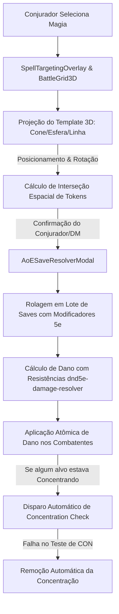

# 📜 Plano de Implementação: Templates de Magia AoE Interativos & Automação de Concentração/Saves

> **Status**: Planejado  
> **Área**: Combate Tático (VTT 3D & 2D) / Live Cockpit / Motor de Regras 5e  
> **Prioridade**: P0 (Alta)  
> **Arquivos Alvo**: `components/BattleGrid3D.tsx`, `components/live-cockpit/SpellTargetingOverlay.tsx`, `components/live-cockpit/AoESaveResolverModal.tsx`, `lib/dnd5e-spells-shapes.ts`, `lib/dnd5e-damage-resolver.ts`, `context/LiveCockpitContext.tsx`

---

## 🎯 1. Objetivo & Visão Geral

Elevar o combate tático do **Masters Codex** ao padrão dos melhores VTTs do mercado (Foundry VTT, TaleSpire, BG3), fornecendo:
1. **Templates de Área de Efeito (AoE) Interativos no BattleGrid3D e Cockpit**: Projeção visual em tempo real de Cones, Esferas/Círculos, Linhas e Cubos com rotação e ajuste de alcance.
2. **Detecção Automática de Alvos em Área**: Cálculo de interseção geométrica 3D entre a malha do template e os tokens no grid.
3. **Painel de Resolução de Saving Throws em Lote**: Lista instantânea de alvos pegos na área, busca automática de bônus de salvaguarda (DEX, CON, WIS, etc.), rolagem em 1 clique e aplicação de dano (integral, metade ou nulo) com respeito a resistências e imunidades.
4. **Automação de Concentração**: Rastreador de concentração ativo por combatente, disparo automático de teste de CON com $DC = \max(10, \lfloor \text{dano} / 2 \rfloor)$ ao tomar dano e limpeza automática de estado em caso de falha.

---

## 🧱 2. Arquitetura da Solução

---

## 📋 3. Tarefas Detalhadas por Módulo

### 🔹 Fase 1: Geometria de Templates & Projeção 3D (`BattleGrid3D.tsx` & `lib/dnd5e-spells-shapes.ts`)
- [ ] **Expansão do Banco de Magias AoE (`lib/dnd5e-spells-shapes.ts`)**:
  - Adicionar dados completos de 50+ magias SRD: CD de Salvaguarda base, Atributo do Save (DEX, CON, WIS, etc.), Tipo de Dano (`fogo`, `eletrico`, `frio`, etc.), Fórmula de Dano (`8d6`, `3d6`, `8d8`) e regra de metade no sucesso (`saveHalves: true`).
- [ ] **Malhas de Projeção Interativas em Three.js (`components/battle-3d/AoETemplateMesh.tsx`)**:
  - **Esfera / Círculo**: `RingGeometry` + `CircleGeometry` translúcido com shader de pulsação e alcance máximo do conjurador.
  - **Cone**: `ConeGeometry` 2D/3D (leque de 53.13° padrão 5e) ancorado no token do conjurador com rotação orientada pelo mouse (`lookAt`).
  - **Linha**: `PlaneGeometry` ou `BoxGeometry` (ex: 30m x 1.5m / 100ft x 5ft) projetada a partir do conjurador.
  - **Cilindro / Cubo**: Malha cúbica/cilíndrica ajustável no chão.
- [ ] **Controles de Teclado/Mouse**:
  - `Wheel` ou teclas `Q` / `E` para rotacionar o cone/linha.
  - `Shift + Wheel` para redimensionar raio (quando aplicável).
  - Raycaster no plano do chão ($Y=0$) com snap opcional ao grid.

### 🔹 Fase 2: Motor de Interseção Geométrica (`lib/vision/aoeCollision.ts`)
- [ ] **Algoritmo de Detecção de Tokens na Área**:
  - **Círculo**: $d(Token, Centro) \le Raio + RaioToken$.
  - **Cone**: Vetor de direção + produto escalar ($Token$ dentro do ângulo do cone e distância $\le Comprimento$).
  - **Linha**: Distância ponto-segmento entre a reta da magia e a posição do token $\le (LarguraLinha / 2 + RaioToken)$.
  - Suporte a altura/elevação ($Y$ dos tokens voando).
- [ ] **Feedback Visual no Grid**: Highlight / contorno brilhante nos tokens que estão atualmente dentro da mira antes do clique final.

### 🔹 Fase 3: Painel de Resolução de Saves em Lote (`AoESaveResolverModal.tsx`)
- [ ] **Modal de Resolução no Live Cockpit**:
  - Exibe o Conjurador, a Magia, a CD de Resistência e o Dano Rolado.
  - Tabela com todos os alvos detectados:
    - Token / Nome do Combatente (Jogador ou Monstro).
    - Modificador de Salvaguarda correspondente (ex: +3 DEX Save).
    - Status de Vantagem / Desvantagem toggleável.
    - Rolagem individual ou botão **"🎲 Rolar Todos os Saves"**.
    - Badge de Sucesso (Verde) / Falha (Vermelho).
    - Modificador de Dano calculado (Integral, Metade, Resistência, Imunidade, Vulnerabilidade, Evasão de Ladino/Monge).
  - Botão **"⚡ Aplicar Dano a Todos"** com log no `BattleLog` compartilhado e sincronização em tempo real.

### 🔹 Fase 4: Automação de Concentração & Disparo por Dano
- [ ] **Estado de Concentração no `LiveCockpitContext` / `Combatant`**:
  - Adicionar flag `concentration?: { spellName: string; castAtLevel: number; dcBase: number }`.
  - Ícone de indicador visual no card do combatente (Badge de Concentração brilhante).
- [ ] **Gatilho de Verificação de Dano (`onCombatantDamaged`)**:
  - Se o combatente que sofreu dano possui concentração ativa:
    - Calcular $DC = \max(10, \lfloor \text{Dano Recebido} / 2 \rfloor)$.
    - Disparar pop-up de prompt imediato: *"Teste de Concentração necessário: CON Save CD {DC}"*.
    - Botão para rolar teste de Constituição instantaneamente com base no bônus do combatente.
    - Se falhar: remove a concentração, limpa tokens de invocação/auras e emite som de quebra de concentração.

---

## 🔬 4. Plano de Verificação & Testes

### Testes Automatizados (Vitest)
1. **`dnd5e-spells-shapes.test.ts`**:
   - Validar normalização de 50+ magias SRD.
   - Validar retorno correto de CD, save attribute, raio e regras de dano.
2. **`aoeCollision.test.ts`**:
   - Testes unitários para interseção de Círculo, Cone e Linha contra posições conhecidas de tokens.
   - Testar casos de borda (tokens grandes 2x2, tokens na extremidade do raio).
3. **`concentration.test.ts`**:
   - Validar cálculo de CD de concentração para danos variados ($4 \to 10$, $22 \to 11$, $50 \to 25$).
   - Validar regras de remoção automática de estado.

### Testes Manuais no Navegador
1. Abrir `LiveCockpitStudio` com mapa 3D ativo e 4 monstros no grid.
2. Selecionar *Bola de Fogo (Fireball)* no overlay -> posicionar a esfera sobre 3 monstros -> verificar highlight visual.
3. Confirmar conjuração -> verificar abertura do `AoESaveResolverModal` com os 3 monstros pré-selecionados.
4. Rolar saves -> aplicar dano -> verificar redução de HP precisa nos cards de combate.
5. Aplicar dano a um mago que conjurou *Invisibilidade* -> verificar prompt de teste de concentração com CD correta.

---

## 🏁 5. Próximos Passos
- [ ] Revisar o plano
- [ ] Iniciar a implementação via `/create` ou aprovação do usuário.
