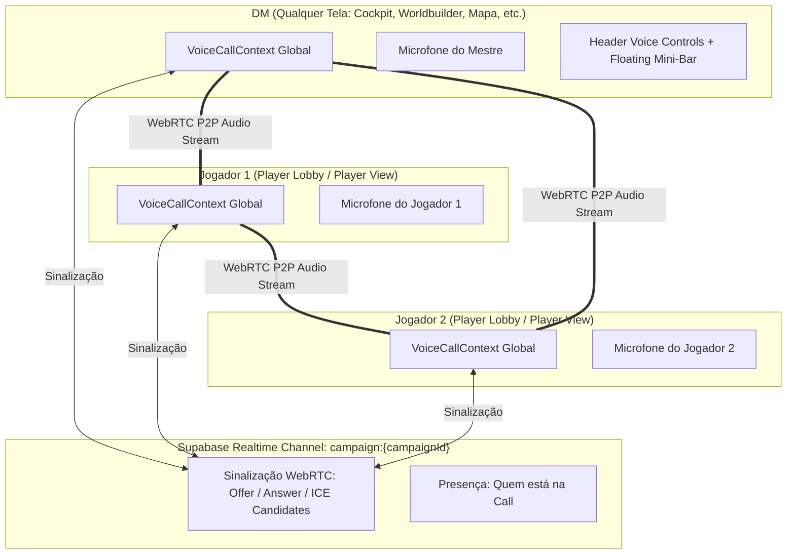

# PLAN: Sistema Global de Transmissão de Áudio e Chamada de Voz (Voice Call) na Campanha

> **Status:** 📝 Em Planejamento | **Prioridade:** 🔴 Alta | **Tipo de Projeto:** WEB (Next.js 16, Supabase Realtime, WebRTC P2P Mesh, Audio API)

---

## 🎯 Visão Geral & Objetivo

Permitir que quando uma sessão de campanha estiver ativa:
1. **Mestre (DM):** Possa falar e escutar os jogadores em **qualquer aba/tela do mestre** (Live Cockpit, Session Studio, Combat Tracker, Worldbuilder, Map Maker, Calendário, Compêndio, etc.), sem que a call caia ao trocar de aba ou abrir modais.
2. **Jogadores (Players):** Possam falar e escutar o mestre e outros jogadores quando estiverem conectados à campanha (Player Lobby, Player View e Modais de Ficha).
3. **Persistência Global:** O ciclo de vida do WebRTC e das conexões de áudio deve residir em um nível de contexto global (`VoiceCallContext` / `AppProviders`), garantindo conexão ininterrupta.
4. **Controles de Áudio Globais:** Widget flutuante / indicador no Header com status do microfone (Mute/Unmute), detecção de voz ativa (VU Meter/Speaking pulse), Push-to-Talk (opcional) e controle de volume individual por participante.

---

## 🏗️ Análise da Arquitetura Atual vs. O Que Falta

### 1. O que já existe no projeto:
- **`lib/voice/WebRTCVoiceManager.ts`**: Gerencia streams locais (`getUserMedia`), `RTCPeerConnection`, criação de nós de áudio Web Audio API para cálculo de VU Meter (nível de voz) e controle de mute local.
- **`lib/voice/VoiceSignalingManager.ts`**: Lida com o signaling P2P Mesh (troca de `offer`, `answer` e `ice-candidate`) utilizando o broadcaster de sinalização.
- **`context/LiveCockpitContext.tsx`**: Já recebe e transmite `voiceSignal` via canais do Supabase Realtime Broadcast.
- **`components/live-cockpit/VoiceChatControls.tsx`**: Componente básico com botão de microfone e status WebRTC.

### 2. O que precisa ser transformado para funcionar globalmente:
- **Desacoplamento do LiveCockpit**: Atualmente, a voz e a presença estão amarradas ao `LiveCockpitContext`. Se o mestre muda para o Worldbuilder ou Mapa, ou se o jogador está fora do cockpit, a voz não deve reiniciar nem ser destruída.
- **`VoiceCallProvider` Dedicado no `AppProviders`**: Manter as conexões WebRTC ativas enquanto a `campaignId` for a mesma, independente da rota ou aba selecionada.
- **Controles de Voz Universais**:
  - Mini-widget no `Header` (barra superior) acessível pelo Mestre e Jogadores em qualquer tela.
  - Floating Voice Bar / Overlay retrátil para ver quem está na call, quem está falando no momento e ajustar volume por participante.
  - Suporte a Push-to-Talk (ex: tecla Espaço ou 'V') e Ativação por Voz (VAD - Voice Activity Detection).
- **Tratamento de Autoplay & Permissões do Navegador**: Gerenciar liberação de áudio com fallback amigável quando o navegador bloquear autoplay de streams remotos.

---

## 📐 Topologia e Fluxo de Comunicação

---

## 📋 Divisão de Tarefas & Arquivos a Modificar / Criar

### Fase 1: Camada de Estado Global de Voz (`VoiceCallContext`)
- **[NEW] `context/VoiceCallContext.tsx`**:
  - Gerenciar o ciclo de vida do `VoiceSignalingManager`.
  - Estados: `isInCall`, `isMuted`, `isDeafened`, `isSpeaking`, `connectedPeers` (com status de quem está falando e volume individual).
  - Preservar o stream de áudio enquanto a campanha estiver selecionada.
- **[MODIFY] `components/AppProviders.tsx`**:
  - Envolver a aplicação com `<VoiceCallProvider>` logo após `CampaignProvider` e `AudioProvider`.

### Fase 2: Robustez e Otimização do WebRTC Manager
- **[MODIFY] `lib/voice/WebRTCVoiceManager.ts`**:
  - Suporte a controle de volume individual (`GainNode`) por peer remoto.
  - Suporte a Deafen (ensurdecer / silenciar áudio recebido).
  - Reconexão automática em caso de queda de ICE candidate.
  - Configuração de servidores STUN públicos padrão (Google STUN) para conexões através de roteadores/NATs domésticos.
- **[MODIFY] `lib/voice/VoiceSignalingManager.ts`**:
  - Sincronização de estado de fala (`isSpeaking`) e entrada/saída de chamada.

### Fase 3: Componentes de Interface Globais
- **[MODIFY] `components/Header.tsx`**:
  - Inserir botão compacto de Chamada de Voz / Microfone diretamente no Header ao lado da identificação da Mesa.
  - Indicação visual de "Na Call (X participantes)" e anel pulsante quando alguém estiver falando.
- **[NEW] `components/voice/VoiceCallFloatingWidget.tsx`**:
  - Widget flutuante minimalista (estilo Discord / Roll20 overlay):
    - Mostra avatares dos participantes conectados.
    - Anel verde pulsante em quem está falando em tempo real.
    - Controle de volume deslizante individual por jogador.
    - Botões rápidos: Mute Mic, Deafen (fones), Configurações de Entrada/Saída, Sair da Call.
- **[MODIFY] `components/PlayerLobby.tsx` & `components/PlayerViewModal.tsx`**:
  - Integrar os controles e feedback de voz de forma fluida para os jogadores.

### Fase 4: Integração com Audio Maestro (Música ambiente x Voz)
- **[MODIFY] `context/AudioContext.tsx` / `AudioMaestro`**:
  - "Audio Ducking": Quando o mestre ou jogador fala, o volume da música de fundo e efeitos sonoros pode opcionalmente reduzir suavemente (ex: -30%) para garantir clareza vocal.

---

## 🧪 Plano de Verificação e Testes

1. **Teste de Persistência na Troca de Telas (DM):**
   - Iniciar call na aba *Live Cockpit*.
   - Navegar para *Worldbuilder*, *Session Studio*, *Combat Tracker*, *Map Maker* e *Calendário*.
   - Garantir que o áudio e a conexão WebRTC continuam transmitindo sem nenhum corte ou reinício de stream.
2. **Teste de Comunicação Bidirecional (DM <-> Jogadores):**
   - Abrir duas abas ou janelas anônimas (1 como Mestre e 1 como Jogador na mesma campanha).
   - Conectar ambos à call.
   - Falar no microfone de uma aba e verificar a saída de áudio e indicação de VU meter na outra.
3. **Teste de Mute e Volume Individual:**
   - Testar o botão de Mute local e verificar que a outra ponta não recebe áudio.
   - Ajustar o slider de volume de um participante específico e validar a alteração na saída do `GainNode`.
