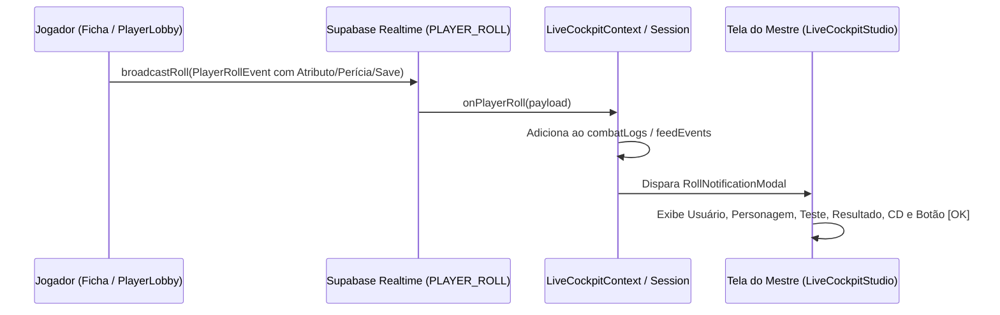

# PLAN: Sincronização de Testes de Atributos, Perícias, Log da Partida & Modal do Mestre

> **Alvo:** Sincronização em tempo real de rolagens da Ficha de Personagem ([`CharacterSheetModal.tsx`](file:///c:/Users/Fred/Documents/game-dev/Masters%20Codex%20-%20The%20Campaign%20Forge%20Tool/components/character-sheet/CharacterSheetModal.tsx)), registro no Log de Combate/Sessão e Alerta em Modal na tela do Mestre ([`LiveCockpitStudio.tsx`](file:///c:/Users/Fred/Documents/game-dev/Masters%20Codex%20-%20The%20Campaign%20Forge%20Tool/components/LiveCockpitStudio.tsx), [`LiveCockpitContext.tsx`](file:///c:/Users/Fred/Documents/game-dev/Masters%20Codex%20-%20The%20Campaign%20Forge%20Tool/context/LiveCockpitContext.tsx)).

---

## 1. Visão Geral do Problema & Diagnóstico

1. **Ausência de Conexão no `PlayerLobby.tsx`**:
   - O componente `<CharacterSheetModal />` em `PlayerLobby.tsx` não estava recebendo as props `broadcastRoll={broadcastPlayerRoll}` e `onRollEvent`.
   - Como resultado, rolagens feitas de dentro da ficha aberta no lobby não eram transmitidas para o canal Realtime (`PLAYER_ROLL`).
2. **Propagação de Testes de Atributos, Perícias e Saves**:
   - Os testes de atributos (Força, Destreza, Constituição, Inteligência, Sabedoria, Carisma), testes de perícias e salvaguardas acionados nas seções da ficha precisam garantir a emissão completa do evento com nome do jogador, nome do personagem, tipo de teste, resultado do d20, bônus, total e dificuldade (CD).
3. **Log de Partida & Alerta Modal para o Mestre**:
   - No Live Cockpit do Mestre, o listener `onPlayerRoll` deve:
     - Inserir a entrada formatada no log de combate/partida.
     - Exibir um modal flutuante de alerta com visual nobre de RPG apresentando:
       - 👤 **Nome do Usuário / Jogador**
       - 🛡️ **Nome do Personagem**
       - 🎲 **Teste Executado** (ex: *Teste de Atributo: Força*, *Perícia: Atletismo*, *Salvaguarda: Destreza*)
       - 📊 **Resultado Numérico** (d20 + modificador = Total)
       - 🎯 **Dificuldade (CD)** e Indicação de Sucesso / Falha (se aplicável)
       - 🔘 **Botão Único "OK"** para fechar o alerta.

---

## 2. Arquitetura da Solução

---

## 3. Estrutura de Mudanças Proposta

### 3.1. Envio de Rolagens em `PlayerLobby.tsx` & `CharacterSheetModal.tsx`
- Em [`components/PlayerLobby.tsx`](file:///c:/Users/Fred/Documents/game-dev/Masters%20Codex%20-%20The%20Campaign%20Forge%20Tool/components/PlayerLobby.tsx):
  - Passar `broadcastRoll={broadcastPlayerRoll}` e `onRollEvent` para `<CharacterSheetModal />`.
- Em [`components/character-sheet/CharacterSheetModal.tsx`](file:///c:/Users/Fred/Documents/game-dev/Masters%20Codex%20-%20The%20Campaign%20Forge%20Tool/components/character-sheet/CharacterSheetModal.tsx):
  - Garantir que todos os cliques de atributos, perícias, saves, iniciativas e ataques passem por `handleRollExecuted` incluindo `playerName` (nome do usuário logado).

### 3.2. Modal de Notificação do Mestre ([`components/live-cockpit/MasterRollAlertModal.tsx`](file:///c:/Users/Fred/Documents/game-dev/Masters%20Codex%20-%20The%20Campaign%20Forge%20Tool/components/live-cockpit/MasterRollAlertModal.tsx))
- Criar componente dedicado com estética dark fantasy, destacando:
  - Header com ícone temático de dado d20 brilhante.
  - Card de identificação: Jogador + Personagem + Avatar.
  - Card central com o Teste Executado e fórmula (`d20(16) + 3 = 19`).
  - Badge de CD e Sucesso/Falha (caso haja CD configurada).
  - Botão largo de confirmação `[ Entendido / OK ]`.

### 3.3. Integração no Live Cockpit & Log ([`LiveCockpitStudio.tsx`](file:///c:/Users/Fred/Documents/game-dev/Masters%20Codex%20-%20The%20Campaign%20Forge%20Tool/components/LiveCockpitStudio.tsx), [`context/LiveCockpitContext.tsx`](file:///c:/Users/Fred/Documents/game-dev/Masters%20Codex%20-%20The%20Campaign%20Forge%20Tool/context/LiveCockpitContext.tsx))
- Em `LiveCockpitContext.tsx`:
  - Armazenar `latestPlayerRollNotification` no estado global do Cockpit.
- Em `LiveCockpitStudio.tsx`:
  - Renderizar `<MasterRollAlertModal />` quando houver uma rolagem pendente.

---

## 4. Fases de Execução

| Fase | Descrição | Arquivos Envolvidos |
|---|---|---|
| **Fase 1** | **Conexão Realtime no Lobby**: Conectar `broadcastRoll` e `playerName` na Ficha aberta pelo Jogador. | `components/PlayerLobby.tsx`, `components/character-sheet/CharacterSheetModal.tsx` |
| **Fase 2** | **Componente do Modal do Mestre**: Criar `MasterRollAlertModal.tsx` com layout limpo e botão [OK]. | `components/live-cockpit/MasterRollAlertModal.tsx` |
| **Fase 3** | **Integração no Cockpit do Mestre**: Disparar o modal no Mestre e garantir o registro no histórico de logs. | `context/LiveCockpitContext.tsx`, `components/LiveCockpitStudio.tsx` |
| **Fase 4** | **Testes & Verificação**: Validar com testes unitários e compilação TypeScript (`npx tsc --noEmit`). | `lib/__tests__/cross-account-realtime-sync.test.ts` |
