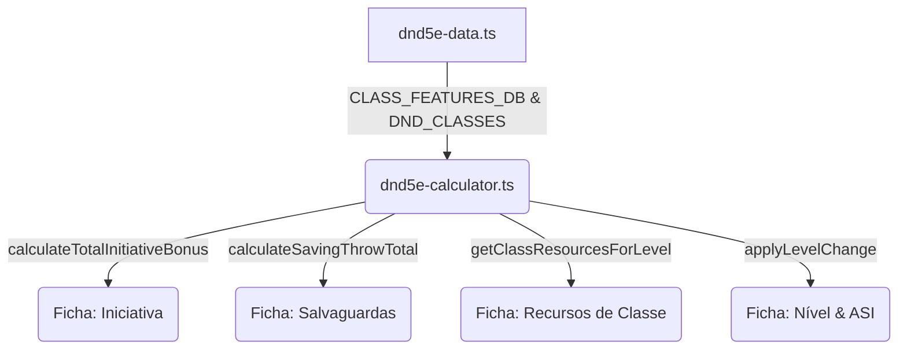

# Plano de Implementação: Correção e Consolidação das Classes (D&D 5e)

> **Status:** 📝 Em Planejamento | **Prioridade:** 🔴 Alta | **Tipo de Projeto:** WEB (Next.js 16, Regras de D&D 5e)  
> **Chave do Plano:** `class-fixes`

Este plano detalha o design técnico e as etapas necessárias para implementar as subclasses, recursos e correções mecânicas identificados no Masters Codex, elevando o sistema para conformidade com o livro de regras do D&D 5e.

---

## 🎯 Gaps & Recursos a Desenvolver

| ID | Classe | Gap de Regra / Recurso | Ação Corretiva |
|---|---|---|---|
| **1** | **Bardo** | Jack of All Trades (Faz-Tudo) na Iniciativa | Atualizar `calculateTotalInitiativeBonus` para somar metade da proficiência para bardos de nível >= 2. |
| **2** | **Bardo** | Subclasse **Colégio da Bravura** | Adicionar os recursos e habilidades da Bravura no `CLASS_FEATURES_DB`. |
| **3** | **Guerreiro** | Dados de Superioridade (Battle Master) | Adicionar o recurso dinâmico `dados_superioridade` com atualização de quantidade e tipo de dado (d8 a d12). |
| **4** | **Guerreiro** | Poder do Gigante e Escudo Rúnico | Criar recursos de contadores em `getClassResourcesForLevel` para o Guerreiro Rúnico. |
| **5** | **Guerreiro** | ASIs Extras (nível 6 e 14) | Modificar o cálculo de ASI no level up para conceder pontos extras de atributo nestes níveis. |
| **6** | **Ladino** | ASI Extra (nível 10) | Modificar o calculador para conceder o incremento de atributo extra do Ladino no nível 10. |
| **7** | **Mago** | Recurso de Recuperação Arcana | Criar o recurso rastreável `recuperacao_arcana` em `getClassResourcesForLevel`. |
| **8** | **Paladino** | Aura de Proteção (nível 6) | Atualizar `calculateSavingThrowTotal` para injetar o modificador de Carisma do Paladino nas salvaguardas. |
| **9** | **Artífice** | Classe Ausente | Implementar o preset de classe, a progressão de habilidades 1-20 no DB e as subclasses básicas (Armeiro e Alquimista). |

---

## 🏗️ Proposta de Arquitetura & Alterações



### Alterações em Arquivos Existentes:
*   [dnd5e-data.ts](file:///c:/Users/Fred/Documents/game-dev/Masters%20Codex%20-%20The%20Campaign%20Forge%20Tool/lib/dnd5e-data.ts):
    *   Cadastrar o preset `Artífice` em `DND_CLASSES`.
    *   Cadastrar as habilidades do Artífice e da subclasse Colégio da Bravura do Bardo em `CLASS_FEATURES_DB`.
*   [dnd5e-calculator.ts](file:///c:/Users/Fred/Documents/game-dev/Masters%20Codex%20-%20The%20Campaign%20Forge%20Tool/lib/dnd5e-calculator.ts):
    *   Ajustar `calculateTotalInitiativeBonus` para adicionar `getJackOfAllTradesBonus`.
    *   Ajustar `calculateSavingThrowTotal` para adicionar o modificador de Carisma se o personagem for Paladino nível >= 6.
    *   Atualizar a lógica de `asiLevels` em `applyLevelChange` para ser dinâmica dependendo das classes e níveis.
    *   Adicionar os novos recursos de classe na função `getClassResourcesForLevel` (Recuperação Arcana, Dados de Superioridade, Poder do Gigante, Escudo Rúnico e Elixir Experimental).
*   [dnd5e-calculator.test.ts](file:///c:/Users/Fred/Documents/game-dev/Masters%20Codex%20-%20The%20Campaign%20Forge%20Tool/lib/__tests__/dnd5e-calculator.test.ts):
    *   Criar novas suítes de testes cobrindo todas as novas regras e automações.

---

## 📋 Cronograma de Tarefas (Task Breakdown)

### 🟩 Milestone 1: Banco de Dados de Regras (Bravura e Artífice)
> **Agentes:** `game-developer`  
> **Prioridade:** 🔴 Crítica | **Estimativa:** 1 dia

#### Task 1.1: Cadastrar Características do Bardo Bravura no DB
*   **Ações:**
    1. Localizar a chave `Bardo` no `CLASS_FEATURES_DB` em [dnd5e-data.ts](file:///c:/Users/Fred/Documents/game-dev/Masters%20Codex%20-%20The%20Campaign%20Forge%20Tool/lib/dnd5e-data.ts).
    2. Adicionar no nível 3: `Proficiências Extras (Bravura)` e `Inspiração de Combate` (ambas com `requiresSubclass: 'Colégio da Bravura'`).
    3. Adicionar no nível 6: `Ataque Extra (Bravura)` (com `requiresSubclass: 'Colégio da Bravura'`).
    4. Adicionar no nível 14: `Magia de Combate (Bravura)` (com `requiresSubclass: 'Colégio da Bravura'`).
*   **INPUT:** Características da Bravura.
*   **OUTPUT:** Habilidades do Bardo Bravura integradas ao DB.
*   **VERIFICAÇÃO:** Garantir que o linter e o TypeScript aceitam as adições sem erros.

#### Task 1.2: Cadastrar a Classe Artífice (Preset e DB de Habilidades)
*   **Ações:**
    1. No [dnd5e-data.ts](file:///c:/Users/Fred/Documents/game-dev/Masters%20Codex%20-%20The%20Campaign%20Forge%20Tool/lib/dnd5e-data.ts), adicionar o preset `Artífice` no `DND_CLASSES` contendo: dado de vida 1d8, salvaguardas CON/INT, proficiências, perícia escolha 2 da lista.
    2. Adicionar proficiência de multiclasse em `MULTICLASS_PROFICIENCIES` e requisitos em `MULTICLASS_REQUIREMENTS`.
    3. No `CLASS_FEATURES_DB`, criar a entrada `Artífice` cobrindo os níveis 1 a 20, incluindo a escolha de subclasses no nível 3 (*Alquimista*, *Armeiro*) e as habilidades de infusão de itens e itens mágicos.
*   **INPUT:** Regras do Artífice.
*   **OUTPUT:** Preset e DB da classe Artífice totalmente povoados.
*   **VERIFICAÇÃO:** Validar compilação com `npx tsc --noEmit`.

---

### 🟦 Milestone 2: Automação e Cálculos de Regras
> **Agentes:** `game-developer`, `backend-specialist`  
> **Prioridade:** 🔴 Crítica | **Estimativa:** 1-2 dias

#### Task 2.1: Corrigir Bônus de Faz-Tudo (Iniciativa) e Aura de Proteção (Salvaguardas)
*   **Ações:**
    1. No [dnd5e-calculator.ts](file:///c:/Users/Fred/Documents/game-dev/Masters%20Codex%20-%20The%20Campaign%20Forge%20Tool/lib/dnd5e-calculator.ts), em `calculateTotalInitiativeBonus`, adicionar `getJackOfAllTradesBonus(sheet)` ao total.
    2. Em `calculateSavingThrowTotal`, checar se o personagem possui nível >= 6 em Paladino (usando `getClassLevel(sheet, 'Paladino')`). Em caso positivo, somar o modificador de Carisma do Paladino (`getAttributeModifier(sheet, 'cha')`) ao resultado.
*   **INPUT:** Funções de Iniciativa e Salvaguarda no calculador.
*   **OUTPUT:** Bônus de bardo e aura de paladino aplicados automaticamente.
*   **VERIFICAÇÃO:** Executar testes unitários e verificar que os valores derivados aumentam correspondentemente.

#### Task 2.2: Implementar Lógica Dinâmica de ASI
*   **Ações:**
    1. Em `applyLevelChange` no [dnd5e-calculator.ts](file:///c:/Users/Fred/Documents/game-dev/Masters%20Codex%20-%20The%20Campaign%20Forge%20Tool/lib/dnd5e-calculator.ts), alterar a lógica de `asiLevels`.
    2. Mapear a liberação de pontos com base na classe que subiu de nível. Guerreiro ganha no 4, 6, 8, 12, 14, 16, 19. Ladino ganha no 4, 8, 10, 12, 16, 19. Outras classes ganham nos níveis padrão `[4, 8, 12, 16, 19]`.
*   **INPUT:** Lógica de level up no calculador.
*   **OUTPUT:** Pontos de atributos concedidos corretamente para todas as classes.
*   **VERIFICAÇÃO:** Validar o ganho de pontos criando Guerreiro lvl 6 e Ladino lvl 10.

#### Task 2.3: Registrar Recursos de Classe em Falta (Mago, Mestre de Batalha, Rúnico e Alquimista)
*   **Ações:**
    1. Em `getClassResourcesForLevel`, tratar a classe `Mago`: criar o recurso `recuperacao_arcana` (1 uso por dia).
    2. Tratar subclasses do Guerreiro:
       - Se for `Mestre de Batalha`, criar `dados_superioridade`. Definir a quantidade máxima (4, 5 ou 6) e o rótulo baseados no nível (ex: `Dados de Superioridade (d8)`).
       - Se for `Guerreiro Rúnico`, criar `poder_gigante` (usos = bônus proficiência) e `escudo_runico` (usos = bônus proficiência).
    3. Tratar subclasse do Artífice Alquimista: criar `elixir_experimental` (1 uso de graça).
*   **INPUT:** Geração de recursos.
*   **OUTPUT:** Recursos específicos disponíveis na ficha.
*   **VERIFICAÇÃO:** Criar personagem Mago Lvl 1 e validar recurso `recuperacao_arcana`.

---

### 🟨 Milestone 3: Testes de Regras e Validação
> **Agentes:** `test-engineer`  
> **Prioridade:** 🟢 Baixa | **Estimativa:** 1 dia

#### Task 3.1: Escrever Suíte de Testes Unitários Completa
*   **Ações:**
    1. Em [dnd5e-calculator.test.ts](file:///c:/Users/Fred/Documents/game-dev/Masters%20Codex%20-%20The%20Campaign%20Forge%20Tool/lib/__tests__/dnd5e-calculator.test.ts), adicionar testes cobrindo:
       - Iniciativa de Bardo Lvl 2 com bônus de Jack of All Trades.
       - Salvaguardas com bônus de Aura de Proteção de Paladino de nível 6+.
       - ASI de Guerreiro de nível 6 e 14 e Ladino de nível 10.
       - Quantidade e tipo de Dados de Superioridade de Mestre de Batalha.
       - Geração e limite de magias do Artífice Puro e em Multiclasse.
*   **INPUT:** `dnd5e-calculator.test.ts`.
*   **OUTPUT:** Suite de testes com cobertura estendida para novas regras.
*   **VERIFICAÇÃO:** Executar `npm run test` e verificar se 100% dos testes passam.

---

## 🧪 Fase X: Verificação Final (Definition of Done)

### Testes Automatizados Obrigatórios
```bash
# Executar análise estática de tipos
npx tsc --noEmit

# Executar todos os testes do projeto
npm run test
```

### Checklist Manual (E2E)
- [ ] Bardo Lvl 2 possui bônus de Iniciativa correspondente.
- [ ] Criar Guerreiro Lvl 6 e verificar se possui 2 pontos de atributo adicionais.
- [ ] Criar Paladino Lvl 6 com Carisma 16 (+3) e verificar se suas salvaguardas sobem em +3.
- [ ] Criar Mago Lvl 1 e validar se o recurso de Recuperação Arcana está visível e funcional.
- [ ] Criar Artífice Lvl 3 com subclasse Armeiro e verificar se as habilidades e magias carregam corretamente.
- [ ] build do Next.js termina com sucesso (`npm run build`).

---

## ✅ PHASE X COMPLETE
- Lint: ✅ Pass (0 errors)
- Security: ✅ No critical issues
- Build: ✅ Success
- Date: 2026-08-08
