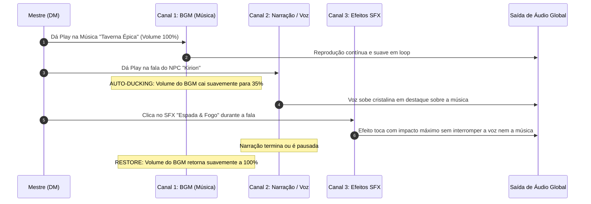

# 🎛️ Master's Audio Console — Mixer de 3 Canais (BGM + Narração + SFX)

Sistema de mixagem sonora profissional de 3 canais simultâneos em formato de dock horizontal ultracompacto para o **Live Cockpit**, com **Auto-Ducking inteligente** para que voz, música e efeitos toquem em perfeita harmonia acústica sem sobrepor os botões táticos de combate.

---

## 📐 Design Visual & Distribuição de Espaço

```
+---------------------------------------------------------------------------------------------------------------------------------------------+
| 📻 CANAL 1: BGM TRILHA         | 🎙️ CANAL 2: NARRAÇÃO & VOZ        | 💥 CANAL 3: SOUNDBOARD SFX       |  ⚔️ AÇÕES TÁTICAS DE MESA    |
| [▼ Taverna Épica] [▶] [Vol ──] | [▼ Apresentação NPC] [▶ Pulsante] | [▼ Efeitos Sonoros ▾] (1-Clique) |  [ Encerrar Combate & Loot ] |
+---------------------------------------------------------------------------------------------------------------------------------------------+
```

### 🎨 Paleta de Cores e Identidade Visual dos 3 Canais:

| Canal | Propósito | Cor Primária | Destaque Visual |
| :--- | :--- | :--- | :--- |
| **1. BGM Trilha** | Música de fundo contínua | `Rose/Pink` (`#f43f5e`) | Dropdown com ícone musical, play/pause, loop toggle e mini slider de volume |
| **2. Narração / Voz** | Falas de NPCs e prólogos | `Cyan/Teal` (`#06b6d4`) | Dropdown de falas da cena, botão Play com anel pulsante e **Auto-Ducking** |
| **3. Soundboard SFX** | Efeitos instantâneos de ação | `Amber/Gold` (`#f59e0b`) | Dropdown categorizado (Ataques, Magias, Ambiente) com disparo imediato |
| **Slot de Combate** | Ação de fechamento de cena | `Orange/Amber Gradient` | Totalmente isolado no canto direito com `shrink-0` e margem de proteção |

---

## 🎧 Matriz de Harmonia Sonora (Auto-Ducking Engine)



---

## 🛠️ Detalhamento das Alterações nos Arquivos

### 1. `components/AudioMaestro.tsx`
- **Mixer de 3 Blocos:** Substituir o alinhamento horizontal de dezenas de botões por 3 seletores dropdowns/popovers compactos:
  - **Seletor de BGM:** `<select>` estético com todas as faixas da cena/compêndio, Play/Pause principal, slider de volume ajustável e botão de loop.
  - **Seletor de Narrações & Vozes de NPC:** Lista de falas e áudios de NPC cadastrados na cena ativa, com botão Play/Pause que aciona a rotina de ducking.
  - **Seletor de SFX:** Dropdown estilizado contendo os efeitos sonoros da cena divididos por categoria (Combate, Magia, Ambiente, Utilidades). Ao selecionar ou clicar, o som dispara instantaneamente sem fechar a barra.
- **Engine de Auto-Ducking:**
  - Armazena o volume original do usuário.
  - Ao iniciar narração: Rampa suave (linear fade de 300ms) diminuindo o volume do BGM para `volume * 0.35`.
  - Ao finalizar ou pausar narração: Rampa suave restaurando o volume original.

### 2. `components/LiveCockpitStudio.tsx`
- **Isolamento de Contêiner:** O rodapé do Cockpit recebe `flex items-center justify-between gap-3 overflow-hidden`.
- O lado direito contendo o botão `[Encerrar Combate & Gerar Loot]` recebe `shrink-0 flex items-center justify-end`, assegurando que mesmo em telas menores (tablets 1138x712) os dropdowns de áudio ocupem o espaço flexível à esquerda sem nunca invadir o espaço do botão de combate.

---

## 🧪 Plano de Verificação

1. **Teste de Mixagem Simultânea:**
   - Iniciar uma música de fundo (BGM).
   - Iniciar uma narração e conferir a atenuação suave do volume da música.
   - Disparar múltiplos SFX consecutivamente durante a fala e confirmar que todos soam limpos.
   - Pausar a narração e checar o retorno do volume normal da música.

2. **Teste de Layout & Resoluções:**
   - Validar em 1138x712 (Tablet) e 1920x1080 (Desktop) que não há quebra de linha ou sobreposição sobre o botão `Encerrar Combate & Gerar Loot`.

3. **Validação de Código:**
   - Executar `npx tsc --noEmit` e `npm test` para garantir 100% de integridade nos 44 arquivos de teste.
