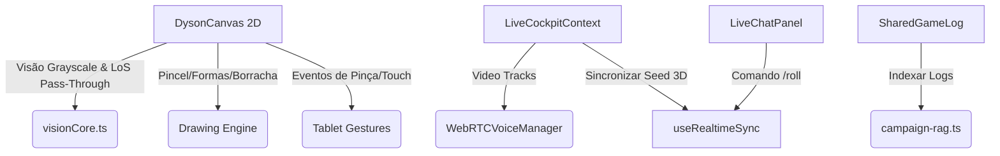

# Plano de Implementação: Conclusão das 11 Funcionalidades Parciais

> **Status:** 📝 Em Planejamento | **Prioridade:** 🔴 Alta | **Tipo de Projeto:** WEB (Next.js 16, Supabase, WebRTC, Canvas 2D, Three.js)  
> **Chave do Plano:** `complete-partial-features`

Este plano detalha o design técnico e as etapas necessárias para finalizar e consolidar as **11 funcionalidades parcialmente implementadas** do Masters Codex, com base nas escolhas e respostas de escopo fornecidas pelo usuário.

---

## 🎯 Gaps & Recursos a Desenvolver

| ID | Funcionalidade Parcial | Escopo & Regra de Negócio |
|---|---|---|
| **1** | **Visão por Modo (Darkvision/Blindsight/Tremorsense)** | - **Darkvision:** Holofote cinza/monocromático em vez de luz colorida.<br>- **Blindsight / Tremorsense:** Passa a atravessar paredes na checagem de LoS de monstros. |
| **2** | **Dados 3D Animados Compartilhados** | Sincronizar o rolar de dados transmitindo o seed/estado físico via Supabase para que a simulação física rode em todos os navegadores simultaneamente. |
| **3** | **Ferramentas de Desenho no VTT (2D)** | Adicionar ferramentas de desenho direto no mapa (Lápis à mão livre, formas como círculos e retângulos, borracha, textos e desfazer/ctrl+z). |
| **4** | **Notebook do Mestre (Quick Notes)** | Adicionar um painel lateral/gaveta persistente no DM Cockpit para anotações rápidas e globais do mestre com salvamento automático. |
| **5** | **RAG & Histórico de Campanha** | Indexar automaticamente os logs de chat de texto e os recaps de sessão no banco vetorial RAG para que a IA lembre das ações passadas dos jogadores. |
| **6** | **Vídeo WebRTC Integrado** | Expandir o WebRTC para permitir transmissão de vídeo de webcam em grade flexível ao lado do áudio e estabilização de conexão. |
| **7** | **Tags/Etiquetas no Worldbuilding** | Adicionar suporte a custom tags/etiquetas de livre digitação para melhor busca de NPCs, Locais e Lore. |
| **8** | **Multi-map & Andares do Cockpit** | Polir e estabilizar a troca de andares/mapas múltiplos de cena com recarregamento ágil de grid e sincronização transparente para o jogador. |
| **9** | **Touch-friendly para Tablets** | Adicionar gestos mobile (pinça para zoom, arrastar tokens com touch, alternância rápida de ferramenta por toque). |
| **10** | **Character Builder Wizard** | Validar e polir o fluxo de criação rápida passo-a-passo. |
| **11** | **ASI (Ability Score Improvement)** | Garantir recalque total e sem fricção de modificadores e bônus derivados no level up. |

---

## 🏗️ Proposta de Arquitetura & Alterações



### Alterações em Arquivos Existentes:
*   [visionCore.ts](file:///c:/Users/Fred/Documents/game-dev/Masters%20Codex%20-%20The%20Campaign%20Forge%20Tool/components/map/visionCore.ts): Alterar `computeVisibilityPolygon` e `hasLineOfSight` para ignorar paredes se a visão for blindsight/tremorsense.
*   [DysonCanvas.tsx](file:///c:/Users/Fred/Documents/game-dev/Masters%20Codex%20-%20The%20Campaign%20Forge%20Tool/components/map/DysonCanvas.tsx):
    *   Injetar filtros CSS de escala de cinza (`filter = 'grayscale(100%)'`) ao desenhar a máscara de luz do Darkvision.
    *   Adicionar handlers de toque (`onTouchStart`, `onTouchMove`, `onTouchEnd`) para cálculo de distância entre dedos (zoom) e arrasto suave de tokens.
    *   Implementar canvas overlay temporário para ações de desenho livre e formas vetoriais.
*   [useRealtimeSync.ts](file:///c:/Users/Fred/Documents/game-dev/Masters%20Codex%20-%20The%20Campaign%20Forge%20Tool/lib/hooks/useRealtimeSync.ts):
    *   Adicionar evento `DRAWING_ACTION` contendo vetor de traço `{ tool, color, points, text }`.
    *   Adicionar payload de seed físico no `DICE_ROLL` / `DICE_3D_BURST`.
*   [WebRTCVoiceManager.ts](file:///c:/Users/Fred/Documents/game-dev/Masters%20Codex%20-%20The%20Campaign%20Forge%20Tool/lib/voice/WebRTCVoiceManager.ts): Adicionar suporte a `addTrack` de stream de vídeo de câmera obtido via `getUserMedia`.

---

## 📋 Cronograma de Tarefas (Task Breakdown)

### 🟩 Milestone 1: Visão & VTT 2D Avançado (Visões, Desenho e Tablet)
> **Agentes:** `frontend-specialist`, `game-developer`  
> **Prioridade:** 🔴 Crítica | **Estimativa:** 3 dias

#### Task 1.1: Implementação de Blindsight/Tremorsense e Grayscale Darkvision
*   **Ações:**
    1. No [visionCore.ts](file:///c:/Users/Fred/Documents/game-dev/Masters%20Codex%20-%20The%20Campaign%20Forge%20Tool/components/map/visionCore.ts), ler o `VisionType` do combatente ativo na função `hasLineOfSight`. Se for `blindsight` ou `tremorsense`, pular as checagens de colisão de paredes e retornar `true` dentro do alcance.
    2. No [DysonCanvas.tsx](file:///c:/Users/Fred/Documents/game-dev/Masters%20Codex%20-%20The%20Campaign%20Forge%20Tool/components/map/DysonCanvas.tsx) na renderização da máscara de luz do token, se `visionType === 'darkvision'`, setar `maskCtx.filter = 'grayscale(100%)'` temporariamente para aquele holofote.
*   **INPUT:** `Combatant` com `visionType: 'darkvision' | 'blindsight'`
*   **OUTPUT:** Raycasting e rendering do canvas alterados conforme o modo de visão.
*   **VERIFICAÇÃO:** Colocar monstro atrás de parede com Blindsight → ele se torna visível para o DM mesmo sob névoa densa. Ativar Darkvision no jogador → visualização fica em tons de cinza na área iluminada.

#### Task 1.2: Desenho Livre e Formas Vetoriais com Sincronização Real-time
*   **Ações:**
    1. Criar novo estado `drawingLayers` em `DysonCanvas` para gerenciar traços.
    2. Adicionar modos de ferramenta: lápis livre, círculo, retângulo, borracha e caixa de texto.
    3. Ao desenhar, transmitir o traço via `DRAWING_ACTION` no Supabase Realtime para renderização instantânea nas outras telas.
    4. Implementar pilha de histórico simples (Ctrl+Z / Undo).
*   **INPUT:** Cliques e movimentos do mouse com a ferramenta de desenho ativa.
*   **OUTPUT:** Camada de desenho no canvas renderizada e replicada em tempo real para os jogadores.
*   **VERIFICAÇÃO:** Desenhar um círculo vermelho como DM → jogador vê o mesmo círculo no exato local em tempo real.

#### Task 1.3: Gestos de Toque e Zoom em Tablets (Touch Support)
*   **Ações:**
    1. Adicionar listeners para eventos touch no canvas.
    2. Calcular distância vetorial entre dois dedos para atualizar o estado `zoom` proporcionalmente.
    3. Permitir arraste de tokens detectando `touch` no raio do token.
*   **INPUT:** Eventos de `onTouchStart`/`onTouchMove` do navegador.
*   **OUTPUT:** Zoom com gesto de pinça e arraste responsivo de tokens.
*   **VERIFICAÇÃO:** Abrir no tablet/simulador mobile → arrastar token e fazer gesto de pinça para ampliar o mapa sem quebras.

---

### 🟦 Milestone 2: Sincronização 3D de Dados & Vídeo WebRTC
> **Agentes:** `frontend-specialist`, `backend-specialist`  
> **Prioridade:** 🔴 Crítica | **Estimativa:** 2-3 dias

#### Task 2.1: Sincronização de Simulação Física de Dados 3D
*   **Ações:**
    1. Alterar `Dice3DCanvas.tsx` para aceitar um `physicsSeed` gerado na rolagem.
    2. Transmitir o `physicsSeed` e força do lançamento no evento `DICE_ROLL`.
    3. Nos clientes receptores, injetar o seed na simulação física local da Cannon.js para reproduzir a exata rolagem e resultado no mesmo local da tela.
*   **INPUT:** Rolagem de dado física iniciada.
*   **OUTPUT:** Evento sincronizado com vetor de física.
*   **VERIFICAÇÃO:** Jogador rola dado → Todos na mesa assistem o dado 3D rolar e cair com o mesmo resultado e posição.

#### Task 2.2: Adição de Vídeo Webcam no WebRTC
*   **Ações:**
    1. Solicitar vídeo de câmera ao chamar `getUserMedia` se a câmera estiver habilitada no painel.
    2. Injetar trilhas de vídeo (`videoTracks`) no peer connection em [WebRTCVoiceManager.ts](file:///c:/Users/Fred/Documents/game-dev/Masters%20Codex%20-%20The%20Campaign%20Forge%20Tool/lib/voice/WebRTCVoiceManager.ts).
    3. Criar uma grade de vídeo flexível flutuante no component [VoiceChatControls.tsx](file:///c:/Users/Fred/Documents/game-dev/Masters%20Codex%20-%20The%20Campaign%20Forge%20Tool/components/live-cockpit/VoiceChatControls.tsx) exibindo as webcams dos participantes online.
*   **INPUT:** Clique no botão "Ativar Câmera" do chat.
*   **OUTPUT:** Transmissão P2P de vídeo fluindo entre jogadores conectados.
*   **VERIFICAÇÃO:** Conectar dois navegadores, ligar webcam em ambos → ambas as imagens aparecem na barra superior do cockpit.

---

### 🟨 Milestone 3: Worldbuilding & Lore Tools (Notebook e Custom Tags)
> **Agentes:** `frontend-specialist`, `database-architect`  
> **Prioridade:** 🟠 Alta | **Estimativa:** 2 dias

#### Task 3.1: Gaveta de Anotações do Mestre (DM Notebook) no Live Cockpit
*   **Ações:**
    1. Criar o componente `DMNotebookDrawer.tsx` contendo editor de texto rico com suporte a Markdown.
    2. Integrá-lo como painel expansível/gaveta deslizante na direita do [LiveCockpitStudio.tsx](file:///c:/Users/Fred/Documents/game-dev/Masters%20Codex%20-%20The%20Campaign%20Forge%20Tool/components/LiveCockpitStudio.tsx).
    3. Salvar o estado do notebook no Supabase na tabela `campaigns` (coluna `dm_notes`) com debounce para auto-salvamento rápido.
*   **INPUT:** Texto digitado no notebook.
*   **OUTPUT:** Gaveta acessível pelo botão de caderno no Cockpit, sincronizando com o banco.
*   **VERIFICAÇÃO:** Digitar nota → recarregar a página → a nota continua salva no notebook do mestre.

#### Task 3.2: Sistema de Tags/Etiquetas no Worldbuilder
*   **Ações:**
    1. Adicionar campo `tags` (array de strings) no modelo de dados do `WorldEntity`.
    2. No [WorldEntityModal.tsx](file:///c:/Users/Fred/Documents/game-dev/Masters%20Codex%20-%20The%20Campaign%20Forge%20Tool/components/WorldEntityModal.tsx), adicionar campo de input estilo *badge chips* para inserção de tags.
    3. Indexar tags no banco de dados e habilitar busca de entidades por tag na barra de pesquisa do Worldbuilder.
*   **INPUT:** Tags de texto inseridas na ficha da entidade de lore.
*   **OUTPUT:** Campo de tag na entidade e lógica de filtro.
*   **VERIFICAÇÃO:** Adicionar tag "Vampiro" em um NPC → Buscar por "Vampiro" e encontrar a entidade.

---

### 🟪 Milestone 4: RAG Inteligente e Histórico de Sessões
> **Agentes:** `backend-specialist`  
> **Prioridade:** 🟠 Alta | **Estimativa:** 2 dias

#### Task 4.1: Indexar Logs de Chat de Texto e Recaps no Banco Vetorial
*   **Ações:**
    1. Adicionar cron/rotina de segundo plano que agrupa as mensagens de chat da sessão a cada 10 minutos.
    2. Enviar o bloco de texto consolidado para gerar embedding vetorial e salvar na tabela `campaign_history_embeddings` do Supabase.
    3. Atualizar o [campaign-rag.ts](file:///c:/Users/Fred/Documents/game-dev/Masters%20Codex%20-%20The%20Campaign%20Forge%20Tool/lib/ai/campaign-rag.ts) para realizar busca semântica em duas frentes: embeddings de lore (Mundo) e embeddings de histórico (Chat/Recap), fundindo-os no prompt do Gemini.
*   **INPUT:** Logs de chat salvos.
*   **OUTPUT:** Embeddings de logs gerados e injetados nos prompts do AI Co-Pilot.
*   **VERIFICAÇÃO:** Perguntar ao Co-Pilot: "O que os jogadores decidiram sobre o enigma na última sala?" → IA responde com base no histórico de conversas do chat.

---

### 🟦 Milestone 5: Validação do Level Up, ASI e Multi-map
> **Agentes:** `frontend-specialist`, `qa-automation-engineer`  
> **Prioridade:** 🟢 Baixa | **Estimativa:** 1-2 dias

#### Task 5.1: Auditoria do Sistema de Level Up, ASI e Classes
*   **Ações:**
    1. Executar testes e validar o fluxo do [LevelUpModal.tsx](file:///c:/Users/Fred/Documents/game-dev/Masters%20Codex%20-%20The%20Campaign%20Forge%20Tool/components/character-sheet/Modals/LevelUpModal.tsx) garantindo que os modificadores dos atributos sobem de forma coerente após a seleção de ASI e refletem na ficha mobile em tempo real.
*   **VERIFICAÇÃO:** Rolar testes com classe Conjuradora pura e multiclasse.

#### Task 5.2: Polimento de Andares e Múltiplos Mapas
*   **Ações:**
    1. Polir a interface de transição de andares no [CockpitDungeonMap.tsx](file:///c:/Users/Fred/Documents/game-dev/Masters%20Codex%20-%20The%20Campaign%20Forge%20Tool/components/live-cockpit/CockpitDungeonMap.tsx).
    2. Assegurar que ao alternar mapas, o estado das posições dos tokens e a névoa de guerra daquele grid específico sejam carregados de forma suave e sincronizados sem delay para o PlayerView.
*   **VERIFICAÇÃO:** Trocar de mapa rápido (3 vezes seguidas) → verificar se PlayerView acompanha a troca corretamente.

---

## 🧪 Fase X: Verificação Final (Definition of Done)

### Testes Automatizados Obrigatórios
```bash
# Executar análise estática de tipos
npx tsc --noEmit

# Executar testes unitários do RAG e do parser de comandos
npm run test
```

### Checklist Manual (E2E)
- [ ] Visão Blindsight atravessa paredes e detecta oponentes no canvas 2D.
- [ ] Desenho livre sincroniza imediatamente entre DM e Player.
- [ ] Fazer gesto de pinça no celular/tablet faz zoom de mapa no DysonCanvas.
- [ ] Webcam de vídeo carrega em conexão P2P no painel superior de voz.
- [ ] Notebook do mestre abre e grava texto sem perda.
- [ ] RAG responde perguntas lembrando de diálogos do chat.
- [ ] build do Next.js termina com sucesso (`npm run build`).

---

## ✅ PHASE X COMPLETE
- Lint: ⬜
- Security: ⬜
- Build: ⬜
- Date: [Aguardando Aprovação]
