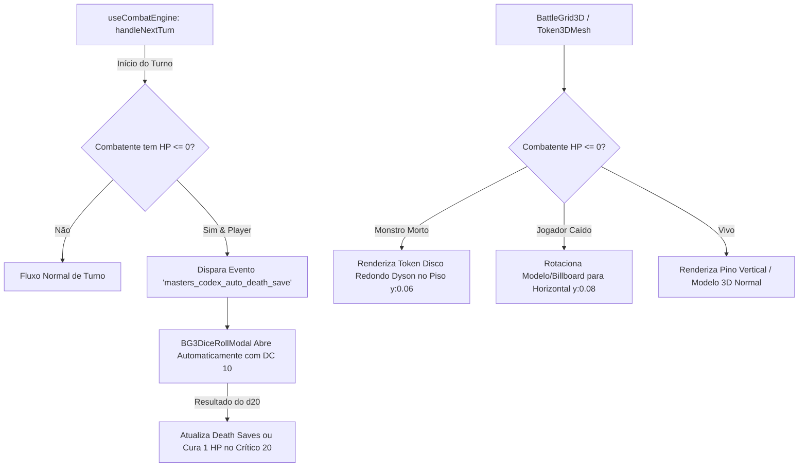

# Plano de Implementação: Tokens de Morte no Grid 3D e Automação de Death Saves

## 1. Visão Geral do Recurso

Aprimorar a fidelidade tática, visual e de regras do VTT 3D e Live Cockpit através de:
1. **Tokens de Monstros Mortos (Estilo Dyson Token)**: Quando uma criatura/monstro atinge 0 HP (ou condição 'Morto'), sua miniatura vertical/3D é substituída por um token de moeda/disco redondo no chão com a foto da criatura, borda estilizada e filtro de morte, elevado ligeiramente acima do piso (`y: 0.06`) para evitar z-fighting e cliping, permanecendo interagível para magias de ressurreição, necrofilia/saque e habilidades táticas.
2. **Jogadores Caídos no Chão (Horizontal/Prone)**: Quando um personagem jogador atinge 0 HP, seu pino/modelo 3D é reorientado para a horizontal (deitado rente ao solo, elevado `y: 0.08` para não clipar), simulando o personagem caído inconsciente.
3. **Automação de Death Saves ao Iniciar Turno**: Sempre que o turno passar para um jogador com 0 HP, o sistema abre automaticamente o modal de dados 3D (`BG3DiceRollModal`) para o Teste de Resistência Contra a Morte (Death Saving Throw - DC 10), aplicando as regras oficiais do D&D 5e (1 = 2 falhas, 2-9 = 1 falha, 10-19 = 1 sucesso, 20 = cura 1 HP e acorda).

---

## 2. Análise Arquitetural & Componentes Afetados

### Arquivos Principais Envolvidos:
1. **`components/battle-3d/Token3DMesh.tsx`**:
   - Criação da malha de disco Dyson (`CylinderGeometry` / `CircleGeometry`) com a arte da criatura, anel escuro/vinheta e ícone sutil de caveira quando `combatant.type === 'monster' && (combatant.hp <= 0 || isDead)`.
   - Rotação do Billboard 2D ou Modelo GLTF 3D para orientação deitada (`rotation.x = -Math.PI / 2` ou `rotation.z = Math.PI / 2` e offset em Y seguro) quando `combatant.type === 'player' && combatant.hp <= 0`.
   - Atualização no `updateTokenMeshState` para transições reativas imediatas caso o HP mude durante o combate.

2. **`components/BattleGrid3D.tsx`**:
   - Manter a interatividade do token morto/caído (raios de seleção, alvo de magia/cura/ressurreição, hover e clique para abrir menu de contexto).
   - Ajustar o anel de seleção para se adequar ao token achatado no chão.

3. **`lib/hooks/useCombatEngine.ts`**:
   - No `handleNextTurn` e `handleHpChange`, verificar se o combatente atual é jogador e está com `hp <= 0`.
   - Se ainda não tiver 3 sucessos (estabilizado) nem 3 falhas (morto), despachar evento `masters_codex_trigger_death_save` com os dados do combatente.

4. **`components/live-cockpit/BG3DiceRollModal.tsx` & `LiveCockpitStudio.tsx` / `PlayerLobby.tsx`**:
   - Escutar o evento de Death Save automático e abrir o modal com a configuração de D20 de Death Save.
   - Ao rolar o dado:
     - **Nat 1**: 2 Falhas.
     - **2 a 9**: 1 Falha.
     - **10 a 19**: 1 Sucesso.
     - **Nat 20**: 1 HP restaurado imediatamente, recupera a consciência e o modelo 3D/token volta a ficar de pé!
   - Sincronizar com a ficha do personagem no `localStorage` / backend em tempo real.

---

## 3. Tarefas de Implementação

### Fase 1: Renderização 3D de Tokens Mortos e Caídos (`Token3DMesh.tsx`)
- [ ] Implementar a função geradora de malha `createDeadMonsterTokenMesh(options, sizeScale)`:
  - Disco cilíndrico chanfrado (raio de acordo com tamanho da criatura, altura ~0.08, `y = 0.05`).
  - Textura superior com a imagem da criatura (`combatImageUrl` / `tokenImageUrl` / `avatarUrl`), com anel de pedra/metal estilo Dyson e filtro cinza/escuro com ícone de caveira.
- [ ] Implementar suporte a jogador caído (Prone / Inconsciente):
  - Billboard 2D deitado no plano XZ (`rotation.x = -Math.PI / 2`, `position.y = 0.08`).
  - Modelo GLTF 3D rotacionado deitado suavemente com compensação de centro de massa para não afundar no chão.
- [ ] Atualizar `updateTokenMeshState` para alternar dinamicamente entre estado vivo, caído e morto sem recriar a cena do zero.

### Fase 2: Automação de Death Saves no Live Cockpit & Player View
- [ ] No `useCombatEngine.ts`, disparar evento de verificação de Death Save no início do turno de jogadores com 0 HP.
- [ ] Configurar `BG3DiceRollModal.tsx` para processar Death Saving Throws:
  - Exibir título temático *"Teste Contra a Morte - [Nome do Jogador]"*.
  - Exibir contadores visuais de Sucessos (O O O) e Falhas (X X X).
  - Aplicar regras oficiais de D&D 5e com log no chat e floating combat text.
  - No Nat 20: Restaurar `hp: 1`, remover condição Inconsciente e resetar death saves para 0/0.

### Fase 3: Validação, Testes e Polimento
- [ ] Testes automatizados no `token-mesh.test.ts` e `useCombatEngine.test.ts`.
- [ ] Teste de interação no grid 3D: verificar se magias como *Revivify*, *Cure Wounds* e *Spare the Dying* podem mirar no token morto/caído.
- [ ] Verificação visual de não-cliping em diferentes tipos de terrenos e elevações.
