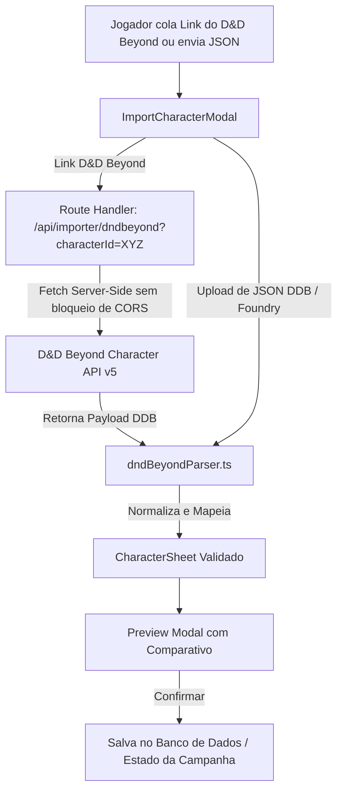

# PLAN-dndbeyond-importer.md - Importador de Fichas (D&D Beyond & Foundry JSON)

> **Status:** 🎯 Planejado  
> **Impacto:** ⭐⭐⭐⭐ (Elimina a maior barreira de entrada para mestres e jogadores migrarem campanhas)  
> **Complexidade:** Média  
> **Endpoints:** `/api/importer/dndbeyond`  
> **Componentes:** `ImportCharacterModal.tsx`, `lib/importers/dndBeyondParser.ts`, `lib/importers/foundryParser.ts`

---

## 📌 1. Visão Geral & Objetivo

Permitir que jogadores e mestres tragam seus personagens prontos do **D&D Beyond** (via link público ou ID do personagem) ou de arquivos **JSON exportados do D&D Beyond / Foundry VTT** diretamente para o Masters Codex em segundos.

### Principais Benefícios:
1. **Importação Instantânea por Link**: O jogador apenas cola `https://www.dndbeyond.com/characters/12345678` e o sistema puxa todos os dados automaticamente.
2. **Importação por Arquivo / Texto JSON**: Fallback completo caso a ficha seja privada ou o usuário possua um backup JSON.
3. **Mapeamento Abrangente e Preciso**:
   - Atributos base + bônus raciais, itens mágicos e ASIs.
   - Perícias (Proficiência, Meia-Proficiência do Bardo, Expertise do Ladino).
   - Classe, Subclasse, Multiclasse, Nível e Dados de Vida.
   - Pontos de Vida (HP Máximo, Atual e Temporário).
   - Magias Conhecidas/Preparadas e Espaços de Magia (Spell Slots).
   - Equipamentos equipados, Armas, Armaduras e Moedas (PC, PP, PE, PO, PL).
   - Personalidade, Ideais, Vínculos, Defeitos, Aparência, Lore e Avatar.
4. **Resolução de Conflitos & Preview**: Modal com tela de confirmação/preview antes de salvar a ficha na campanha.

---

## 🏗️ 2. Arquitetura da Solução



---

## 🧩 3. Detalhamento do Parser D&D Beyond (`lib/importers/dndBeyondParser.ts`)

O D&D Beyond armazena fichas em uma estrutura de dados aninhada com modificadores (`modifiers.race`, `modifiers.class`, `modifiers.item`, etc.). O parser resolverá:

### 1. Identidade e Raça:
- `character.name` ➔ `characterName`
- `character.decorations.avatarUrl` ➔ `avatarUrl`
- `character.classes` ➔ Extrai classe primária, nível total e multiclasses (`CharacterClassProgress[]`).
- `character.race.fullName` ➔ `race` + `subrace`
- `character.background.definition.name` ➔ `background`
- `character.alignmentId` ➔ Converte ID numérico para 'Leal e Bom', 'Caótico e Neutro', etc.

### 2. Atributos e Modificadores:
- `stats` (STR=1, DEX=2, CON=3, INT=4, WIS=5, CHA=6) + `bonusStats` + `overrideStats`.
- Cálculo somatório de modificadores raciais, talentos e itens equipados para definir o valor final de cada atributo (1-30).

### 3. Perícias & Salvaguardas:
- Mapeamento das 18 perícias do D&D 5e:
  - Tipo `proficiency` (tipo 2) ➔ `proficient`
  - Tipo `expertise` (tipo 3) ➔ `expertise`
  - Tipo `half-proficiency` (tipo 1) ➔ `half`
  - Sem modificador ➔ `none`
- Salvaguardas das classes base marcadas como proficientes.

### 4. Combate & HP:
- `baseHitPoints` + (CON mod * nível) + `bonusHitPoints` ➔ `maxHp`.
- `currentHp = maxHp - removedHitPoints`.
- CA: Calcula 10 + Mod DEX ou armadura equipada + escudo.
- Dados de vida: `hitDiceTotal` formatado como `${level}d${hitDie}`.

### 5. Equipamentos, Armas e Riquezas:
- Itera sobre `character.inventory`:
  - Itens com `definition.filterType === 'Weapon'` ➔ Mapeia para `attacks` (com dano, tipo e bônus de ataque) e `equipment`.
  - Itens com `definition.filterType === 'Armor'` ➔ Mapeia para armadura equipada e CA.
  - Outros itens ➔ `equipment` (com quantidade, peso e descrição).
- Moedas: `currencies.cp`, `sp`, `ep`, `gp`, `pp` ➔ `currency`.

### 6. Magias e Espaços (Spellcasting):
- Extrai magias conhecidas/preparadas de `classSpells`, `spells.race`, `spells.feat`, `spells.item`.
- Mapeia nomes de magias em inglês para a base SRD em português do Masters Codex quando houver correspondência exata.
- Espaços de magia calculados com base na tabela de conjuração da classe e nível.

---

## 📂 4. Estrutura de Arquivos

```
app/
└── api/
    └── importer/
        └── dndbeyond/
            └── route.ts             # Proxy server-side para buscar dados da API do DDB sem erro de CORS
lib/
└── importers/
    ├── dndBeyondParser.ts           # Motor de parsing e conversão DDB JSON -> CharacterSheet
    ├── dndBeyondTypes.ts            # Tipagens do payload bruto da API v5 do DDB
    ├── dndBeyondMappings.ts         # Tabelas de conversão (alinhamentos, IDs de perícias, escolas de magia)
    └── foundryParser.ts             # Parser para fichas exportadas do Foundry VTT (módulo ddb-importer)
components/
└── character-sheet/
    ├── ImportCharacterModal.tsx     # Modal moderno com abas: "Link D&D Beyond" e "Upload JSON"
    └── CharacterImportPreview.tsx   # Card de pré-visualização da ficha importada antes de salvar
```

---

## 📋 5. Tarefas de Implementação

### Fase 1: Motor de Parsing & Mapeamentos (`lib/importers/`)
- [ ] Criar `dndBeyondTypes.ts` com as interfaces do payload `character-service.dndbeyond.com`.
- [ ] Criar `dndBeyondMappings.ts` (mapeamento de IDs de atributos, perícias, alinhamentos e moedas).
- [ ] Implementar `dndBeyondParser.ts`:
  - Extração de cabeçalho, avatar e classes.
  - Cálculo de atributos finais com modificadores.
  - Cálculo de HP, CA, Iniciativa e Deslocamento.
  - Mapeamento de perícias e salvaguardas.
  - Mapeamento de magias, ataques e inventário.
- [ ] Implementar testes unitários exaustivos com payloads reais em `lib/__tests__/dndbeyond-importer.test.ts`.

### Fase 2: Rota de API Proxy (`app/api/importer/dndbeyond/route.ts`)
- [ ] Extrair ID do personagem a partir de URLs completas (`https://www.dndbeyond.com/characters/12345678`) ou apenas dígitos numéricos.
- [ ] Chamar `https://character-service.dndbeyond.com/character/v5/character/{id}` com headers adequados.
- [ ] Tratamento de erros:
  - Ficha privada / Não encontrada (Status 404 / 403) com mensagem amigável ao usuário ("A ficha precisa estar configurada como Pública no D&D Beyond").
  - Timeout e validação de schema.

### Fase 3: Interface do Usuário (`components/character-sheet/`)
- [ ] Criar `ImportCharacterModal.tsx`:
  - Aba 1: **Link Direto do D&D Beyond** (Input com detecção automática de URL e botão "Buscar Personagem").
  - Aba 2: **Colar ou Fazer Upload de JSON** (Drag & drop de arquivo `.json` ou textarea).
  - Estado de carregamento com spinner temático e barra de progresso.
- [ ] Criar `CharacterImportPreview.tsx`:
  - Exibe avatar, nome, raça, classe, nível, HP, CA e atributos principais antes de salvar.
  - Botão "Confirmar e Criar Ficha" e "Cancelar".
- [ ] Integrar o botão **"Importar D&D Beyond"** no `CharacterSheetModal.tsx` e no fluxo de criação de personagens da campanha (`PlayerLobby.tsx` / `Worldbuilder`).

---

## 🧪 6. Plano de Verificação

1. **Testes Unitários Automatizados**:
   - Parser com Personagem Nível 1 (Bárbaro Humano simples).
   - Parser com Personagem Nível 10 Conjurador (Mago Elfo com magias preparadas e slots).
   - Parser com Multiclasse (Ladino 3 / Guerreiro 2).
   - Tratamento de links inválidos e formatos JSON corrompidos.
2. **Teste de Integração de API**:
   - Chamada à rota `/api/importer/dndbeyond` com ID público válido.
3. **Teste de Fluxo de Criação**:
   - Importar uma ficha no Masters Codex e verificar se todas as abas (Geral, Combate, Perícias, Habilidades, Equipamento, Magias e Diário) são preenchidas corretamente.
