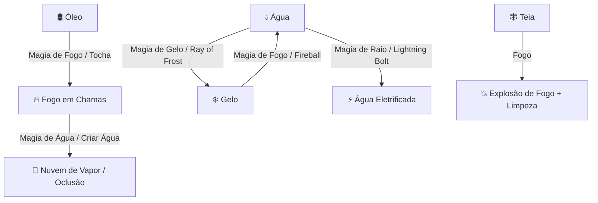

# PLAN: Análise Profunda do 3D Forge & Sistema de Terrenos Táticos (BG3 Style)

> **Documento de Arquitetura, Diagnóstico e Planejamento de Engenharia**  
> **Status:** Pronto para Revisão & Aprovação (Socratic Gate)  
> **Agente Principal:** `@[project-planner]` + `@[game-developer]` + `@[frontend-specialist]`  
> **Arquivo:** `docs/PLAN-forge-3d-terrains.md`

---

## 🧭 1. Diagnóstico & Análise Profunda do 3D Forge Atual

### 1.1 Estado Atual da Ferramenta
O **3D BattleGrid / Forge** do Masters Codex possui uma base sólida construída sobre Three.js e React:
- **Catálogo de Blocos 3D Procedurais e GLB:** Mais de 40 estruturas, luzes dinâmicas (`PointLight` com raio e cor configuráveis) e props medievais com fallback procedural e suporte a modelos customizados em `public/assets/3d/forge/`.
- **Controles de Arena & Grade:** Configuração de dimensões (8x8 a 50x50 células), opacidade e formatos (Quadrado e Arena Circular).
- **Templates de Magia 3D (AoE):** Esfera, Cone, Cubo e Linha projetados no espaço 3D.
- **Elevação Vertical de Tokens:** Altitudes de 0 a 90ft com cálculo de alcance tridimensional e arco parabólico de disparo (BG3 Spline Arc).
- **Rastro de Movimento (Drag Trail):** Sistema de arrasto com snap em tempo real, recuo inteligente (*backtracking*) e badge flutuante de distância percorrida.

### 1.2 Pontos Fracos, Gargalos e Limitações Identificadas

| Área | Situação Atual | Impacto no Jogo | Oportunidade de Melhoria |
|---|---|---|---|
| **Piso & Terreno** | Piso 100% homogêneo. Todo quadrado tem o mesmo custo. | Falta de profundidade tática; sem diferenciação de lama, água, gelo ou óleo. | **Sistema de Superfícies & Terrenos BG3** com multiplicador de deslocamento e efeitos de status. |
| **Cálculo de Deslocamento** | Custo fixo de 1.5m (5ft) por célula, sem considerar terreno difícil. | Personagens movem a mesma distância dentro de um pântano ou em um piso polido. | **Orçamento dinâmico de movimento** ponderado pelos modificadores de terreno das células pisadas. |
| **Interações Elementais** | Magias de fogo, gelo e relâmpago não interagem com o chão. | Magias parecem apenas visuais flutuantes sem impacto persistente no cenário. | **Reações Elementais em Cadeia:** Fogo queima óleo; Gelo congela água; Fogo derrete gelo em água. |
| **Ferramentas de Pincel (Brush)** | Só é possível colocar 1 bloco por clique no centro da célula. | Pintar um lago ou área de difícil acesso requer colocar dezenas de props individuais. | **Pincel de Terreno (Terrain Brush)** 1x1, 2x2, 3x3 e Balde de Preenchimento (Flood Fill). |
| **Interatividade de Props** | Portas e Baús têm estado estático ou requerem gizmo manual. | DM precisa abrir o inspetor para girar porta ou mudar estado. | **Clique Rápido de Interação:** Clicar na porta abre/fecha com animação de rotação e som. |
| **Armadilhas & Gatilhos** | Não há gatilhos reativos no piso 3D. | Mestre precisa lembrar manualmente onde estão armadilhas. | **Tile Hazards / Reactive Traps 3D** que disparam ao ser pisados pelo token. |
| **Salvamento de Arenas** | Blocos ficam no estado local transitório. | DMs perdem tempo reconstruindo cenários complexos a cada sessão. | **Sistema de Presets & Export/Import JSON** de Masmorras/Arenas 3D. |

---

## 🌋 2. Sistema de Terrenos & Superfícies (Baldur's Gate 3 Style)

### 2.1 Tipos de Terrenos & Superfícies Suportados

Cada célula do grid pode receber um tipo de superfície (`SurfaceType`), com renderização visual temática (shader/textura procedural em camada sobre o chão) e regras mecânicas automáticas D&D 5e:

```typescript
export type TerrainSurfaceType = 
  | 'normal'        // Terreno padrão (1x movimento)
  | 'difficult_rock'// Pedregoso / Escombros (2x custo de movimento)
  | 'mud_swamp'     // Lama / Pântano (2x custo de movimento, pegajoso)
  | 'shallow_water' // Água Rasa (2x custo de movimento, dissipa fogo)
  | 'deep_water'    // Água Profunda (3x custo ou natação, sem corrida)
  | 'oil_slick'     // Poça de Óleo (2x custo, DC 10 DES ou cai Prone, Altamente Inflamável)
  | 'ice_sheet'     // Gelo Liso (2x custo, DC 12 DES ao correr ou cai Prone, Derrete com fogo)
  | 'burning_fire'  // Superfície em Chamas (1d4 de fogo ao entrar / iniciar turno)
  | 'acid_pool'     // Poça de Ácido (-2 CA temporária ou 2d4 dano de ácido)
  | 'web_entangle'  // Teias de Aranha / Raízes (2x custo, DC 12 FOR/DES ou Contido)
  | 'holy_ground'   // Solo Sagrado (+1d4 cura ou dano a mortos-vivos)
  | 'cursed_mist';  // Névoa Amaldiçoada (Desvantagem em testes de resistência)
```

### 2.2 Tabela de Propriedades Mecânicas

| Terreno / Superfície | Ícone & Visual 3D | Custo de Movimento | Efeito Mecânico / Condição 5e | Interação Elemental |
|---|---|---|---|---|
| **Pedregoso / Rochas** | 🪨 Piso rachado com detritos | **2x (10ft/célula)** | Concede Meia-Cobertura se agachado. | Imune a fogo/gelo. |
| **Lama Paspalhada** | 🟤 Lama espessa com pegadas | **2x (10ft/célula)** | Desvantagem em testes acrobáticos. | Seca com calor intenso. |
| **Água Rasa** | 💧 Lâmina d'água cristalina / ondulada | **2x (10ft/célula)** | Apaga chamas de criaturas; conduz choque. | Eletricidade eletrifica (+1d6 raio); Gelo congela. |
| **Gelo Escorregadio** | ❄️ Cristal translúcido reflexivo | **2x (10ft/célula)** | Teste de DES DC 12 ao entrar ou fica **Caído (Prone)**. | Dano de fogo derrete para Água Rasa. |
| **Poça de Óleo** | 🛢️ Líquido negro viscoso arco-íris | **2x (10ft/célula)** | Teste de DES DC 10 ou cai Caído. | **Ignita com fogo** e vira Superfície em Chamas. |
| **Superfície em Chamas** | 🔥 Brasas e labaredas animadas | **1x (Normal)** | Causa **1d4 dano de fogo** ao entrar ou iniciar turno. | Água apaga e gera nuvem de vapor. |
| **Poça de Ácido** | 🧪 Líquido verde fluorescente borbulhante | **1x (Normal)** | Causa **2d4 dano ácido** e corrói armadura. | Neutralizável com água. |
| **Teias / Raízes** | 🕸️ Filamentos brancos tridimensionais | **2x (10ft/célula)** | Teste de FOR DC 12 ou fica **Contido (Restrained)**. | Inflamável (queima em 1 turno causando 2d4). |

---

## ⚡ 3. Motor de Interações Elementais (Combos Estilo Larian / BG3)



1. **Detecção Automática no Cast de Magias:**
   - Ao lançar uma magia de área (ex: *Bola de Fogo*, *Mãos Flamejantes*), o sistema varre todas as células atingidas: se houver Óleo ou Teia, transforma automaticamente em Chamas!
   - Ao lançar *Raio de Gelo* ou *Cone de Frio* sobre Água Rasa, converte as células atingidas em Gelo Liso por 3 rodadas.
   - Ao lançar *Relâmpago* sobre poça de água, aplica choque em cadeia em todos os combatentes que estiverem na mesma poça contígua.

---

## 🛠️ 4. Novas Ferramentas Propostas para o 3D Forge

### 4.1 🖌️ Pincel de Terreno (Terrain Surface Painter)
- **Tamanhos de Pincel:** 1x1 (preciso), 2x2 (médio), 3x3 (amplo), ou **Balde de Tinta** (preenche toda a área fechada por paredes).
- **Modo Pincel vs Borracha:** Alterna rapidamente com tecla `B` (Brush) e `E` (Eraser).
- **Duração da Superfície:** Permanente (preparada pelo mestre) ou Temporária (criada por feitiço/barril, com contador de rodadas).

### 4.2 🚪 Interação com Portas e Baús com 1 Clique (Smart Dynamic Props)
- Ao clicar em uma porta fechada no modo normal, a porta roda 90° com animação suave e som de rangido medieval, atualizando instantaneamente o bloqueio de visão e movimento!
- Ao clicar em um baú, a tampa se abre revelando o brilho dourado do tesouro e disparando o modal de Loot da Sessão.

### 4.3 📐 Régua 3D Multi-Ponto (Freeform 3D Ruler)
- Ferramenta de régua tática com cálculo de distância euclidiana 3D ($\sqrt{x^2 + y^2 + z^2}$).
- Suporte a medição em linha reta, caminho com múltiplos pontos de curva (*Waypoints* com tecla `Shift + Clique`) e indicação de alcance de armas corpo-a-corpo / à distância.

### 4.4 💾 Presets de Cenários & Salas Modulares (Forge Prefabs)
- Biblioteca de salas e ambientes pré-configurados:
  - 🏰 *Taverna do Dragão Adormecido* (Balcão, mesas, fogueira, barris).
  - 💀 *Cripta Ancestral* (Sarcófagos, pilares em ruínas, braseiros verdes, poças de ácido).
  - 🌲 *Acampamento na Clareira* (Fogueira, tendas, pinheiros, pedregulhos).
  - 🌉 *Ponte do Abismo* (Passarela estreita, colunas, tochas).
- Botão para o mestre **Salvar Sala como Prefab** e reutilizar em qualquer mapa com arrastar e soltar.

### 4.5 🏃‍♂️ Rastro de Movimento Inteligente com Custo Real (Smart Path Budgeting)
- Durante o arrasto do token:
  - O rastro destaca em **Azul** o caminho em terreno normal e em **Laranja/Vermelho** as células de terreno difícil.
  - O badge flutuante mostra: `12m / 9m (Terreno Difícil +3m!)`.
  - Se o token entrar em gelo ou óleo, exibe um alerta tático no topo: `⚠️ Teste de Destreza DC 12 necessário!`.

---

## 🏗️ 5. Plano de Implementação em Fases

### Fase 1: Núcleo de Dados & Catálogo de Terrenos (`lib/3d-terrains.ts`)
- Definição da tipagem `TerrainSurfaceType`, `TerrainCellData`, `TERRAIN_SURFACE_CATALOG`.
- Funções utilitárias de conversão de coordenadas, cálculo de custo de movimento por célula e matriz de reações elementais.

### Fase 2: Renderização Visual de Superfícies 3D (`TerrainSurfaceGrid.ts`)
- InstancedMesh ou BufferGeometry customizado no Three.js para renderizar as texturas/cores de piso com alta performance sem queda de FPS.
- Shaders de ondulação para água, brilho reflexivo para gelo, faíscas animadas para fogo e brilho tóxico para ácido.

### Fase 3: Aba de Terrenos no Drawer da Forja (`BattleForgeToolbar.tsx`)
- Nova aba **"Terrenos & Superfícies"** com seletores de bioma (Rochas, Lama, Gelo, Óleo, Fogo, Ácido, Água, Teia).
- Seletor de tamanho de pincel (1x1, 2x2, 3x3, Balde) e borracha.

### Fase 4: Integração com Movimento de Tokens & Combate (`BattleGrid3D.tsx`)
- Atualização do `handlePointerMove` e `renderDragTrail` para computar o custo de cada quadrado com base no grid de superfícies.
- Atualização do `renderMovementHighlights` para calcular alcance real levando em conta áreas difíceis.
- Gatilhos de dano de superfície integrados ao Combat Tracker (notificação sonora e log de combate).

### Fase 5: Interações Elementais & Props Dinâmicos
- Sistema de reação em cadeia ao spawnar Spell Templates (Fogo + Óleo, Gelo + Água).
- Clique direto para abrir/fechar portas e baús.

---

## ❓ 6. Socratic Gate (Perguntas Estratégicas para Alinhamento)

1. **Grau de Automação de Regras 5e:**  
   Deseja que os testes de resistência (ex: DC 12 DES no gelo ou DC 10 DES no óleo) façam uma rolagem automática com notificação no Combat Log, ou prefere que seja apenas um alerta visual para o Mestre decidir?
2. **Reações Elementais Automáticas:**  
   Deseja que o fogo sempre queime automaticamente óleo/teias ao posicionar um template de magia (como no BG3), ou prefere um botão no toolbar para o DM confirmar a ignição?
3. **Persistência de Cenários:**  
   As superfícies e blocos devem ser salvas diretamente no objeto da Cena atual da Campanha (Supabase / LocalStorage) para que fiquem salvas quando o mestre reabrir a sessão?
