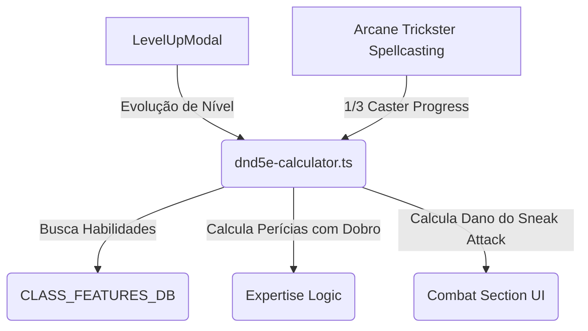

# Plano de Implementação: Ladino (Rogue) - Níveis 1-20

Este plano detalha a implementação completa da classe **Ladino (Rogue)** para o sistema D&D 5e no Masters Codex, cobrindo a progressão do nível 1 ao 20 para a classe base e suas subclasses clássicas: **Ladrão (Thief)**, **Assassino (Assassin)** e **Trapaceiro Arcano (Arcane Trickster)**.

---

## 📐 Tipo de Projeto
**WEB** (Lógica de Regras e Interface da Ficha do Personagem)

---

## 🎯 Critérios de Sucesso
* [ ] Ladino disponível e funcional como opção de classe na criação de personagem e no `LevelUpModal`.
* [ ] Atributos e proficiências iniciais aplicados corretamente (D8, salvaguardas de Destreza e Inteligência, 4 perícias à escolha, ferramentas de ladino).
* [ ] Banco de dados `CLASS_FEATURES_DB` atualizado com todas as características de Ladino do nível 1 ao 20.
* [ ] Mecânica de **Ataque Furtivo (Sneak Attack)** calculada por nível e atalho de rolagem visível na interface de combate.
* [ ] Sistema de **Especialização (Expertise)** integrado à lógica de perícias, permitindo dobrar o bônus de proficiência nas escolhas do jogador.
* [ ] Automação e suporte para magias e slots do **Trapaceiro Arcano (Arcane Trickster)** integrados no calculador.

---

## 🔴 Perguntas em Aberto (Socratic Gate)

### 1. Subclasses (Roguish Archetypes) a Implementar
*   **Decisão:** Devemos implementar as três subclasses clássicas do PHB (*Ladrão*, *Assassino* e *Trapaceiro Arcano*) ou focar apenas em uma/duas delas inicialmente?
*   **Por que importa:** O Trapaceiro Arcano é um conjurador de 1/3 e adiciona complexidade significativa de gerenciamento de magias conhecidas e slots na ficha.
*   **Opção Recomendada:** **Opção B (Três Subclasses)**. O calculador (`dnd5e-calculator.ts`) já possui referências a `Trapaceiro Arcano` e a arquitetura geral do `LevelUpModal` já suporta a seleção automática de subclasses baseada em banco de dados.

### 2. Interface do Ataque Furtivo (Sneak Attack)
*   **Decisão:** Como o Ataque Furtivo deve ser acionado na UI?
*   **Por que importa:** Facilita a rolagem rápida de dano extra no chat.
*   **Opção Recomendada:** **Opção A (Botão na Seção de Combate)**. Adicionar um botão independente "Ataque Furtivo" na seção de combate da ficha que calcula o dano dinamicamente de acordo com o nível de Ladino e rola no log da campanha.

---

## 🏗️ Proposta de Arquitetura & Alterações



### Arquivos a Modificar:
*   [dnd5e-data.ts](file:///c:/Users/Fred/Documents/game-dev/Masters%20Codex%20-%20The%20Campaign%20Forge%20Tool/lib/dnd5e-data.ts):
    *   Cadastrar a entrada `Ladino` no `CLASS_FEATURES_DB` contendo todas as habilidades do nível 1 ao 20.
    *   Adicionar as habilidades das subclasses (Ladrão, Assassino, Trapaceiro Arcano).
    *   Adicionar requisitos multiclasse em `MULTICLASS_REQUIREMENTS` e proficiências em `MULTICLASS_PROFICIENCIES`.
*   [dnd5e-calculator.ts](file:///c:/Users/Fred/Documents/game-dev/Masters%20Codex%20-%20The%20Campaign%20Forge%20Tool/lib/dnd5e-calculator.ts):
    *   Adicionar suporte à Especialização (Expertise) no calculador (calculando o dobro da proficiência).
    *   Ajustar cálculo de espaços de magia multiclasse para incluir o divisor de $1/3$ do nível de Trapaceiro Arcano.
    *   Atualizar `calculateSavingThrowTotal` para conceder automaticamente proficiência na salvaguarda de Sabedoria (`wis`) se o personagem for Ladino de nível 15 ou superior (Mente Escorregadia).
*   [dnd5e-dice.ts](file:///c:/Users/Fred/Documents/game-dev/Masters%20Codex%20-%20The%20Campaign%20Forge%20Tool/lib/dnd5e-dice.ts):
    *   Adicionar o parâmetro opcional `skillKey?: DndSkillKey` na função `executeCheckRoll` para implementar o Talento Confiável (Reliable Talent).
    *   Criar a função `executeSneakAttackRoll` para rolar os dados do Ataque Furtivo.
*   [LevelUpModal.tsx](file:///c:/Users/Fred/Documents/game-dev/Masters%20Codex%20-%20The%20Campaign%20Forge%20Tool/components/character-sheet/Modals/LevelUpModal.tsx):
    *   Como a ficha já permite que o jogador alterne manualmente a proficiência para especialização (`expertise`) ao clicar nas perícias em `SkillsSection`, o modal de nível focará em exibir as novas habilidades e automatizar a escolha da subclasse no nível 3 (que usará o seletor genérico existente).
*   [CombatSection.tsx](file:///c:/Users/Fred/Documents/game-dev/Masters%20Codex%20-%20The%20Campaign%20Forge%20Tool/components/character-sheet/Sections/CombatSection.tsx):
    *   Inserir o botão rápido para rolagem de dano do Ataque Furtivo correspondente ao nível de Ladino do personagem.

---

## 📋 Cronograma de Tarefas (Task Breakdown)

### 🟩 Milestone 1: Dados Base e Características de Progresso
> **Agente:** `backend-specialist` | **Prioridade:** 🔴 Crítica | **Estimativa:** 1 dia

#### Task 1.1: Mapear Progressão Base do Ladino e Multiclasse
*   **INPUT:** `lib/dnd5e-data.ts`
*   **OUTPUT:** Entrada `Ladino` em `CLASS_FEATURES_DB` contendo todas as habilidades de nível 1 a 20. Configurar `MULTICLASS_REQUIREMENTS` e `MULTICLASS_PROFICIENCIES`.
*   **VERIFICAÇÃO:** Compilação do TypeScript limpa.

#### Task 1.2: Adicionar Habilidades das Subclasses
*   **INPUT:** `lib/dnd5e-data.ts`
*   **OUTPUT:** Mapeamento de subclasses em `CLASS_FEATURES_DB` para Ladrão, Assassino e Trapaceiro Arcano.
*   **VERIFICAÇÃO:** Verificar se as habilidades extras aparecem dependendo da subclasse escolhida.

---

### 🟦 Milestone 2: Mecânicas de Cálculo e Dados
> **Agente:** `backend-specialist` | **Prioridade:** 🔴 Crítica | **Estimativa:** 1 dia

#### Task 2.1: Implementar Mente Escorregadia e Suporte a Magias
*   **INPUT:** `lib/dnd5e-calculator.ts`
*   **OUTPUT:** Ajustar salvaguardas para dar Wis prof para Ladinos nível 15+ e calcular spell slots de 1/3 para Trapaceiro Arcano.
*   **VERIFICAÇÃO:** Um Ladino de Nível 15+ ganha bônus de proficiência na salvaguarda de Sabedoria automaticamente.

#### Task 2.2: Implementar Talento Confiável e Rolagem de Ataque Furtivo
*   **INPUT:** `lib/dnd5e-dice.ts`
*   **OUTPUT:** Implementar a lógica de piso `10` para rolagens de perícias com proficiência/especialização para Ladinos de nível 11+ e a função helper de dano do Ataque Furtivo.
*   **VERIFICAÇÃO:** Testar unidade mostrando que o dado selecionado nunca rola menos de 10 se a regra for aplicada.

---

### 🟨 Milestone 3: Interface da Ficha
> **Agente:** `frontend-specialist` | **Prioridade:** 🟠 Alta | **Estimativa:** 1-2 dias

#### Task 3.1: Botão Rápido de Ataque Furtivo
*   **INPUT:** `components/character-sheet/Sections/CombatSection.tsx`
*   **OUTPUT:** Botão rápido na ficha de combate para rolagem do Sneak Attack no log.
*   **VERIFICAÇÃO:** Clicar no botão rola os dados corretos no chat da campanha.

---

## 🧪 Fase X: Verificação Final (Definition of Done)

### Testes Automatizados Obrigatórios
```bash
# Executar análise de tipos estática
npx tsc --noEmit

# Executar testes unitários do calculador
npm run test
```

### Checklist Manual (E2E)
- [ ] Criar um Ladino de nível 1 via wizard e verificar bônus de Especialização.
- [ ] Subir nível para 3 e selecionar a subclasse Trapaceiro Arcano, validando a adição dos slots de nível 1.
- [ ] Rolar o Ataque Furtivo e checar o log do chat.
- [ ] Build de produção sem warnings/erros (`npm run build`).

---

## ✅ PHASE X COMPLETE
- Lint: ⬜
- Security: ⬜
- Build: ⬜
- Date: [Aguardando Aprovação]
