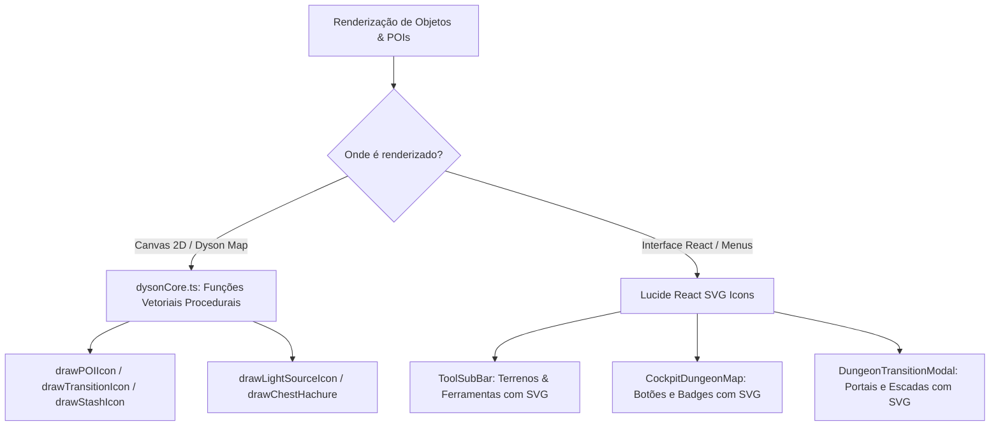

# 📜 Plano de Implementação: Substituição de Emojis por Ícones Vetoriais SVG no Dungeon Map & Menus

> **Status**: Planejado  
> **Área**: Map Making (2D Dyson & VTT) / UI Design / Procedural Canvas Rendering  
> **Prioridade**: P1 (Alta)  
> **Arquivos Alvo**: `components/map/dysonCore.ts`, `components/map/DysonCanvas.tsx`, `components/map/ToolSubBar.tsx`, `components/live-cockpit/CockpitDungeonMap.tsx`, `components/MapMaker.tsx`, `components/map/DungeonTransitionModal.tsx`

---

## 🎯 1. Objetivo & Visão Geral

Eliminar completamente todos os emojis/emoticons do mapa tático de masmorras (Dyson Map) e de seus menus/sub-barras, substituindo-os por:
1. **Ícones Vetoriais Procedurais Estilo Bico de Pena (Dyson Logos) no Canvas 2D (`dysonCore.ts` / `DysonCanvas.tsx`)**:
   - Criação de renderizadores vetoriais dedicados (`drawStashIcon`, `drawTransitionIcon`, `drawPOIIcon`) que desenham traços orgânicos em Canvas 2D, integrando-se perfeitamente ao estilo dos mapas e fontes de luz.
   - Eliminação de qualquer chamada `ctx.fillText('💎' | '🪜' | '🌀' | '🚪')`.
2. **Ícones SVG Modernos (Lucide React) nas Barras de Ferramentas e Modais (`ToolSubBar.tsx`, `CockpitDungeonMap.tsx`, `MapMaker.tsx`)**:
   - Substituição de strings com emojis nos botões de terreno e ferramentas por componentes Lucide SVG (`DoorClosed`, `ShieldAlert`, `Package`, `Gem`, `Sliders`, `Grid`, `EyeOff`, `Navigation`, `Pencil`).
   - Padronização visual premium com gradientes sutis, bordas polidas e consistência visual Dark Fantasy.

---

## 🧱 2. Arquitetura da Solução

---

## 📋 3. Tarefas Detalhadas por Módulo

### 🔹 Fase 1: Motor Vetorial de POIs no Canvas (`dysonCore.ts` & `DysonCanvas.tsx`)
- [ ] **Criar `drawStashIcon(ctx, x, y, isLooted, zoom)`**:
  - Desenho vetorial de um diamante/cristal estilizado com facetas geométricas bico de pena em preto/ouro, sem uso de emojis.
- [ ] **Criar `drawTransitionIcon(ctx, x, y, type, targetLevelName, zoom)`**:
  - Desenho vetorial específico para cada tipo de transição:
    - `stairs_down` / `stairs_up`: Degraus estilizados em perspectiva isométrica com seta direcional.
    - `ladder`: Hastes e travessas de madeira/ferro.
    - `portal`: Vórtice de runas arcanas concêntricas brilhantes.
    - `doorway`: Arco de pedra com portal aberto.
- [ ] **Criar `drawPOIIcon(ctx, x, y, cell, zoom)` para Previews de Drag & Drop**:
  - Substituir o texto de drag & drop em `DysonCanvas.tsx` (`ctx.fillText(emoji)`) pelo desenho vetorial unificado `drawPOIIcon`.

### 🔹 Fase 2: Substituição de Emojis nos Menus & Sub-barras
- [ ] **`components/map/ToolSubBar.tsx`**:
  - Atualizar a lista de terrenos e ferramentas para usar ícones Lucide React SVG (`DoorClosed`, `ShieldAlert`, `Package`, `Gem`, `Sliders`, `Grid`, `EyeOff`, `Milestone`).
- [ ] **`components/live-cockpit/CockpitDungeonMap.tsx`**:
  - Substituir `✏️` por `<Pencil className="w-4 h-4 text-amber-400" />`.
  - Substituir badges e botões de pisos/transições por ícones Lucide SVG (`Layers`, `Navigation`, `Sparkles`).
- [ ] **`components/MapMaker.tsx`**:
  - Remover qualquer emoji remanescente nos seletores de ferramentas, opções de exportação e menus de configuração de masmorra.
- [ ] **`components/map/DungeonTransitionModal.tsx`**:
  - Substituir os ícones de seleção de tipo de escada/portal por botões visuais com Lucide SVG components.

---

## 🔬 4. Plano de Verificação & Testes

### Testes Automatizados (Vitest)
- Validar se os ícones vetoriais de transição, stash e fontes de luz não causam regressão na suíte de testes.
- Garantir que todos os 37 arquivos de teste continuam passando com 100% de sucesso.

### Validação Visual
- Abrir o mapa tático no `MapMaker` e no `LiveCockpit`:
  - Verificar que stashes, escadas, portais e baús aparecem como belos desenhos bico de pena vetorizados.
  - Verificar que a barra de ferramentas de terrenos exibe ícones SVG elegantes e modernos.
  - Testar arrastar um POI no mapa e confirmar que o cursor de preview exibe o ícone vetorial sem emojis do sistema operacional.

---

## 🏁 5. Próximos Passos
- [ ] Revisar o plano
- [ ] Iniciar a implementação via `/create` ou aprovação do usuário.
