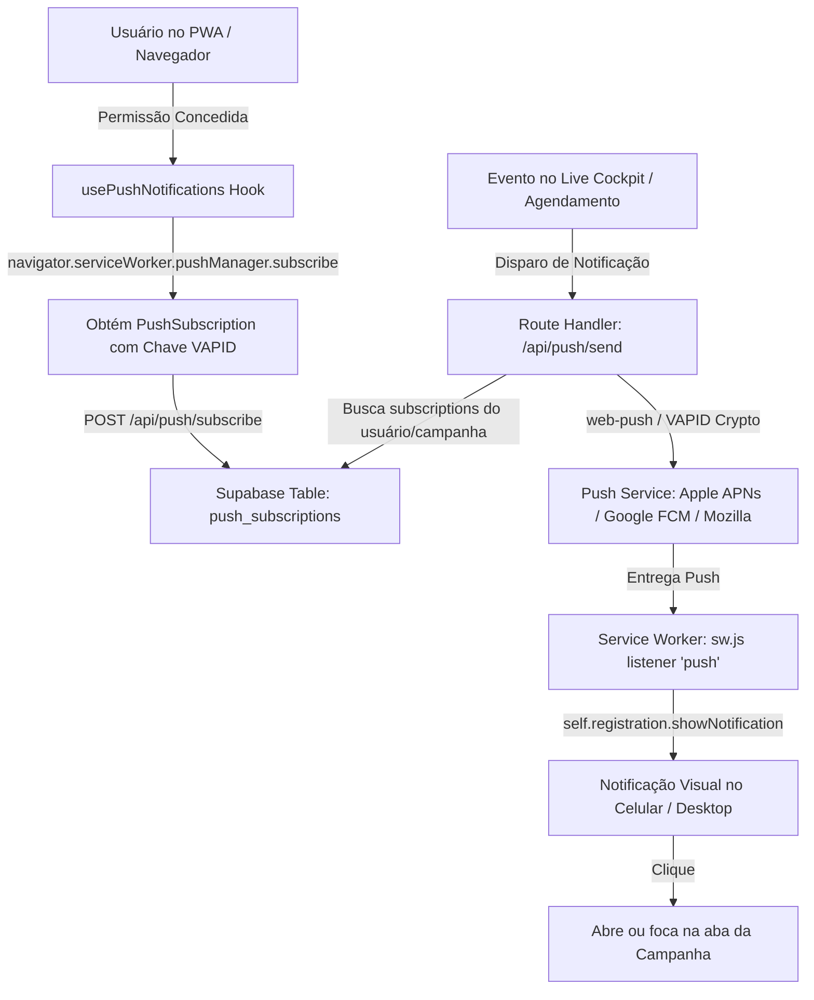

# PLAN-push-notifications.md - Notificações Push Web (Push API / WebPush)

> **Status:** 🎯 Planejado  
> **Impacto:** ⭐⭐⭐ (Mantém jogadores engajados mesmo com a aba em segundo plano ou celular bloqueado)  
> **Complexidade:** Média  
> **Padrões:** W3C Web Push API, VAPID, Service Worker, Supabase Subscriptions

---

## 📌 1. Visão Geral & Objetivo

Implementar suporte nativo a **Notificações Push no Navegador e PWA (Android, iOS 16.4+, Windows e macOS)** para avisar jogadores e mestres sobre eventos críticos da mesa em tempo real, mesmo quando o aplicativo estiver fechado ou em segundo plano.

### Principais Casos de Uso na Mesa:
1. ⚔️ **Alerta de Turno de Combate**: Quando o mestre avança o turno e chega a vez do jogador ("⚔️ É a sua vez de agir!").
2. 🏰 **Lembrete de Sessão de RPG**: Notificação 15 minutos ou 1 hora antes do início agendado da sessão.
3. 🔒 **Sussurros Privados & Mensagens Secretas**: Notificação quando o mestre ou outro jogador envia um sussurro no chat.
4. 🛑 **Alerta de Segurança (X-Card)**: Notificação instantânea com alta prioridade para o mestre pausar a mesa.
5. 🎁 **Distribuição de Saques (Party Loot)**: Notificação de moedas ou itens transferidos para a ficha.

---

## 🏗️ 2. Arquitetura da Solução



---

## 🔐 3. VAPID Keys & Segurança

O WebPush utiliza chaves VAPID (*Voluntary Application Server Identification*) para assinar as mensagens:
- **`NEXT_PUBLIC_VAPID_PUBLIC_KEY`**: Chave pública exposta no frontend para criar a subscrição no navegador.
- **`VAPID_PRIVATE_KEY`**: Chave privada armazenada exclusivamente nas variáveis de ambiente do backend.
- **`VAPID_SUBJECT`**: Email ou URL de contato (ex: `mailto:admin@masterscodex.app`).

---

## 🗄️ 4. Esquema de Banco de Dados (`push_subscriptions`)

```sql
CREATE TABLE IF NOT EXISTS push_subscriptions (
  id UUID PRIMARY KEY DEFAULT gen_random_uuid(),
  user_id UUID REFERENCES auth.users(id) ON DELETE CASCADE,
  campaign_id UUID REFERENCES campaigns(id) ON DELETE CASCADE,
  endpoint TEXT NOT NULL UNIQUE,
  p256dh TEXT NOT NULL,
  auth TEXT NOT NULL,
  user_agent TEXT,
  settings JSONB DEFAULT '{
    "combatTurn": true,
    "sessionReminder": true,
    "whispers": true,
    "safetyAlerts": true
  }'::jsonb,
  created_at TIMESTAMPTZ DEFAULT NOW(),
  updated_at TIMESTAMPTZ DEFAULT NOW()
);

-- Índices para buscas ultrarrápidas ao disparar eventos de combate
CREATE INDEX idx_push_user ON push_subscriptions(user_id);
CREATE INDEX idx_push_campaign ON push_subscriptions(campaign_id);
```

---

## 📂 5. Estrutura de Arquivos e Componentes

```
public/
└── sw.js                            # Adição de listeners 'push' e 'notificationclick'
app/
└── api/
    └── push/
        ├── subscribe/
        │   └── route.ts             # Salva/remove inscrições no Supabase
        ├── send/
        │   └── route.ts             # Dispara notificações push via VAPID
        └── vapid-public-key/
            └── route.ts             # Retorna a chave pública VAPID
lib/
├── push/
    ├── webPushService.ts            # Lógica server-side de assinatura VAPID e envio
    └── pushTypes.ts                 # Interfaces de payloads e configurações
└── hooks/
    └── usePushNotifications.ts      # Hook frontend para solicitar permissão e gerenciar inscrição
components/
└── push/
    ├── PushNotificationToggle.tsx   # Switch elegante Obsidian/Âmbar com status de permissão
    └── PushPreferencesModal.tsx     # Modal para configurar tipos de alerta (Turno, Lembrete, Sussurros)
```

---

## 📋 6. Tarefas de Implementação

### Fase 1: Service Worker & Infraestrutura VAPID
- [ ] Atualizar `public/sw.js` com suporte a evento `push`:
  - Extração do payload JSON (`title`, `body`, `icon`, `badge`, `data`, `tag`).
  - Chamada a `self.registration.showNotification` com ícone temático e vibração.
- [ ] Adicionar suporte ao evento `notificationclick` no `public/sw.js`:
  - Focar na aba existente do Masters Codex se já estiver aberta (`clients.matchAll`).
  - Ou abrir nova janela na rota da campanha (`clients.openWindow(url)`).
- [ ] Criar utilitário `lib/push/webPushService.ts` para geração de payloads autenticados VAPID.

### Fase 2: Rotas de API (`app/api/push/`)
- [ ] `POST /api/push/subscribe`:
  - Recebe o endpoint, chaves `p256dh` e `auth` do navegador.
  - Upsert na tabela `push_subscriptions` vinculado ao `user_id` e `campaign_id`.
- [ ] `POST /api/push/send`:
  - Recebe `targetUserIds` ou `campaignId`, `title`, `body`, `type` e `url`.
  - Dispara em paralelo para os endpoints com tratamento automático de inscrições expiradas (Status 410/404 remove do banco).

### Fase 3: Hook Frontend & Componentes Visuais (`lib/hooks/` & `components/push/`)
- [ ] Criar `usePushNotifications.ts`:
  - Consulta `Notification.permission` ('granted', 'denied', 'default').
  - Função `requestPermissionAndSubscribe()` com conversão `urlBase64ToUint8Array`.
- [ ] Criar `PushNotificationToggle.tsx`:
  - Botão na barra do jogador e nas configurações de campanha com feedback claro.
- [ ] Integrar gatilhos automáticos no `LiveCockpitCombat`:
  - Ao avançar o turno de combate (`handleNextTurn`), se o próximo combatente for um jogador online/offline com `userId`, disparar push instantâneo:  
    `"⚔️ É o seu turno! Seu personagem está pronto para agir."`

---

## 🧪 7. Plano de Verificação

1. **Testes Unitários**:
   - Conversão de chaves VAPID base64 para Uint8Array.
   - Validação de schema e sanitização de endpoints.
2. **Teste de Permissão no Navegador**:
   - Solicitar permissão e verificar se o status transiciona corretamente para `granted`.
3. **Teste de Notificação em Background**:
   - Minimizar a aba do jogador.
   - No Live Cockpit do mestre, passar a vez para o jogador.
   - Verificar se a notificação nativa do sistema operacional (Windows/Android/macOS) surge com som/vibração e título correto.
4. **Teste de Clique na Notificação**:
   - Clicar na notificação e verificar se o navegador foca instantaneamente na tela da sessão.
