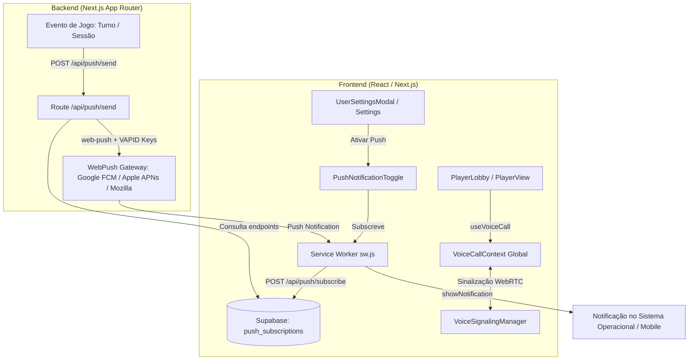

# PLAN: Sprint 1 (P0) - Web Push Real & Controles de Voz Globais no Player Lobby/View

> **Status:** 📝 Em Planejamento | **Prioridade:** 🔴 P0 (Crítica) | **Tipo de Projeto:** WEB (Next.js 16, Supabase Realtime, Web Push / VAPID, WebRTC VoIP)  
> **Chave do Plano:** `push-voice-p0`

---

## 🎯 1. Visão Geral & Objetivo

Concluir e conectar as duas principais funcionalidades P0 que atualmente estão com lacunas estruturais ou desconectadas da interface:

1. **Envio Real de Notificações Web Push (`web-push` / VAPID)**:
   - Substituir o mock da rota `/api/push/send` por um despacho criptográfico real via biblioteca `web-push`.
   - Adicionar o componente `PushNotificationToggle` com preferências no `UserSettingsModal` e no `CampaignSettingsStudio`.
   - Disparar notificações push automáticas em eventos-chave: início de sessão de RPG, chegada do turno do jogador em combate e acionamento de X-Card.

2. **Integração dos Controles de Voz Globais (WebRTC) no Player Lobby e Player View**:
   - Conectar o hook `useVoiceCall()` nas telas e modais dos jogadores (`PlayerLobby.tsx` e `PlayerViewModal.tsx`).
   - Fornecer botão direto de *Entrar na Call / Microfone (Mute/Unmute)*, indicador de participantes ativos e atalho para abrir o widget flutuante.
   - Atualizar `LiveCockpitStudio` para usar a camada global unificada de voz em vez de estado isolado.

---

## 🏗️ 2. Arquitetura da Solução & Dependências



### Novas Dependências:
- `web-push`: Biblioteca padrão para assinar mensagens VAPID e despachar para Google FCM, Apple APNs e Mozilla push services.
- `@types/web-push`: Tipagem TypeScript para o `web-push`.

---

## 📋 3. Divisão de Tarefas & Arquivos a Modificar / Criar

### 🟥 Módulo A: Web Push Real & UI de Configurações

#### Task A.1: Instalação e Configuração do `web-push` no Backend
- **Arquivo:** [package.json](file:///c:/Users/Fred/Documents/game-dev/Masters%20Codex%20-%20The%20Campaign%20Forge%20Tool/package.json) & [app/api/push/send/route.ts](file:///c:/Users/Fred/Documents/game-dev/Masters%20Codex%20-%20The%20Campaign%20Forge%20Tool/app/api/push/send/route.ts)
- **Ações:**
  1. Instalar `web-push` e `@types/web-push`.
  2. Configurar `webpush.setVapidDetails()` utilizando `process.env.VAPID_SUBJECT`, `process.env.NEXT_PUBLIC_VAPID_PUBLIC_KEY` e `process.env.VAPID_PRIVATE_KEY` (com fallback amigável em ambiente dev local).
  3. No [app/api/push/send/route.ts](file:///c:/Users/Fred/Documents/game-dev/Masters%20Codex%20-%20The%20Campaign%20Forge%20Tool/app/api/push/send/route.ts), buscar as subscrições ativas do usuário alvo (`targetUserId`) ou de todos os membros da campanha (`campaignId`) da tabela `push_subscriptions` do Supabase.
  4. Executar `webpush.sendNotification()` iterando pelas inscrições, tratando status 410/404 (inscrições expiradas que devem ser deletadas do banco).
- **Verificação:** Enviar um payload de teste via POST para `/api/push/send` e verificar se a notificação nativa do sistema operacional é disparada e recebida pelo Service Worker.

#### Task A.2: Inserção do `PushNotificationToggle` na Interface
- **Arquivos:**
  - [components/UserSettingsModal.tsx](file:///c:/Users/Fred/Documents/game-dev/Masters%20Codex%20-%20The%20Campaign%20Forge%20Tool/components/UserSettingsModal.tsx)
  - [components/CampaignSettingsStudio.tsx](file:///c:/Users/Fred/Documents/game-dev/Masters%20Codex%20-%20The%20Campaign%20Forge%20Tool/components/CampaignSettingsStudio.tsx)
- **Ações:**
  1. No [UserSettingsModal.tsx](file:///c:/Users/Fred/Documents/game-dev/Masters%20Codex%20-%20The%20Campaign%20Forge%20Tool/components/UserSettingsModal.tsx), adicionar seção "Notificações Push da Mesa" com toggle de ativação e checkboxes de preferências (Turno de Combate, Início de Sessão, Sussurros, Alertas).
  2. No [CampaignSettingsStudio.tsx](file:///c:/Users/Fred/Documents/game-dev/Masters%20Codex%20-%20The%20Campaign%20Forge%20Tool/components/CampaignSettingsStudio.tsx), permitir que o mestre veja o status geral de notificações e faça envio de lembrete de teste para a mesa.
- **Verificação:** Abrir o modal de configurações de usuário, alternar o switch de push, conceder permissão no navegador e verificar se o endpoint é salvo na base de dados.

#### Task A.3: Gatilhos Automáticos de Push
- **Arquivos:**
  - [components/CombatTracker.tsx](file:///c:/Users/Fred/Documents/game-dev/Masters%20Codex%20-%20The%20Campaign%20Forge%20Tool/components/CombatTracker.tsx) (ao avançar turno)
  - [components/SessionNavigator.tsx](file:///c:/Users/Fred/Documents/game-dev/Masters%20Codex%20-%20The%20Campaign%20Forge%20Tool/components/SessionNavigator.tsx) / [LiveCockpitStudio.tsx](file:///c:/Users/Fred/Documents/game-dev/Masters%20Codex%20-%20The%20Campaign%20Forge%20Tool/components/LiveCockpitStudio.tsx) (ao iniciar sessão)
- **Ações:**
  1. Quando o mestre clicar em "Próximo Turno" no combate, identificar se o combatente da vez é um jogador e chamar `/api/push/send` com `type: 'combat_turn'`.
  2. Quando uma sessão for iniciada, disparar push `type: 'session_reminder'` para os membros da campanha.

---

### 🟩 Módulo B: Controles de Voz Globais no Player Lobby e Player View

#### Task B.1: Integração de Chamada de Voz no Player Lobby
- **Arquivo:** [components/PlayerLobby.tsx](file:///c:/Users/Fred/Documents/game-dev/Masters%20Codex%20-%20The%20Campaign%20Forge%20Tool/components/PlayerLobby.tsx)
- **Ações:**
  1. Importar e invocar `useVoiceCall()` dentro de `PlayerLobby`.
  2. Adicionar na barra superior do Lobby (ao lado do status de conexão e botão do X-Card) um botão compacto de Voz:
     - Estado Desconectado: Botão com ícone de fone/microfone e label "Entrar na Call".
     - Estado Conectado: Botão pulsante com número de participantes, botão rápido de Mute/Unmute e botão para abrir o [VoiceCallFloatingWidget](file:///c:/Users/Fred/Documents/game-dev/Masters%20Codex%20-%20The%20Campaign%20Forge%20Tool/components/voice/VoiceCallFloatingWidget.tsx).
- **Verificação:** Conectar como jogador no Player Lobby → clicar em "Entrar na Call" → microfone liga e widget flutuante expande.

#### Task B.2: Integração de Chamada de Voz no Player View
- **Arquivo:** [components/PlayerViewModal.tsx](file:///c:/Users/Fred/Documents/game-dev/Masters%20Codex%20-%20The%20Campaign%20Forge%20Tool/components/PlayerViewModal.tsx)
- **Ações:**
  1. Conectar `useVoiceCall()` na barra de ferramentas superior do `PlayerViewModal`.
  2. Inserir botão de microfone e atalho para o painel de voz, garantindo que o jogador consiga mutar/desmutar e ajustar volumes sem sair da tela cheia de jogo.
- **Verificação:** Abrir o Player View → validar que os controles de voz estão visíveis, funcionais e sincronizados com o estado global.

#### Task B.3: Unificação no Live Cockpit
- **Arquivo:** [components/LiveCockpitStudio.tsx](file:///c:/Users/Fred/Documents/game-dev/Masters%20Codex%20-%20The%20Campaign%20Forge%20Tool/components/LiveCockpitStudio.tsx)
- **Ações:**
  1. Garantir que os botões de áudio do Cockpit utilizem `useVoiceCall()` do contexto global, eliminando qualquer estado legado isolado.

---

## 🧪 4. Plano de Testes & Validação (Definition of Done)

### Testes Automatizados
```bash
# Validação de tipos TypeScript
npx tsc --noEmit

# Testes de regressão existentes
npm run test
```

### Checklist de Validação Manual
1. **Web Push:**
   - Ativar push no `UserSettingsModal` concedendo permissão.
   - Enviar notificação de teste e confirmar o pop-up nativo no SO.
   - Avançar turno no combate e confirmar que o jogador recebe o push `⚔️ Seu Turno no Combate!`.
2. **Chamada de Voz:**
   - Abrir Mestre no `LiveCockpit` e Jogador no `PlayerLobby` em navegadores distintos.
   - Ambos clicam em "Entrar na Call".
   - Confirmar transmissão de áudio bidirecional e indicação de fala (VU meter pulsante verde).
   - Testar botão de Mute e fechamento/reabertura do widget flutuante sem queda de stream.

---

## ✅ PHASE X COMPLETE
- Lint: ⬜
- Build: ⬜
- Push Real: ⬜
- Voice UI Integrada: ⬜
