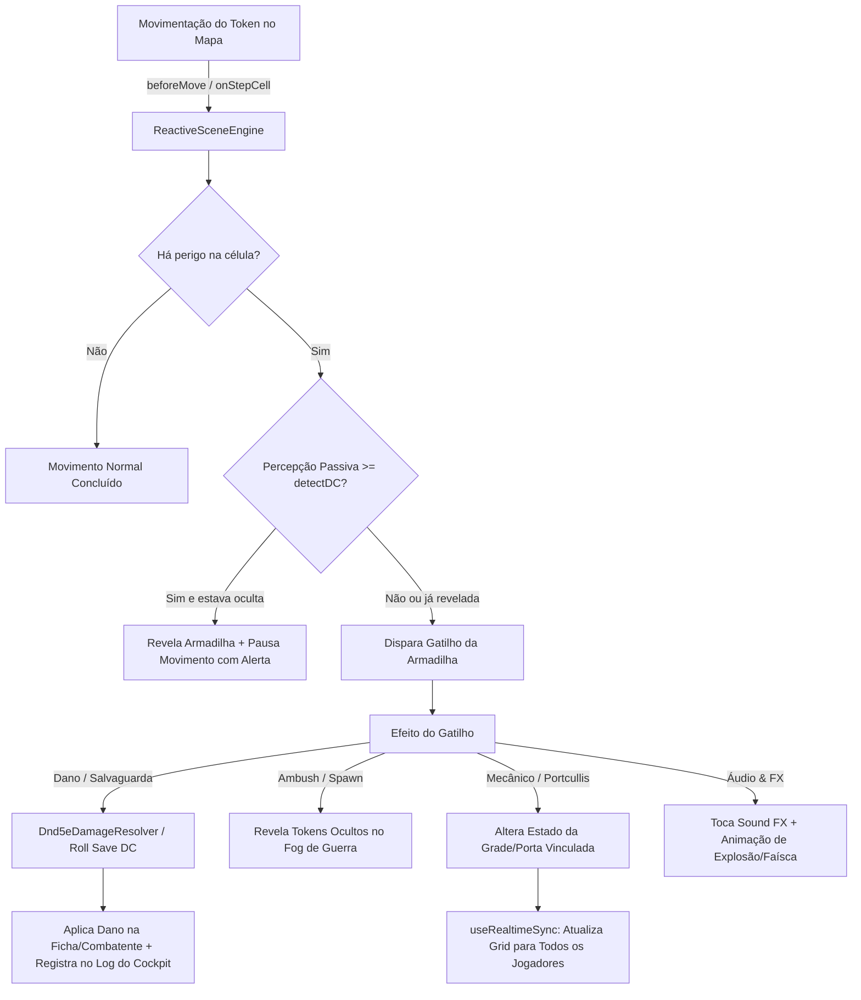

# PLAN-reactive-scenes.md - Reactive Scenes & Armadilhas VTT Estilo BG3

> **Status:** 🎯 Planejado  
> **Impacto:** ⭐⭐⭐⭐ (Eleva o VTT ao nível de Baldur's Gate 3 com automação imersiva de perigos)  
> **Complexidade:** Alta  
> **Padrões:** Event-driven Token Movement, Deterministic Trap Engine, Audio/FX Triggers, Realtime Sync

---

## 📌 1. Visão Geral & Objetivo

Transformar as masmorras e mapas do Masters Codex em **Cenários Reativos (Reactive Scenes)** inspirados em Baldur's Gate 3. Ao mover um token pelo mapa:
- **Detecção Passiva Prévia**: Se a Percepção Passiva do personagem superar o `detectDC`, o token para antes de pisar e a armadilha brilha em alerta.
- **Disparo Reativo ao Pisar (On-Step Trigger)**:
  - Disparo de armadilhas mecânicas (estacas, dardos envenenados, foices) e mágicas (glifos de fogo, runas de sono).
  - Resolução automática de Salvaguarda (ex: TR Destreza CD 13) e aplicação de dano/condição com feedback sonoro e visual.
- **Gatilhos de Emboscada (Ambush Spawns)**: Cruzar uma porta ou limiar de sala revela monstros ocultos na névoa e inicia combate/iniciativa.
- **Gatilhos Mecânicos em Cadeia (Pressure Plates & Levers)**: Pisar em uma placa de pressão fecha uma grade de ferro (*Portcullis*) ou abre uma passagem secreta.
- **Superfícies Ambientais Reativas**: Óleo/Graxa que escorrega (teste de Destreza para não cair *Prone*) e incendeia se atingido por fogo.

---

## 🏗️ 2. Arquitetura da Solução



---

## 🗂️ 3. Modelo de Dados & Tipos (`lib/reactive/reactiveTypes.ts`)

```typescript
export type ReactiveTriggerType =
  | 'trap_damage'      // Causa dano ou impõe condição (Estacas, Fogo, Veneno)
  | 'pressure_plate'  // Aciona elemento vinculado (Grade, Porta, Alçapão)
  | 'ambush_spawn'    // Revela monstros e inicia combate
  | 'audio_ambience'   // Muda a música ambiente ou toca rugido/som misterioso
  | 'surface_hazard'; // Superfície de terreno difícil (Graxa, Gelo, Ácido)

export interface ReactiveTrapEffect {
  type: ReactiveTriggerType;
  name: string;
  description: string;
  detectDC: number;              // CD Percepção Passiva/Investigação para notar
  disarmDC: number;              // CD Prestidigitação para desarmar com Ferramentas
  saveStat?: 'str' | 'dex' | 'con' | 'int' | 'wis' | 'cha'; // Atributo para Salvaguarda
  saveDC?: number;               // CD da Salvaguarda
  damageDice?: string;           // Ex: '2d10', '4d6'
  damageType?: string;           // 'Perfurante', 'Fogo', 'Veneno', 'Ácido'
  conditionApplied?: string;     // 'Envenenado', 'Caído', 'Impedido', 'Cego'
  targetId?: string;             // ID da porta/grade associada se for pressure_plate
  revealedToPlayers: boolean;    // Se está visível no mapa
  isArmed: boolean;              // Se está armada ou já foi desarmada/disparada
  oneShot: boolean;              // Se dispara apenas uma vez ou sempre que pisar
  soundEffect?: string;          // 'trap_spike', 'trap_explosion', 'trap_click', 'gate_close'
}
```

---

## 📂 4. Estrutura de Arquivos e Componentes

```
lib/
├── reactive/
│   ├── reactiveTypes.ts              # Tipos de armadilhas, gatilhos e efeitos ambientais
│   ├── reactiveSceneEngine.ts        # Motor determinístico de colisão de token e disparo de regras
│   ├── trapPresets.ts                # Biblioteca pronta (Estacas, Dardo Venenoso, Glifo de Fogo, Graxa)
│   └── __tests__/
│       └── reactive-scenes.test.ts   # Suíte de testes unitários para detecção, saves e danos
components/
└── map/
    ├── ReactiveTrapBadge.tsx         # Indicador visual sobre a célula (ícone de perigo, desarmar)
    ├── ReactiveTrapModal.tsx         # Modal do Mestre para configurar efeitos ao clicar na armadilha
    └── TrapTriggerAnimation.tsx      # Partículas/animação de faísca, estacas ou fogo sobre o grid
```

---

## 📋 5. Tarefas de Implementação

### Fase 1: Motor de Regras e Tipagens
- [ ] Criar `lib/reactive/reactiveTypes.ts` com interfaces completas de armadilhas e gatilhos de BG3.
- [ ] Criar `lib/reactive/trapPresets.ts` com 10 armadilhas prontas do D&D 5e:
  - *Fosso de Estacas* (TR Dex CD 13, 2d10 Perfurante + Caído).
  - *Dardo Envenenado* (Ataque +5 vs CA, 1d4 Perfurante + 2d6 Veneno, CD 12 Con).
  - *Glifo Explosivo de Chamas* (TR Dex CD 15, 5d8 Fogo em raio de 6m).
  - *Gás Sonífero* (TR Con CD 13, Condição Inconsciente por 1 minuto).
  - *Placa de Pressão de Grade* (Desce a *Portcullis* impedindo a rota de fuga).
  - *Terreno de Graxa/Gelo* (TR Dex CD 12 ao entrar na célula ou fica Caído).
- [ ] Criar `lib/reactive/reactiveSceneEngine.ts`:
  - Função `evaluateTokenStep(token, targetCell, isPlayer)`:
    - Checa percepção passiva.
    - Se não detectado e armado: calcula salvaguarda / dano e retorna o evento de disparo.

### Fase 2: Integração com o DysonCanvas / MapMaker
- [ ] Integrar no hook de movimentação de tokens (`handleTokenMove`):
  - Interceptar o movimento antes de concluir a translação do token.
  - Se houver armadilha oculta e a percepção do token detectar: parar o movimento na célula anterior, alertar o jogador com som de clique e revelar a armadilha.
  - Se o token pisar: disparar animação de partículas e aplicar dano automaticamente no combatente correspondente.
- [ ] Sincronização em tempo real (`useRealtimeSync`):
  - Transmitir evento `REACTIVE_TRAP_TRIGGERED` com coordenadas, dano e animação para todos os jogadores na mesa.

### Fase 3: Interface do Mestre (Configuração e Edição de Armadilhas)
- [ ] Criar `components/map/ReactiveTrapModal.tsx`:
  - Interface no MapMaker para clicar em qualquer célula de armadilha/gatilho e escolher preset ou customizar dano, CD e som.
- [ ] Adicionar botão de **"Desarmar / Testar Ladinagem"** ao clicar em armadilha revelada.

---

## 🧪 6. Plano de Verificação

1. **Testes Unitários Automatizados**:
   - Detecção passiva (Passiva 14 vs CD 13 detecta; Passiva 11 vs CD 13 não detecta).
   - Resolução de dano e salvaguarda com sucesso e falha.
   - Acionamento em cadeia de *Portcullis* via placa de pressão.
   - Estado de armadilha de disparo único (*oneShot*) desarmada após o primeiro uso.
2. **Compilação e Verificação do Build**:
   - `npx vitest --run`
   - `npm run build`
