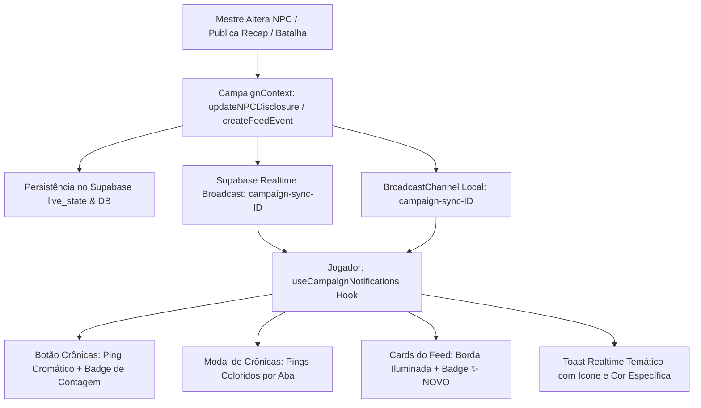

# PLAN: Sistema Avançado de Notificações Cromáticas & Sincronização Atômica das Crônicas

## 🎯 Visão Geral do Sistema Aprimorado
Transformar o sistema de Crônicas e Revelação de NPCs em uma central viva e reativa, onde cada tipo de acontecimento narrativo possui sua **assinatura visual cromática exclusiva** (cor do ping, badges e cards), com sincronização atômica instantânea entre Mestre e Jogadores (Supabase Realtime + BroadcastChannel + LocalStorage persistente).

---

## 🎨 Sistema de Assinatura Cromática (Design System de Notificações)

| Categoria Narrativa | Cor Principal | Efeito Ping / Glow | Badge do Card | Onde Aplica |
|---|---|---|---|---|
| **💬 NPCs & Revelações** | **Ciano / Cyan (`#06b6d4`)** | `animate-ping bg-cyan-400` + glow ciano | `✨ REVELAÇÃO NOVA` | Botão Crônicas, Aba NPCs, Card do NPC |
| **⚔️ Resumos de Batalha** | **Rubro / Rose (`#f43f5e`)** | `animate-ping bg-rose-500` + glow carmesim | `⚔️ NOVA BATALHA` | Botão Crônicas, Aba Batalhas, Card do Combate |
| **📖 Recaps de Sessão** | **Dourado / Âmbar (`#f59e0b`)** | `animate-ping bg-amber-400` + glow dourado | `📜 NOVO RECAP` | Botão Crônicas, Aba Recaps, Card do Recap |
| **🔮 Lore & Documentos** | **Ametista / Roxo (`#a855f7`)** | `animate-ping bg-purple-500` + glow arcano | `🔮 NOVO LORE` | Botão Crônicas, Aba Lore, Card do Lore |

---

## 🚀 Arquitetura Completa em 4 Pilares

---

## 📐 Detalhamento dos Componentes e Módulos

### 1. Hook Central: `lib/hooks/useCampaignNotifications.ts`
- **Rastreamento de Leitura Granular por Jogador**:
  - `codex_last_seen_chronicle_${campaignId}`: Timestamp geral de abertura do diário.
  - `codex_seen_npc_disclosures_${campaignId}`: Mapa JSON de timestamps de cada NPC inspecionado.
  - `codex_seen_feed_events_${campaignId}`: Conjunto de IDs de eventos já lidos.
- **Detecção Inteligente de Tipos Não Lidos**:
  - `unreadCounts`: `{ npcs: number, battles: number, recaps: number, lore: number, total: number }`
  - `latestUnreadType`: Retorna a categoria mais recente para definir a **cor do ping** no botão do topo.
- **Ações Reativas**:
  - `markNPCAsRead(entityId)`: Limpa o badge específico do NPC quando o jogador abre o modal dele.
  - `markEventAsRead(eventId)`: Limpa o badge de um evento específico.
  - `markAllAsRead()`: Botão "Marcar Tudo como Lido" com ícone de `CheckCheck` na barra de ferramentas.

### 2. Cabeçalho do Jogador: `components/PlayerLobby.tsx`
- **Botão "📖 Crônicas" Reativo**:
  - Se houver novidades, renderiza no canto superior direito do botão:
    - **Ponto Pulsante com Cor Dinâmica** baseada no tipo mais recente (Ciano para NPC, Rose para Batalha, Âmbar para Recap, Roxo para Lore).
    - **Pill Numérico** se houver mais de 1 novidade (ex: `(3)` com aura suave).

### 3. Modal de Crônicas dos Jogadores: `components/session/CampaignFeedModal.tsx`
- **Chips de Filtro Horizontais com Indicadores de Novidade**:
  - Cada chip de categoria (`Recaps`, `Batalhas`, `NPCs`, `Lore`) exibe uma bolinha luminosa da sua respectiva cor caso contenha registros ainda não visualizados.
- **Cards da Linha do Tempo e da Aba de NPCs**:
  - Cards com atualizações recentes ganham:
    1. Borda sutilmente iluminada na cor da categoria (`border-cyan-500/60`, `border-rose-500/60`, etc.).
    2. Badge destacado no canto superior: `✨ Revelação Recente` ou `✨ Novo Registro`.
- **Botão de Ação Rápida**:
  - Botão discreto `"Marcar Tudo como Lido"` no canto da barra de pesquisa.

### 4. Camada de Comunicação Atômica Realtime: `context/CampaignContext.tsx`
- Emissão unificada de eventos atômicos:
  - `NPC_DISCLOSURE_UPDATED`: Transmite `{ entityId, entityName, disclosure, entitySnapshot, timestamp }`.
  - `CAMPAIGN_FEED_EVENT_CREATED`: Transmite o novo evento do feed em tempo real para os jogadores.
- Escuta instantânea no canal do Supabase Realtime + BroadcastChannel, atualizando o estado da campanha e disparando toasts temáticos sem necessitar de refresh.

---

## 🧪 Plano de Testes Automatizados
- **Arquivo**: `lib/__tests__/campaign-notifications-engine.test.ts`
  - Teste 1: Cálculo correto de contagem e cores de badges por tipo de novidade.
  - Teste 2: Limpeza seletiva ao inspecionar NPC específico mantendo as outras categorias não lidas.
  - Teste 3: Ação "Marcar Tudo como Lido" limpando todos os indicadores.
  - Teste 4: Reatividade atômica a broadcasts recebidos do Mestre.

---

## 🔍 Critérios de Aceitação & Validação
1. **0 Erros de Compilação** (`npx tsc --noEmit`).
2. **100% de Testes Unitários Aprovados** (`npx vitest run`).
3. **Teste Funcional Multi-Navegador**:
   - Mestre altera a visibilidade de um NPC -> Botão Crônicas do Jogador pisca em **Ciano**.
   - Mestre publica um Recap de Sessão -> Botão Crônicas do Jogador pisca em **Dourado**.
   - Mestre publica uma Batalha -> Botão Crônicas do Jogador pisca em **Rubro**.
   - Mestre publica um Lore -> Botão Crônicas do Jogador pisca em **Roxo**.
   - Jogador clica no NPC para ler a ficha -> o badge daquele NPC desaparece organicamente.
