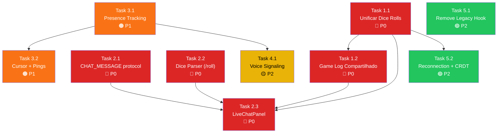

# PLAN-realtime-phase3: Completar Real-Time Sync — Chat, Dice, Cursor, Voice & Presence

> **Status:** 📝 Em Planejamento | **Prioridade:** 🔴 Alta | **Tipo de Projeto:** WEB (Next.js 16, Supabase Realtime, WebSockets, WebRTC)  
> **Predecessores:** [PLAN-realtime-backend.md](file:///c:/Users/Fred/Documents/game-dev/Masters%20Codex%20-%20The%20Campaign%20Forge%20Tool/docs/PLAN-realtime-backend.md) (Fase 2 — ✅ Concluída)  
> **Base da Auditoria:** [realtime_sync_audit.md](file:///C:/Users/Fred/.gemini/antigravity-ide/brain/14ccd01a-bca7-4132-94d1-b85a05e1eccc/realtime_sync_audit.md)

---

## 📖 Visão Geral

A Fase 2 construiu a infraestrutura core de real-time: Supabase Broadcast channels, BroadcastChannel cross-tab, Offline Queue com IndexedDB, e sincronização de combate/tokens/scenes/loot. **~70% do real-time já funciona.**

Esta **Fase 3** completa os **6 gaps restantes** identificados na auditoria + **4 itens de robustez**, transformando o Masters Codex numa mesa virtual totalmente colaborativa e competitiva com Roll20/Foundry/Alchemy.

### Gaps a resolver:

| # | Gap | Impacto |
|:---:|:---|:---:|
| 1 | Dice Rolls da ficha não passam pelo Supabase (só BroadcastChannel local) | 🔴 Crítico |
| 2 | Não existe Game Log compartilhado visível para todos | 🔴 Crítico |
| 3 | Não existe Chat integrado em tempo real | 🔴 Crítico |
| 4 | Cursor/Ponteiro do DM não é transmitido | 🟠 Alto |
| 5 | Pings de localização não existem | 🟠 Alto |
| 6 | Voice Chat sem signaling (P2P nunca conecta) | 🟠 Alto |
| 7 | Sem Presence tracking (quem está online?) | 🟡 Médio |
| 8 | Sem testes de reconnection real | 🟡 Médio |
| 9 | Hook `useRealtimeBattleSync` duplicado/legado | 🟢 Baixo |
| 10 | CRDTSolver nunca invocado | 🟢 Baixo |

---

## 🎯 Critérios de Sucesso (Success Criteria)

- [ ] Rolagens de dados na ficha de personagem são visíveis em tempo real para TODOS os participantes.
- [ ] Game Log unificado mostra rolagens, ações e chat de todos os jogadores e DM.
- [ ] Chat de texto funcional com suporte a `/roll XdY+Z` renderizando resultado inline.
- [ ] Cursor do DM visível na PlayerView quando em modo combat/map.
- [ ] Pings efêmeros de localização (click = ping animado visível por 3s para todos).
- [ ] Voice Chat P2P conectando via signaling pelo Supabase Broadcast.
- [ ] Indicadores de Presence (quem está online, quem está falando).
- [ ] Hook legado `useRealtimeBattleSync` removido sem regressão.
- [ ] Build de produção limpo (`npm run build` sem erros).

---

## 🏗️ Arquitetura: Novos Event Types no Protocolo

Expandir o [useRealtimeSync.ts](file:///c:/Users/Fred/Documents/game-dev/Masters%20Codex%20-%20The%20Campaign%20Forge%20Tool/lib/hooks/useRealtimeSync.ts) com 5 novos event types:

```typescript
// Novos tipos a adicionar em RealtimeSyncPayloads
CHAT_MESSAGE: {
  id: string;
  senderId: string;
  senderName: string;
  senderAvatar?: string;
  channel: 'general' | 'whisper' | 'ic';  // in-character
  whisperTo?: string; // userId do destinatário
  content: string;
  rollResult?: { formula: string; rolls: number[]; total: number; isCrit?: boolean; isFail?: boolean };
  timestamp: string;
};

DM_CURSOR: {
  x: number; // percentual 0-100 da viewport
  y: number;
  context: 'map' | 'battle3d';
};

PING_LOCATION: {
  x: number;
  y: number; // ou z para battle3d
  context: 'map' | 'battle3d';
  senderName: string;
  color: string;
};

VOICE_SIGNAL: {
  type: 'offer' | 'answer' | 'ice-candidate';
  fromUserId: string;
  toUserId: string;
  data: any; // SDP ou ICE Candidate
};

PRESENCE_UPDATE: {
  userId: string;
  displayName: string;
  avatarUrl?: string;
  status: 'online' | 'away' | 'speaking';
};
```

---

## 📋 Milestones & Tasks

### 🟩 Milestone 1: Unificar Dice Rolls + Game Log Compartilhado
> **Prioridade:** P0 | **Dependências:** Nenhuma | **Estimativa:** 1-2 dias

---

#### Task 1.1: Refatorar `dnd5e-dice.ts` para usar Supabase Broadcast

- **Agente:** `backend-specialist` | **Skill:** `clean-code`
- **Prioridade:** P0 | **Dependências:** Nenhuma

**Problema atual:** A função [broadcastDiceRoll](file:///c:/Users/Fred/Documents/game-dev/Masters%20Codex%20-%20The%20Campaign%20Forge%20Tool/lib/dnd5e-dice.ts#L30-L52) cria um `new BroadcastChannel('masters_codex_sync')` temporário e envia por ele. Isso só funciona cross-tab no mesmo navegador. Rolagens da ficha de personagem NUNCA chegam a dispositivos remotos.

**Solução:** Injetar a função `sendBroadcast` do `useRealtimeSync` no contexto, expondo-a globalmente para que `dnd5e-dice.ts` possa usá-la.

**Abordagem técnica:**
1. Criar um `RealtimeBroadcastProvider` minimalista (ou expandir `LiveCockpitContext`) que exponha `sendBroadcast` via React Context
2. Criar um setter global `setGlobalBroadcaster(fn)` que `dnd5e-dice.ts` possa chamar (já que é um módulo pure TS, não um componente React)
3. A `broadcastDiceRoll()` tenta o global broadcaster primeiro, e faz fallback para BroadcastChannel se não disponível

**Arquivos:**
- [MODIFY] [dnd5e-dice.ts](file:///c:/Users/Fred/Documents/game-dev/Masters%20Codex%20-%20The%20Campaign%20Forge%20Tool/lib/dnd5e-dice.ts) — Usar global broadcaster
- [MODIFY] [LiveCockpitContext.tsx](file:///c:/Users/Fred/Documents/game-dev/Masters%20Codex%20-%20The%20Campaign%20Forge%20Tool/context/LiveCockpitContext.tsx) — Registrar broadcaster global no mount

**Verificação:** Rolar dado na ficha de personagem → DM vê a rolagem no combat log + em outro dispositivo.

---

#### Task 1.2: Criar Game Log Compartilhado (componente visual)

- **Agente:** `frontend-specialist` | **Skill:** `frontend-design`
- **Prioridade:** P0 | **Dependências:** Task 1.1

**Objetivo:** Componente `SharedGameLog.tsx` que unifica rolagens de dados, ações de combate, e mensagens de chat num feed visual cronológico visível para DM E Players.

**Design:**
- Scroll automático para última entrada
- Ícones por tipo (⚔️ ataque, 💚 cura, 🎲 rolagem, 💬 chat)
- Entradas de crit com glow dourado, fail com vermelho
- Avatar do rolador à esquerda
- Filtros (Todos / Combate / Rolagens / Chat)

**Integração:**
- Renderizado no painel lateral do `LiveCockpitStudio` (DM) e no `PlayerViewModal` (Player)
- Alimentado pelos events `DICE_ROLL`, `COMBAT_LOG_ENTRY`, `PLAYER_ROLL`, e o novo `CHAT_MESSAGE`

**Arquivos:**
- [NEW] `components/live-cockpit/SharedGameLog.tsx`
- [MODIFY] [LiveCockpitStudio.tsx](file:///c:/Users/Fred/Documents/game-dev/Masters%20Codex%20-%20The%20Campaign%20Forge%20Tool/components/LiveCockpitStudio.tsx) — Adicionar tab do Game Log
- [MODIFY] [PlayerViewModal.tsx](file:///c:/Users/Fred/Documents/game-dev/Masters%20Codex%20-%20The%20Campaign%20Forge%20Tool/components/PlayerViewModal.tsx) — Substituir/expandir painel de log

**Verificação:** DM e Players veem o mesmo feed em tempo real com rolagens + ações.

---

### 🟦 Milestone 2: Chat em Tempo Real com Rolagens Inline
> **Prioridade:** P0 | **Dependências:** M1 | **Estimativa:** 2-3 dias

---

#### Task 2.1: Adicionar event type `CHAT_MESSAGE` ao protocolo

- **Agente:** `backend-specialist` | **Skill:** `clean-code`
- **Prioridade:** P0 | **Dependências:** Nenhuma

**Arquivos:**
- [MODIFY] [useRealtimeSync.ts](file:///c:/Users/Fred/Documents/game-dev/Masters%20Codex%20-%20The%20Campaign%20Forge%20Tool/lib/hooks/useRealtimeSync.ts) — Novo payload type + callback + broadcast fn
- [MODIFY] [types.ts](file:///c:/Users/Fred/Documents/game-dev/Masters%20Codex%20-%20The%20Campaign%20Forge%20Tool/lib/types.ts) — Interface `ChatMessage`

---

#### Task 2.2: Criar parser de `/roll XdY+Z`

- **Agente:** `backend-specialist` | **Skill:** `clean-code`
- **Prioridade:** P0 | **Dependências:** Nenhuma

**Objetivo:** Função pure `parseDiceCommand(text: string)` que:
- Detecta padrões `/roll 2d6+3`, `/r 1d20-1`, `/roll 4d8`
- Executa a rolagem (gera números aleatórios reais)
- Retorna `{ formula, rolls[], total, isCrit?, isFail? }`
- Retorna `null` se não for um comando de dado

**Arquivos:**
- [NEW] `lib/chat-dice-parser.ts`
- Testes unitários em `lib/__tests__/chat-dice-parser.test.ts`

---

#### Task 2.3: Criar componente de Chat `LiveChatPanel.tsx`

- **Agente:** `frontend-specialist` | **Skill:** `frontend-design`
- **Prioridade:** P0 | **Dependências:** Tasks 2.1, 2.2

**Design:**
- Painel deslizante lateral (drawer) ou aba no Game Log
- 3 canais: `#geral`, `#sussurro` (DM↔Player privado), `#in-character`
- Input com detecção de `/roll` → renderiza bloco de resultado de dado inline
- Mensagens com avatar, nome, timestamp
- Indicador "fulano está digitando..." (Presence)
- Rolagens inline com visual estilizado (crit glow, fail shake)

**Arquivos:**
- [NEW] `components/live-cockpit/LiveChatPanel.tsx`
- [NEW] `components/live-cockpit/ChatMessageBubble.tsx`
- [MODIFY] [LiveCockpitContext.tsx](file:///c:/Users/Fred/Documents/game-dev/Masters%20Codex%20-%20The%20Campaign%20Forge%20Tool/context/LiveCockpitContext.tsx) — Adicionar estado de chat messages + broadcast
- [MODIFY] [LiveCockpitStudio.tsx](file:///c:/Users/Fred/Documents/game-dev/Masters%20Codex%20-%20The%20Campaign%20Forge%20Tool/components/LiveCockpitStudio.tsx) — Integrar Chat no layout do DM
- [MODIFY] [PlayerViewModal.tsx](file:///c:/Users/Fred/Documents/game-dev/Masters%20Codex%20-%20The%20Campaign%20Forge%20Tool/components/PlayerViewModal.tsx) — Integrar Chat no layout do Player

**Verificação:** Enviar mensagem no chat DM → aparece no Player. Digitar `/roll 2d6+3` → resultado renderizado inline.

---

### 🟪 Milestone 3: Presence Tracking + Cursor/Pings do DM
> **Prioridade:** P1 | **Dependências:** M1 | **Estimativa:** 1-2 dias

---

#### Task 3.1: Implementar Supabase Presence para indicadores de online

- **Agente:** `backend-specialist` | **Skill:** `clean-code`
- **Prioridade:** P1 | **Dependências:** Nenhuma

**Abordagem:** Usar `supabase.channel().track()` (Supabase Presence API) em vez de broadcast custom. Isso dá lista de participantes online automaticamente.

**Arquivos:**
- [MODIFY] [useRealtimeSync.ts](file:///c:/Users/Fred/Documents/game-dev/Masters%20Codex%20-%20The%20Campaign%20Forge%20Tool/lib/hooks/useRealtimeSync.ts) — Adicionar `.on('presence', ...)` + `channel.track()`
- [NEW] `components/live-cockpit/PresenceIndicator.tsx` — Avatares com dot verde/amarelo dos participantes online
- [MODIFY] [LiveCockpitStudio.tsx](file:///c:/Users/Fred/Documents/game-dev/Masters%20Codex%20-%20The%20Campaign%20Forge%20Tool/components/LiveCockpitStudio.tsx) — Mostrar indicador no header
- [MODIFY] [PlayerViewModal.tsx](file:///c:/Users/Fred/Documents/game-dev/Masters%20Codex%20-%20The%20Campaign%20Forge%20Tool/components/PlayerViewModal.tsx) — Mostrar quem está online

**Verificação:** Jogador abre PlayerView → DM vê avatar com dot verde. Jogador fecha → dot desaparece após 10s.

---

#### Task 3.2: Implementar Cursor do DM + Pings de Localização

- **Agente:** `frontend-specialist` | **Skill:** `frontend-design`
- **Prioridade:** P1 | **Dependências:** Task 3.1

**Cursor do DM:**
- `onMouseMove` no grid/mapa do DM com throttle (60ms)
- Broadcast via `DM_CURSOR` (payload minúsculo: `{x, y, context}`)
- PlayerView renderiza cursor com label "DM" e trail suave

**Pings:**
- DM ou Player clica com modifier key (ex: `Ctrl+Click`) ou botão de ping
- Broadcast `PING_LOCATION` com posição e cor do sender
- Todos veem um círculo pulsante que desaparece após 3 segundos
- Áudio SFX sutil no ping (`ping.mp3`)

**Arquivos:**
- [NEW] `components/live-cockpit/DmCursorOverlay.tsx` — Renderiza cursor do DM na PlayerView
- [NEW] `components/live-cockpit/PingEffect.tsx` — Animação efêmera de ping
- [MODIFY] [useRealtimeSync.ts](file:///c:/Users/Fred/Documents/game-dev/Masters%20Codex%20-%20The%20Campaign%20Forge%20Tool/lib/hooks/useRealtimeSync.ts) — Adicionar `DM_CURSOR` e `PING_LOCATION`
- [MODIFY] [BattleGrid3D.tsx](file:///c:/Users/Fred/Documents/game-dev/Masters%20Codex%20-%20The%20Campaign%20Forge%20Tool/components/BattleGrid3D.tsx) — Emitir cursor position + handler de ping click
- [MODIFY] [PlayerViewModal.tsx](file:///c:/Users/Fred/Documents/game-dev/Masters%20Codex%20-%20The%20Campaign%20Forge%20Tool/components/PlayerViewModal.tsx) — Renderizar overlays de cursor + pings

**Verificação:** DM move mouse no BattleGrid → cursor fantasma aparece na tela do Player. Ctrl+Click → ping animado para todos.

---

### 🟧 Milestone 4: Voice Chat Signaling via Supabase
> **Prioridade:** P2 | **Dependências:** M3 (Presence) | **Estimativa:** 2-3 dias

---

#### Task 4.1: Implementar signaling de WebRTC via Supabase Broadcast

- **Agente:** `backend-specialist` | **Skill:** `clean-code`
- **Prioridade:** P2 | **Dependências:** Task 3.1 (Presence para saber quem está online)

**Abordagem:** Usar o canal Supabase existente para trocar SDP offers/answers e ICE candidates. Não precisa de servidor TURN/signaling externo.

**Fluxo:**
1. Jogador A clica "Conectar Voz" → `initializeLocalStream()` (já funciona)
2. Presence mostra A como "falando"
3. Para cada peer online, A cria `RTCPeerConnection` → gera offer → broadcast `VOICE_SIGNAL { type: 'offer', toUserId: B, data: sdp }`
4. B recebe, cria answer → broadcast `VOICE_SIGNAL { type: 'answer', toUserId: A, data: sdp }`
5. Troca de ICE candidates pelo mesmo canal
6. Conexão P2P estabelecida → áudio fluindo

**Arquivos:**
- [MODIFY] [WebRTCVoiceManager.ts](file:///c:/Users/Fred/Documents/game-dev/Masters%20Codex%20-%20The%20Campaign%20Forge%20Tool/lib/voice/WebRTCVoiceManager.ts) — Adicionar `handleOffer()`, `handleAnswer()`, `handleIceCandidate()`, `connectToPeer()`
- [MODIFY] [useRealtimeSync.ts](file:///c:/Users/Fred/Documents/game-dev/Masters%20Codex%20-%20The%20Campaign%20Forge%20Tool/lib/hooks/useRealtimeSync.ts) — Adicionar `VOICE_SIGNAL` event type
- [MODIFY] [VoiceChatControls.tsx](file:///c:/Users/Fred/Documents/game-dev/Masters%20Codex%20-%20The%20Campaign%20Forge%20Tool/components/live-cockpit/VoiceChatControls.tsx) — Conectar ao signaling + mostrar peers conectados
- [NEW] `lib/voice/VoiceSignalingManager.ts` — Orquestrador de signaling (mesh topology para poucos peers)

**Verificação:** 2 browsers diferentes → clicar "Conectar Voz" → áudio fluindo via P2P. VU meter mostra quem fala.

---

### 🟫 Milestone 5: Robustez & Cleanup
> **Prioridade:** P2 | **Dependências:** M1 | **Estimativa:** 1 dia

---

#### Task 5.1: Remover hook legado `useRealtimeBattleSync.ts`

- **Agente:** `backend-specialist` | **Skill:** `clean-code`
- **Prioridade:** P2 | **Dependências:** Nenhuma

**Ação:** Verificar se há algum import residual, remover o arquivo.

**Arquivos:**
- [DELETE] [useRealtimeBattleSync.ts](file:///c:/Users/Fred/Documents/game-dev/Masters%20Codex%20-%20The%20Campaign%20Forge%20Tool/lib/hooks/useRealtimeBattleSync.ts)
- [VERIFY] Grep por imports do hook → atualizar se necessário

---

#### Task 5.2: Implementar reconnection handling + integrar CRDTSolver

- **Agente:** `backend-specialist` | **Skill:** `clean-code`
- **Prioridade:** P2 | **Dependências:** Task 1.1

**Ações:**
1. No `useRealtimeSync`, ao reconectar, solicitar state snapshot do DM (novo event `STATE_SNAPSHOT_REQUEST` → DM responde com `STATE_SNAPSHOT`)
2. Integrar `CRDTSolver.shouldApplyRemoteEvent()` no handler de `TOKEN_MOVE_3D` para resolver conflitos de posição quando 2+ tabs movem o mesmo token

**Arquivos:**
- [MODIFY] [useRealtimeSync.ts](file:///c:/Users/Fred/Documents/game-dev/Masters%20Codex%20-%20The%20Campaign%20Forge%20Tool/lib/hooks/useRealtimeSync.ts)
- [MODIFY] [CRDTSolver.ts](file:///c:/Users/Fred/Documents/game-dev/Masters%20Codex%20-%20The%20Campaign%20Forge%20Tool/lib/sync/CRDTSolver.ts)
- [MODIFY] [LiveCockpitContext.tsx](file:///c:/Users/Fred/Documents/game-dev/Masters%20Codex%20-%20The%20Campaign%20Forge%20Tool/context/LiveCockpitContext.tsx)

---

## 🗺️ Mapa de Dependências



**Tarefas independentes (podem iniciar em paralelo):** T1.1, T2.1, T2.2, T3.1, T5.1

---

## 📁 Resumo de Arquivos Impactados

| Ação | Arquivo | Tasks |
|:---:|:---|:---|
| **NEW** | `components/live-cockpit/SharedGameLog.tsx` | 1.2 |
| **NEW** | `components/live-cockpit/LiveChatPanel.tsx` | 2.3 |
| **NEW** | `components/live-cockpit/ChatMessageBubble.tsx` | 2.3 |
| **NEW** | `components/live-cockpit/PresenceIndicator.tsx` | 3.1 |
| **NEW** | `components/live-cockpit/DmCursorOverlay.tsx` | 3.2 |
| **NEW** | `components/live-cockpit/PingEffect.tsx` | 3.2 |
| **NEW** | `lib/chat-dice-parser.ts` | 2.2 |
| **NEW** | `lib/__tests__/chat-dice-parser.test.ts` | 2.2 |
| **NEW** | `lib/voice/VoiceSignalingManager.ts` | 4.1 |
| **MODIFY** | `lib/hooks/useRealtimeSync.ts` | 1.1, 2.1, 3.1, 3.2, 4.1 |
| **MODIFY** | `lib/dnd5e-dice.ts` | 1.1 |
| **MODIFY** | `lib/types.ts` | 2.1 |
| **MODIFY** | `lib/sync/CRDTSolver.ts` | 5.2 |
| **MODIFY** | `lib/voice/WebRTCVoiceManager.ts` | 4.1 |
| **MODIFY** | `context/LiveCockpitContext.tsx` | 1.1, 2.3, 5.2 |
| **MODIFY** | `components/LiveCockpitStudio.tsx` | 1.2, 2.3, 3.1 |
| **MODIFY** | `components/PlayerViewModal.tsx` | 1.2, 2.3, 3.1, 3.2 |
| **MODIFY** | `components/BattleGrid3D.tsx` | 3.2 |
| **MODIFY** | `components/live-cockpit/VoiceChatControls.tsx` | 4.1 |
| **DELETE** | `lib/hooks/useRealtimeBattleSync.ts` | 5.1 |

**Total:** 9 novos + 11 modificados + 1 deletado = **21 arquivos**

---

## 🧪 Fase X: Checklist de Verificação Final (Definition of Done)

### Testes Automatizados
- [ ] `npx tsc --noEmit` — Zero erros de tipagem
- [ ] `npm run build` — Build de produção limpo
- [ ] `npx vitest run lib/__tests__/chat-dice-parser.test.ts` — Parser de dados funcional

### Testes Manuais Obrigatórios (Multi-Device)
- [ ] **Dice Roll E2E:** Rolar dado na ficha (Browser A) → resultado aparece no Game Log do DM (Browser B)
- [ ] **Chat E2E:** Enviar mensagem no chat (Player) → aparece para o DM + outros players
- [ ] **Chat /roll:** Digitar `/roll 2d8+3` no chat → resultado renderizado inline com total
- [ ] **Whisper:** Enviar sussurro DM↔Player → outros players NÃO veem
- [ ] **Presence:** Abrir PlayerView → avatar aparece como online no DM. Fechar → desaparece.
- [ ] **Cursor DM:** DM move mouse no mapa → cursor fantasma visível no PlayerView
- [ ] **Ping:** Ctrl+Click no grid → ping animado visível em todas as telas por 3s
- [ ] **Voice:** 2 browsers → Conectar Voz → áudio P2P fluindo → VU meter funcional
- [ ] **Reconnection:** Desconectar Wi-Fi 5s → reconectar → state se reconcilia automaticamente

---

## ⏱️ Estimativa Total

| Milestone | Estimativa | Prioridade |
|:---|:---:|:---:|
| M1: Dice Rolls + Game Log | 1-2 dias | 🔴 P0 |
| M2: Chat com /roll | 2-3 dias | 🔴 P0 |
| M3: Presence + Cursor + Pings | 1-2 dias | 🟠 P1 |
| M4: Voice Signaling | 2-3 dias | 🟡 P2 |
| M5: Cleanup + Robustez | 1 dia | 🟢 P2 |
| **TOTAL** | **7-11 dias** | |

> [!IMPORTANT]
> Após M1 + M2 (3-5 dias), o Masters Codex já terá **paridade funcional** com Alchemy RPG no quesito real-time. M3 + M4 levam à paridade com Roll20/Foundry.
