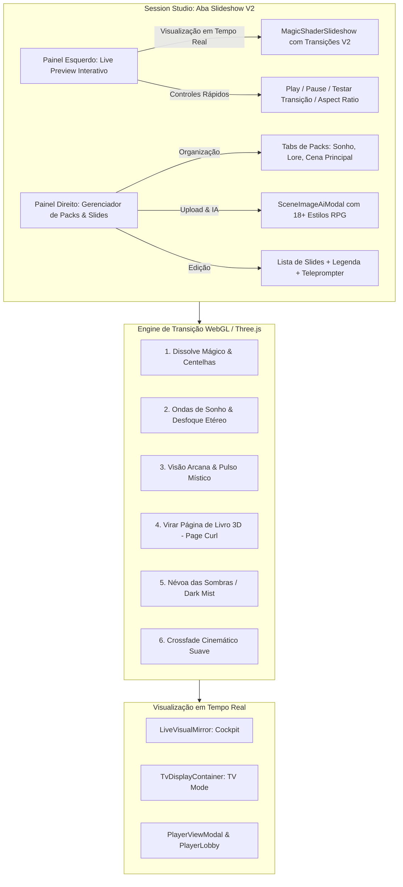

# Plano de Implementação: Slideshow Studio V2 & Sistema de Transições Cinemáticas

Este plano descreve a evolução da tela de **Slideshow de Cenas** no **SessionStudio**, trazendo uma interface split-screen premium com pré-visualizador interativo à esquerda, suporte a múltiplos **Packs de Slides** por cena (ex: Sonhos, Lore, Flashbacks), sistema de **Transições Cinemáticas em WebGL** (incluindo Efeito Sonho, Visões Arcanas e Virar Página de Livro 3D), seletores de proporção/formato de tela e integração com os **Estilos de Arte IA do World Building**.

---

## 1. Visão Geral das Mudanças



---

## 2. Componentes e Estrutura Técnica

### A. Tipos e Modelo de Dados (`lib/types.ts`)
1. **Novo Tipo `SlidePack`**:
   ```typescript
   export type SlideTransitionType = 
     | 'magical_dissolve' 
     | 'dream_waves' 
     | 'arcane_vision' 
     | 'book_page_flip_3d' 
     | 'dark_mist' 
     | 'crossfade';

   export type SlideAspectRatio = '16:9' | '4:3' | '1:1' | '9:16' | 'cover' | 'contain';

   export interface SlidePack {
     id: string;
     title: string;
     category?: 'principal' | 'sonho' | 'lore' | 'flashback' | 'custom';
     transitionType?: SlideTransitionType;
     aspectRatio?: SlideAspectRatio;
     images: SceneImage[];
     activeImageIndex?: number;
   }
   ```
2. **Atualização em `GameScene`**:
   - Adicionar `slidePacks?: SlidePack[]`
   - Adicionar `activeSlidePackId?: string`
   - Adicionar `defaultTransition?: SlideTransitionType`
   - Manter compatibilidade total com `sceneImages?: SceneImage[]` para retrocompatibilidade sem quebras.

### B. Shaders de Transição WebGL (`components/MagicShaderSlideshow.tsx`)
Expandir o `MagicShaderSlideshow` para receber `transitionType?: SlideTransitionType` e renderizar shaders customizados:
1. **`dream_waves` (Sonhos & Visões)**: Distorção senoidal de ondas com dispersão cromática RGB suave e blur etéreo.
2. **`book_page_flip_3d` (Virar Página de Grimório 3D)**: Efeito de curvatura geométrica 3D (Cylindrical Page Curl) com sombra suave na dobra da página revelando a folha posterior.
3. **`arcane_vision` (Visão Mística & Fenda)**: Pulso de luz cósmica/arcana com flash de contraste e transição em fenda.
4. **`magical_dissolve` (Padrão Atual Aprimorado)**: Dissolução orgânica com partículas de fogo/éter dourado.
5. **`dark_mist` (Névoa Sombria)**: Transição volumétrica em névoa negra.
6. **`crossfade` (Suave)**: Interpolação linear pura de alta fidelidade.

### C. Redesenho da Aba de Slideshow (`components/SessionStudio.tsx`)
Substituir o layout de coluna única centralizada por um **Layout Split-Screen Ergonômico**:
1. **Lado Esquerdo (Live Canvas Preview & Transição)**:
   - Painel com moldura estilizada de TV/Projetor.
   - Renderizador ao vivo com a transição ativa.
   - Seletor de Formato/Aspect Ratio (16:9, 4:3, 1:1, 9:16) com prévia do enquadramento.
   - Seletor de Efeito de Transição com botão interativo **"▶️ Testar Transição"**.
   - Controles de reprodução: Próximo Slide, Slide Anterior, Legenda Overlay Preview e Teleprompter Preview.
2. **Lado Direito (Gerenciador de Packs e Mídias)**:
   - **Tabs de Packs de Slides**: Alternador rápido de packs (ex: `[🌟 Principal]`, `[💭 Sonho do Elfo]`, `[📜 História Ancestral]`, `[+ Novo Pack]`).
   - Barra de Ações: Upload Supabase, Colar URL e **"✨ Gerar Imagem com IA"**.
   - Lista Reordenável de Slides do Pack com drag/botões de subir/descer, edição de Legenda para Jogadores e Teleprompter do Narrador.

### D. Integração com Estilos de IA do World Building (`components/modals/SceneImageAiModal.tsx`)
1. **Exportar & Compartilhar `RPG_IMAGE_STYLES`**:
   - Centralizar os 18+ estilos em `lib/constants/rpgArtStyles.ts` (ou importar diretamente de `WorldEntityModal.tsx`).
2. **Adicionar Seletor Visual de Estilos no `SceneImageAiModal`**:
   - Grid de cards ou dropdown com ícones de estilo (Dark Fantasy, Pintura a Óleo MTG, Aquarela Medieval, Anime/Ghibli, Terror Cósmico, Gótico, etc.).
   - Suporte a Aspect Ratio (16:9, 4:3, 1:1, 9:16) que injeta a proporção e adiciona a arte diretamente no Pack ativo da cena.

### E. Atualização dos Espelhos de Exibição dos Jogadores & Cockpit
1. `components/live-cockpit/LiveVisualMirror.tsx`: Suporte à seleção do pack ativo, disparo de transição customizada e espelho fiel.
2. `components/PlayerViewModal.tsx` & `components/tv/TvDisplayContainer.tsx` & `components/PlayerLobby.tsx`: Aplicação do tipo de transição e enquadramento configurados no pack/cena.

---

## 3. Plano de Execução em Fases

### Fase 1: Tipos e Shaders de Transição
- [ ] Criar `lib/constants/rpgArtStyles.ts` para centralizar os estilos de arte RPG e transições.
- [ ] Atualizar `lib/types.ts` com `SlidePack`, `SlideTransitionType`, `SlideAspectRatio`.
- [ ] Refatorar `components/MagicShaderSlideshow.tsx` para implementar os 6 shaders de transição (incluindo Sonhos e Virar Página 3D).

### Fase 2: Modal de Imagem IA com Estilos
- [ ] Atualizar `components/modals/SceneImageAiModal.tsx` com o seletor de 18+ estilos de arte, opções de proporção (16:9, 4:3, 1:1, 9:16) e prompts otimizados para cenários de RPG.

### Fase 3: Layout Split-Screen no SessionStudio
- [ ] Criar subcomponente de Preview de Slide no lado esquerdo com testes de transição e seleção de enquadramento.
- [ ] Implementar sistema de Packs de Slides no painel direito com gerenciamento de abas/decks.
- [ ] Conectar upload, URL direta e IA para o pack ativo.

### Fase 4: Sincronização e Visualização dos Jogadores
- [ ] Atualizar `LiveVisualMirror.tsx`, `PlayerViewModal.tsx`, `TvDisplayContainer.tsx` e `PlayerLobby.tsx` para honrar o pack ativo, transições configuradas e aspect ratio.

### Fase 5: Validação e Testes
- [ ] Testar transições WebGL (Sonhos, Visão, Virar Página 3D) sem travamentos.
- [ ] Testar criação e alternância de packs de slides na mesma cena.
- [ ] Testar geração de arte com IA em diferentes estilos.
