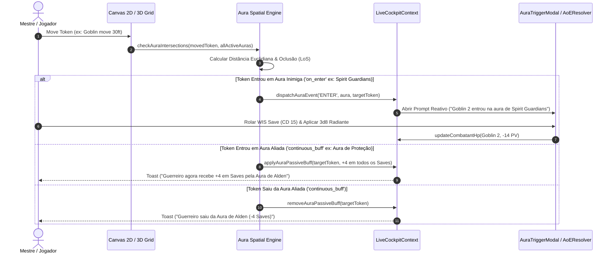

# 🛡️ PLAN: Smart Spell Shapes & Dynamic Aura System

> **Status:** Planejado ⏳  
> **Prioridade:** 🔥🔥🔥 P0 - Altíssimo Impacto em Combate & Imersão  
> **Dependências:** `lib/vision/aoeCollision.ts`, `lib/dnd5e-spells-shapes.ts`, `context/LiveCockpitContext.tsx`, `components/BattleGrid3D.tsx`, `components/map/DysonCanvas.tsx`, `components/live-cockpit/AoESaveResolverModal.tsx`  
> **Módulos Afetados:** Motor de Regras 5e, Detecção Espacial 2D/3D, Live Cockpit do Mestre, HUD de Combate, Sincronização Realtime.

---

## 🎯 1. Visão Geral & Objetivos

O **Smart Spell Shapes & Dynamic Aura System** é o motor de automação espacial e reativa do *Masters Codex*. Ele transforma tokens estáticos em emissores de auras vivas (como a *Aura de Proteção do Paladino*, *Guardiões Espirituais / Spirit Guardians*, *Santuário do Crepúsculo*, *Silêncio* e *Escuridão*).

### Objetivos Principais:
1. **Auras Passivas & Buffs Contínuos**: Tokens aliados dentro da aura recebem bônus automáticos (ex: +3 em todos os Saves dentro de 10ft do Paladino) sem necessidade de cálculos manuais.
2. **Gatilhos Reativos em Tempo Real (Reactive Triggers)**: Quando uma criatura entra no raio da aura (ou inicia seu turno nela), o sistema detecta a transição e abre automaticamente um prompt no *Live Cockpit* para o Mestre/Jogador resolver o teste de resistência ou aplicar o dano.
3. **Renderização Visual 2D & 3D Imersiva**: Anéis pulsantes, glifos rúnicos e efeitos visuais translúcidos acompanham os tokens em tempo real no *Dyson Canvas* e no *BattleGrid 3D*.
4. **Resolução de Spells com Geometria Inteligente**: Cones, Linhas e Esferas que respeitam oclusão de paredes/portas e calculam automaticamente alvos válidos e coberturas (+2 CA para meia cobertura, +5 CA para 3/4).

---

## 🏗️ 2. Arquitetura de Dados & Interfaces

### 2.1. Tipos de Auras (`lib/auras/auraTypes.ts`)

```typescript
export type AuraShape = 'circle' | 'cube' | 'cylinder';
export type AuraTargetFilter = 'allies' | 'enemies' | 'all' | 'custom';
export type AuraTriggerTiming = 'on_enter' | 'on_turn_start' | 'on_turn_end' | 'continuous_buff';
export type AuraActionType = 'saving_throw' | 'apply_damage' | 'apply_condition' | 'stat_modifier' | 'vision_blocker';

export interface AuraEffectAction {
  type: AuraActionType;
  // Para Saving Throws & Dano
  saveAbility?: 'STR' | 'DEX' | 'CON' | 'INT' | 'WIS' | 'CHA';
  saveDc?: number | 'caster_spell_dc';
  damageFormula?: string; // ex: '3d8'
  damageType?: string;    // ex: 'Radiante', 'Necrótico'
  saveHalves?: boolean;
  
  // Para Condições (ex: Silêncio / Amedrontado)
  condition?: ConditionType;
  
  // Para Buffs / Modificadores (ex: Aura do Paladino)
  statModifier?: {
    savingThrowsBonus?: number | 'caster_cha_mod';
    acBonus?: number;
    speedBonusFt?: number;
    advantageOnSavesAgainst?: string[]; // ex: ['Frightened', 'Charmed']
  };
}

export interface TokenAura {
  id: string;
  sourceCombatantId: string;
  sourceCombatantName: string;
  spellName?: string;
  name: string;             // ex: 'Spirit Guardians (15ft)', 'Aura de Coragem (10ft)'
  radiusFt: number;         // Raio em pés (10, 15, 30) -> convertido para metros / grid
  shape: AuraShape;
  affects: AuraTargetFilter;
  triggerTiming: AuraTriggerTiming;
  action: AuraEffectAction;
  requiresConcentration: boolean;
  
  // Estilização Visual
  visual: {
    colorHex: string;       // ex: '#facc15' (Dourado/Radiante), '#8b5cf6' (Arcano)
    opacity: number;        // 0.1 a 0.5
    pulsing: boolean;
    borderStyle: 'solid' | 'dashed' | 'runic';
    textureShader?: 'divine' | 'fire' | 'necrotic' | 'frost' | 'faerie' | 'standard';
  };
  
  // Estado de Ocorrência por Rodada (Evitar disparos duplicados na mesma rodada)
  triggeredInRoundCombatantIds?: Record<number, string[]>; // { [round]: [combatantId1, combatantId2] }
}
```

---

## ⚙️ 3. Motor Espacial & Fluxo de Execução (Aura Engine)



---

## 🗂️ 4. Presets Oficiais de Auras de D&D 5e (`lib/auras/auraPresets.ts`)

O sistema virá pré-carregado com as auras e magias mais emblemáticas do jogo:

| Magia / Habilidade | Raio | Alvos | Efeito & Automação | Estilo Visual |
| :--- | :---: | :---: | :--- | :--- |
| **Spirit Guardians** | 15 ft | Inimigos | Reduz movimento pela metade + Dispara WIS Save (3d8 Radiante/Necrótico) ao entrar ou começar turno | Anel de espíritos dourados/sombrios em órbita |
| **Aura of Protection (Paladino)** | 10/30 ft | Aliados | Adiciona o modificador de CAR do Paladino a todos os Saves de aliados | Círculo translúcido âmbar/dourado |
| **Aura of Courage (Paladino)** | 10/30 ft | Aliados | Concede imunidade à condição *Amedrontado (Frightened)* | Brasão rúnico de bravura |
| **Twilight Sanctuary (Clérigo)** | 30 ft | Aliados | No final do turno: Concede 1d6 + Nível de Clérigo em PV Temp OU encerra Enfeitiçado/Amedrontado | Crepúsculo estrelado azul-índigo suave |
| **Silence** | 20 ft | Todos | Bloqueia 100% de magias com componente Verbal + Imunidade a dano Trovejante | Domo silencioso esfumaçado cinza |
| **Darkness (Mágico)** | 15 ft | Todos | Bloqueia visão normal e visão no escuro (área opaca total) | Esfera negra com partículas de ébano |
| **Pass Without Trace** | 30 ft | Aliados | +10 em testes de Furtividade (Dexterity: Stealth) | Bruma sombria rente ao solo |
| **Aura of Vitality** | 30 ft | Aliados | Ação bônus no turno: cura 2d6 de um aliado na área | Pulso esmeralda revigorante |
| **Antimagic Field** | 10 ft | Todos | Suprime todas as magias, itens mágicos e auras concorrentes | Esfera de runas desativadas |

---

## 💻 5. Tarefas de Implementação (Task Breakdown)

### 🔹 Fase 1: Motor Central de Tipos & Lógica Espacial (Core Engine)
- [ ] Criar `lib/auras/auraTypes.ts` com todas as interfaces e enums de auras e triggers.
- [ ] Criar `lib/auras/auraPresets.ts` contendo a biblioteca de auras oficiais D&D 5e.
- [ ] Criar `lib/auras/auraEngine.ts`:
  - Algoritmo de intersecção token-aura considerando raio, tamanho da criatura (`sizeUnits`) e elevação (`elevation`).
  - Verificação de Linha de Visão (*Line of Sight*) para auras que não atravessam cobertura total (usando `visionCore.ts`).
  - Rastreamento de estado de ocupação (`occupancyTracker`) para detectar entradas/saídas por rodada.

### 🔹 Fase 2: Integração com o Live Cockpit & Store
- [ ] Atualizar `Combatant` em `lib/types.ts` para suportar `auras?: TokenAura[]` e `activeAuraBuffs?: ActiveAuraBuff[]`.
- [ ] Atualizar `LiveCockpitContext.tsx` e `useBattleGridStore.ts`:
  - `addTokenAura(combatantId, aura)` e `removeTokenAura(auraId)`.
  - Integrar `checkAuraTriggersOnMove` na chamada de atualização de posição dos tokens.
  - Sincronização em tempo real via Supabase Realtime (`AURA_TRIGGER_EVENT`).

### 🔹 Fase 3: Renderização Visual 2D (Dyson Canvas) & 3D (Three.js)
- [ ] **2D Dyson Canvas (`components/map/DysonCanvas.tsx`)**:
  - Renderizar anéis de aura dinâmicos abaixo da camada de tokens com gradientes radiais, bordas tracejadas e rotação rúnica sutil.
- [ ] **3D BattleGrid (`components/battle-3d/AuraMesh3D.tsx`)**:
  - Criar componente `AuraMesh3D` com shader Three.js de pulso, cor customizável e anéis de partículas.
  - Fixar o mesh na posição do token ou como filho do grupo do token.

### 🔹 Fase 4: Interface do Usuário (UI / UX & Modais de Resolução)
- [ ] Criar `components/live-cockpit/AuraTriggerModal.tsx`:
  - Notificação flutuante para o Mestre: *"⚠️ Alden moveu 15ft: Goblin 1 e Goblin 2 entraram em Spirit Guardians! [Rolar Saves (CD 16)] [Ignorar]"*.
  - Conectar diretamente ao `AoESaveResolverModal.tsx` para rolagem em lote de dano e salvaguardas.
- [ ] Criar `components/combat/TokenAuraManagerModal.tsx`:
  - Modal intuitivo para o mestre/jogador adicionar, editar raio (10/15/30ft), mudar cor ou desligar auras de um token.
- [ ] Integrar atalho de aura rápida no menu de contexto do token e na Ficha de Personagem ao conjurar magias com aura.

---

## 🧪 6. Plano de Verificação & Testes

### Testes Automatizados (Vitest):
- `tests/auras/auraEngine.test.ts`:
  - Testar detecção de entrada de token em círculo de 15ft (Spirit Guardians).
  - Testar se token fora do raio não dispara evento.
  - Testar se parede sólida com bloqueio de visão impede o efeito da aura através de LoS.
  - Testar aplicação e remoção de bônus de save do Paladino (+4 CAR) ao entrar e sair da aura.

### Verificação Manual no Live Cockpit:
1. Adicionar um Paladino e um Goblin no tabuleiro 2D e 3D.
2. Ativar a aura de *Spirit Guardians (15ft)* no Paladino.
3. Mover o Goblin para dentro do raio: verificar se o alerta do Mestre surge instantaneamente.
4. Rolar o Save no modal e checar se o dano é debitado do HP do Goblin no tracker e no log de combate.
5. Mover o Guerreiro aliado para 10ft do Paladino: verificar se o modificador de Save na ficha/tracker sobe automaticamente.

---

## 🚀 Próximos Passos
- Executar a implementação passo a passo iniciando pela criação do motor de tipos e detecção espacial em `lib/auras/`.
