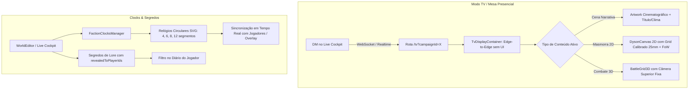

# 📜 Plano de Implementação: Modo TV / Mesa Presencial & Progress Clocks de Facções com Segredos de Lore

> **Status**: Planejado  
> **Área**: VTT Presencial (TV Mode) / Worldbuilding & Lore / Mecânicas Narrativas (Progress Clocks)  
> **Prioridade**: P1 / P2  
> **Arquivos Alvo**: `app/tv/page.tsx`, `components/tv/TvDisplayContainer.tsx`, `components/world/FactionClocksManager.tsx`, `components/world/ProgressClockWidget.tsx`, `lib/types.ts`, `components/live-cockpit/LiveCockpitMasterView.tsx`, `components/WorldEditor.tsx`

---

## 🎯 1. Objetivo & Visão Geral

Este plano combina duas grandes evoluções estratégicas do **Masters Codex**:
1. **Modo TV / Mesa Presencial (TV & Second Monitor View)**:
   - Uma tela de projeção 100% limpa (sem nenhuma UI de mestre, barras de menu ou botões de edição) voltada para ser exibida em um segundo monitor ou em uma TV deitada horizontalmente no centro da mesa de jogo.
   - Suporte a **Calibração de Escala Física** (garante que 1 quadrado do grid meça exatamente 1 polegada / 25mm na TV para uso com miniaturas físicas reais).
   - Suporte a **Rotação da Projeção** ($0^\circ, 90^\circ, 180^\circ, 270^\circ$) e alternância fluida entre Mapa 2D, Batalha 3D e Artwork de Cena em tela cheia.
2. **Progress Clocks de Facções & Segredos de Lore por Jogador (Estilo Blades in the Dark + D&D 5e)**:
   - **Relógios de Progresso (Clocks)**: Círculos segmentados (4, 6, 8 ou 12 fatias) para rastrear planos de vilões, influência de facções, rituais cósmicos, tempo de exploração ou perigo crescente.
   - **Segredos de Lore Granulares por Jogador**: Controle de quem descobriu cada documento ou mistério (`revealedToPlayerIds`), permitindo que segredos sejam sussurrados ou visualizados apenas pelos jogadores que passaram no teste ou descobriram a pista.

---

## 🧱 2. Arquitetura da Solução

---

## 📋 3. Tarefas Detalhadas por Módulo

### 🔹 Módulo A: Modo TV / Mesa Presencial (`app/tv/page.tsx` & `components/tv/`)
- [ ] **Criar Rota Dedicada `app/tv/page.tsx`**:
  - Parâmetros de URL: `campaignId`, `scale`, `rotation` (0, 90, 180, 270), `mode` (auto, map, scene, combat), `showCombatTracker` (mini tracker lateral flutuante opcional).
- [ ] **Componente `TvDisplayContainer.tsx`**:
  - Container responsivo `w-screen h-screen overflow-hidden bg-black` com zero barras de ferramentas.
  - Rotação via CSS transform (`rotate(90deg)` / `scale(...)`) para mesas digitais personalizadas.
  - Sincronização automática com a cena ativa, mapa atual, nível do mapa, tokens e névoa de guerra.
- [ ] **Calibrador Físico de Grid para Miniaturas (1 Grid = 1 Polegada / 25mm)**:
  - Ferramenta no Live Cockpit do mestre para ajustar a escala da TV (mostra uma régua digital de 10cm na TV para o mestre calibrar com uma régua real na mesa).
- [ ] **Controles no Live Cockpit do Mestre**:
  - Botão "Abrir Visão da TV em Nova Janela" (`window.open('/tv?campaignId=...')`).
  - Painel de controle de projeção da TV (Girar Tela, Forçar Cena, Forçar Mapa, Ocultar Grid).

---

### 🔹 Módulo B: Progress Clocks de Facções (`components/world/`)
- [ ] **Definição de Tipos (`lib/types.ts`)**:
  - `ProgressClock`:
    - `id: string`
    - `title: string`
    - `description?: string`
    - `totalSegments: 4 | 6 | 8 | 12`
    - `filledSegments: number`
    - `factionId?: string`
    - `category: 'faction' | 'danger' | 'quest' | 'stealth' | 'ritual'`
    - `colorHex?: string`
    - `isPublic: boolean` (se os jogadores veem o relógio ou se é secreto do mestre)
- [ ] **Componente Vetorial SVG `ProgressClockWidget.tsx`**:
  - Renderização circular vetorial com arcos de ângulo $(\frac{360^\circ}{N})$ para 4, 6, 8 e 12 segmentos.
  - Animação de preenchimento com brilho arcano/ameaça ao avançar segmentos.
  - Controles de 1-clique para o mestre: Avançar (+1), Retroceder (-1), Completar / Disparar Evento.
- [ ] **Gerenciador de Relógios (`FactionClocksManager.tsx`)**:
  - Aba de Relógios no `WorldEditor` e gaveta rápida no `LiveCockpit` para o mestre controlar tensões em tempo real.

---

### 🔹 Módulo C: Segredos de Lore & Revelação por Jogador
- [ ] **Extensão de Documentos e Entidades de Lore (`lib/types.ts`)**:
  - Adicionar `isSecret: boolean` e `revealedToPlayerIds: string[]` em `CampaignDocument` e `WorldEntity`.
- [ ] **Seletor de Revelação de Segredos no Editor de Lore**:
  - Checkbox para cada jogador da campanha ("Revelado para Thorin", "Revelado para Lilith").
  - Botão de 1-clique no Live Cockpit: "Revelar Segredo para o Jogador Selecionado".
- [ ] **Visualização no Diário do Jogador**:
  - Filtro automático no `PlayerLobby` / Ficha de Personagem para exibir apenas os documentos que o jogador possui permissão de leitura.

---

## 🔬 4. Plano de Verificação & Testes

### Testes Automatizados (Vitest)
1. **`tv-mode-scaling.test.ts`**:
   - Validar conversão de pixels para milímetros e rotações da visualização TV.
2. **`progress-clocks.test.ts`**:
   - Validar preenchimento, cálculo de porcentagem e disparo de relógios completos ($N/N$).
3. **`lore-secrets-visibility.test.ts`**:
   - Validar filtragem de documentos secretos por ID de jogador.

### Testes Manuais no Navegador
1. Abrir `/tv?campaignId=TESTE` em uma segunda janela:
   - Mudar a cena no Live Cockpit do mestre $\rightarrow$ verificar atualização instantânea na janela da TV sem barras de rolagem ou menus.
2. Criar um Relógio de 6 segmentos para "Alarme da Masmorra":
   - Avançar segmentos $\rightarrow$ verificar feedback visual e alerta de relógio completo.
3. Marcar um segredo de lore para apenas 1 jogador $\rightarrow$ abrir a visão do outro jogador e confirmar que o documento permanece oculto.

---

## 🏁 5. Próximos Passos
- [ ] Revisar o plano
- [ ] Iniciar a implementação via `/create` ou aprovação do usuário.
