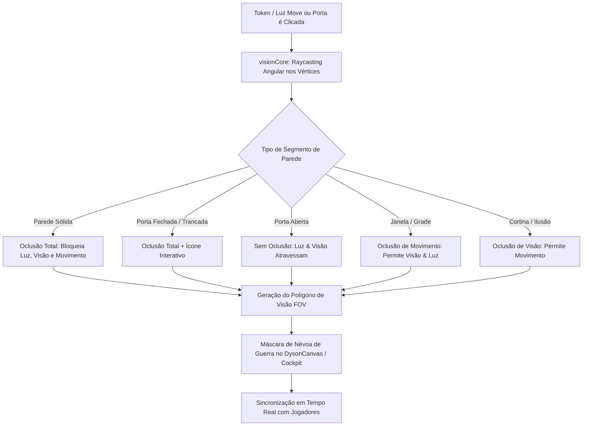

# 📜 Plano de Implementação: Evolução do visionCore e dysonCore para Paredes Oclusivas & Portas Interativas

> **Status**: Planejado  
> **Área**: Map Making (2D Dyson & VTT) / Motor de Visão e Oclusão / Sincronização em Tempo Real  
> **Prioridade**: P0 (Alta)  
> **Arquivos Alvo**: `components/map/visionCore.ts`, `components/map/dysonCore.ts`, `components/map/DysonCanvas.tsx`, `components/live-cockpit/CockpitDungeonMap.tsx`, `lib/types.ts`

---

## 🎯 1. Objetivo & Visão Geral

Evoluir a engine de visão e mapas do **Masters Codex** para o padrão de ponta da indústria (estilo Foundry VTT / Roll20 Dynamic Lighting), entregando:
1. **Motor de Oclusão e Raycasting Completo (`visionCore.ts`)**:
   - Cálculo preciso de polígonos de visibilidade (Sight Polygons) a partir de fontes de luz e tokens.
   - Suporte aos tipos de oclusão 5e: **Paredes Sólidas**, **Portas** (`open`, `closed`, `locked`, `broken`), **Portas Secretas**, **Janelas/Grades** (bloqueiam movimento, mas transmitem visão/luz), **Cortinas/Ilusões** (bloqueiam visão, mas permitem travessia) e **Meia-Parede/Cobertura**.
2. **Portas Interativas com 1-Clique no Canvas & Hover Feedback**:
   - Clique direto no ícone/pivô da porta para alternar entre Aberta (Verde), Fechada (Âmbar) e Trancada (Vermelho).
   - Detecção de proximidade do token do jogador para interação seletiva.
   - Recalculação instantânea da Névoa de Guerra (Fog of War) e propagação em tempo real via Supabase/WebSockets.
3. **Efeitos Visuais e Sonoros Orgânicos no Dyson Logos Canvas (`dysonCore.ts`)**:
   - Renderização adaptativa de portas e paredes no estilo bico de pena (Dyson Logos), com hachuras que se ajustam organicamente quando portas são abertas.
   - Gatilhos de áudio automáticos: rangido de madeira antiga, porta de ferro pesada, mecanismo de pedra secreta.

---

## 🧱 2. Arquitetura da Solução

---

## 📋 3. Tarefas Detalhadas por Módulo

### 🔹 Fase 1: Extensão de Tipos e Motor de Raycasting (`lib/types.ts` & `visionCore.ts`)
- [ ] **Expansão de Propriedades de Portas e Paredes (`lib/types.ts`)**:
  - Estender `WallSegment`:
    - `doorState`: `'closed' | 'open' | 'locked' | 'stuck' | 'broken'`
    - `lockDC?: number` (CD para arrombar com gazua ou forçar com Atletismo)
    - `secretFoundBy?: string[]` (IDs de jogadores que já detectaram a porta secreta)
    - `materialType?: 'wood' | 'iron' | 'stone' | 'bars'` (para efeitos sonoros temáticos)
    - `coverType?: 'none' | 'half' | 'three_quarters' | 'total'` (+2 ou +5 CA)
- [ ] **Algoritmo de Polígono de Visão por Vértices (Sight Polygon Casting)**:
  - Coleta de todos os pontos finais de segmentos de parede no mapa.
  - Emissão de raios a partir do token em ângulos $\theta - \epsilon$, $\theta$, $\theta + \epsilon$ para cada vértice.
  - Ordenação polar dos pontos de impacto para criar um polígono contínuo sem vazamento de luz através de quinas.

### 🔹 Fase 2: Portas Interativas & Hit-Testing no Canvas (`DysonCanvas.tsx` & `CockpitDungeonMap.tsx`)
- [ ] **Interatividade de 1-Clique para Mestres e Jogadores**:
  - Hit-test para detectar clique dentro de 10px da maçaneta/centro do segmento da porta.
  - Clique esquerdo no modo DM: Alterna `closed` $\leftrightarrow$ `open`.
  - `Shift + Clique` ou clique com botão direito: Alterna `locked` $\leftrightarrow$ `unlocked`.
  - Jogadores só podem interagir se o seu token estiver a até 1.5m (1 quadrado adjacente) da porta e a porta não estiver trancada.
- [ ] **Feedback Visual no Hover**:
  - Cursor muda para ícone de mão/chave ao passar sobre portas interativas.
  - Efeito de destaque brilhante (glow verde para abrir, vermelho para trancar).
- [ ] **Renderização de Portas Secretas**:
  - Totalmente invisível na tela dos jogadores até o mestre marcar como "Revelada" ou um jogador passar no teste passivo de Percepção.

### 🔹 Fase 3: Efeitos Sonoros & Sincronização em Tempo Real
- [ ] **Gatilhos de Áudio Contextuais**:
  - Disparo de SFX no `AudioMaestro` ao alternar portas:
    - Madeira: `door_creak_wood.mp3`
    - Ferro/Masmorra: `door_iron_clank.mp3`
    - Pedra Secreta: `stone_slide_heavy.mp3`
    - Trancada: `door_locked_rattle.mp3`
- [ ] **Sincronização Atômica WebSocket**:
  - Transmissão instantânea do estado da porta para `PlayerViewModal` e todos os clientes conectados sem re-renderizar o mapa inteiro.

---

## 🔬 4. Plano de Verificação & Testes

### Testes Automatizados (Vitest)
1. **`visionCore.test.ts`**:
   - Validar se `hasLineOfSight` retorna `true` através de porta aberta e `false` através de porta fechada/trancada.
   - Validar se janelas permitem visão mas bloqueiam movimento.
   - Validar polígono de sombra gerado por paredes em ângulo reto (quinas sem vazamento).
2. **`doorState.test.ts`**:
   - Validar alternância de estados `closed` -> `open` -> `locked`.
   - Validar restrição de distância de interação de tokens de jogadores.

### Testes Manuais no Navegador
1. Abrir `MapMaker` e criar uma masmorra com 2 salas conectadas por uma porta e uma janela de barras.
2. Posicionar um token na sala 1 e verificar que a sala 2 está sob Névoa de Guerra total.
3. Clicar na porta para abri-la -> verificar revelação imediata e fluida da sala 2.
4. Mudar a porta para `locked` -> tentar interagir com a visão do jogador -> verificar som de trancada.

---

## 🏁 5. Próximos Passos
- [ ] Revisar o plano
- [ ] Iniciar a implementação via `/create` ou aprovação do usuário.
